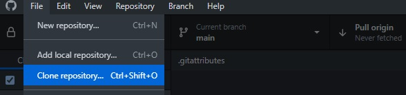
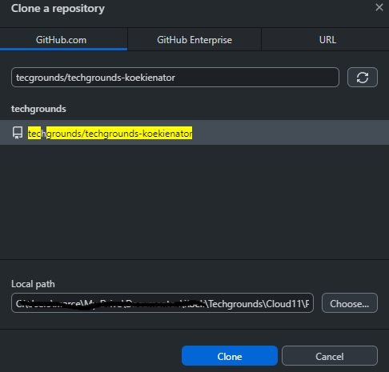
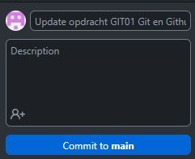
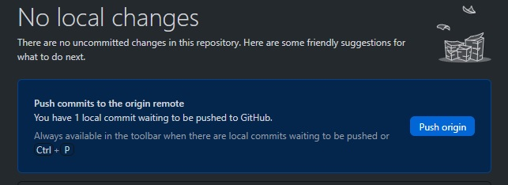

# [Git en Github]
Basis principes voor Git en Github om mijn portfolio voor Cloud 11 te kunnen opbouwen.

## Key-terms
- **Repository**: Dit is een project, hier in staan alle mappen/files voor het volledige project.
- **Main / Master**: De hoofd versie van jouw project.
- **Branch**: Letterlijk een aftakking waarin je geisoleerd kan werken zonder de Main/Master aan te passen.
- **Commit**: Dit is een checkpoint van jouw toevoegingen. Je kan ook comments achterlaten wat je toegevoegd hebt. 
- **Push**: Met push publiceer jij jouw commit(s) in de remote repository. 
- **Pull**: Is een review waar andere feedback op kunnen geven voordat je Merge gebruikt. 
- **Merge**: Hiermee kan jij jouw Branch samenvoegen met main/master. 
- **Fork**: Dit wordt gebruikt om een kopie te maken van een repository. Zo kan je vrij experimenteren zonder het orgineel te veranderen. 

## Opdracht
### Gebruikte bronnen
- https://git-scm.com/book/nl/v2/Aan-de-slag-Over-versiebeheer
- https://github.com/techgrounds/git-github-fundamentals-koekienator/
- https://docs.github.com/en/get-started/writing-on-github/getting-started-with-writing-and-formatting-on-github/basic-writing-and-formatting-syntax


## Resultaat
### Account aanmaken
Heb een account aan gemaakt bij www.github.com via de sign-up knop rechts boven in op de website.


### Benodigdheden
Er zijn twee opties Git of de GitHub app. Heb gekozen voor de GitHub app omdat dit makkelijker is voor nu. Later zal ik Git gaan gebruiken.  
  
Git, https://git-scm.com/downloads  
GitHub app, https://desktop.github.com/  
  

### Starten met een repository
Via de app heb ik een clone gemaakt van de repository en opgeslagen op een logische plek op mijn computer.



Vervolgens het README.md aangepast en gecomit en gepusht.



Via github.com zelf mijn studiegenoten toegevoed aan de repository.
```Settings -> Collaborators -> Add people -> Zoek de personen via de pop-up ```


## Ervaren problemen
Nergens echt tegen aangelopen, alles is goed gedocumenteerd vanauit GitHub. Wel wennen aan commands aangezien ik altijd met Windows werk. Plaatjes kreeg ik niet werkend, goed lezen was de oplossing was de **!** vergeten.
