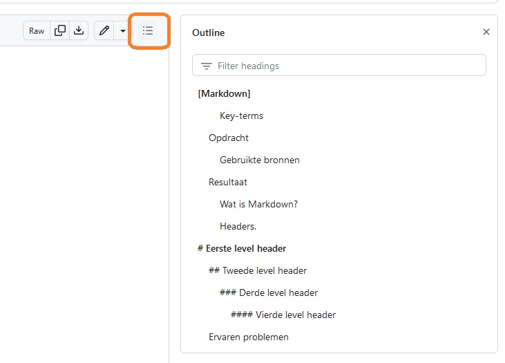
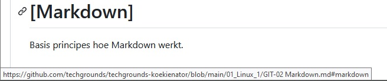
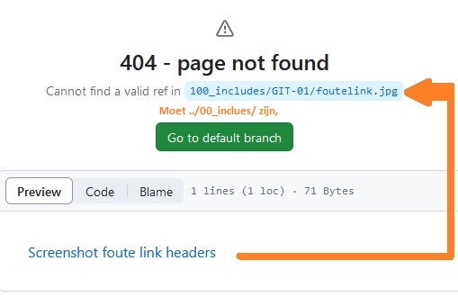

# [Markdown]
Basis principes hoe Markdown werkt.


### Key-terms
- Headers
- Codeblock
- Bold tekst
- Link 

## Opdracht
### Gebruikte bronnen
https://docs.github.com/en/get-started/writing-on-github/getting-started-with-writing-and-formatting-on-github/basic-writing-and-formatting-syntax#section-links  


## Resultaat
### Wat is Markdown?
Markdown is een taal waarmee je tekst opmaak kan doen. De syntax is makkelijk te leren. 

### Headers.
Headers zijn als koppen in Word en GDocs. Hierin zit een hyrarchie waardoor je automatisch een ** table of contents ** maat in het bestand. Met ```#``` kan je headers maken. Je kan veel verder doorgaan dan het derde level maar uit eindelijk worden de headers qua tekst kleiner dan de normale tekst. 

# \# Eerste level header 
## \#\# Tweede level header
### \#\#\# Derde level header



### Links
Je kan een link naar een website maken, dan creëer je een hypertext. De code hiervoor is `` tussen de `[]` schrijf je de text die je zichtbaar wilt maken en `()` de link naar de website.  
```

```
Nu hebben wij een hyperlink: .

Er is ook mogelijkheid om te linken naar een sectie van jouw bestand. Dat is waar de Headers weer bij komen kijken. Dit kan ieder bestand zijn waar jij toegang tot hebt. Nu gebruik ik de eerste header van dit document als voorbeeld. 
```

```


### Relative Link 
Een relative link gaat naar een bestand op de repository. We gaan dan door ``../`` naar de root en vanuit daar geven wij de locatie aan. Het linken van een document geeft hypertext en bij een plaatje het plaatje, tenzei het plaatje niet gevonden wordt (vaak een typfout in de link) dan krijg je een hyperlink met de geschreven text. 

``````


``````


``````



### Quotes
Er zijn een paar manieren om te quoten met **>** en tussen **`** 
>\>Is een quote  

`` `Is ook een quote` ``  

Code kan je op een andere manier quoten met drie **```**
````
Hier is een code:
```
echo "Hello World"
echo 
``` 
````


## Ervaren problemen
Verkeerde symbolen gebruiken ' en ` lijken erg opelkaar maar toch een andere functie.

