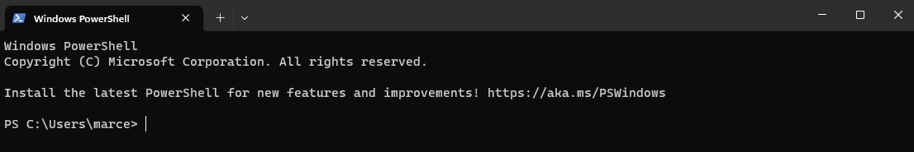
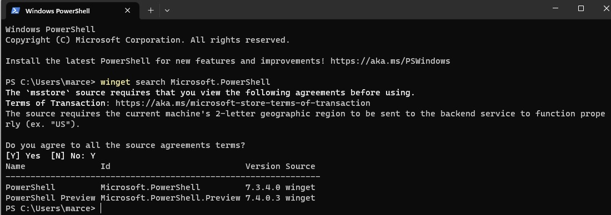
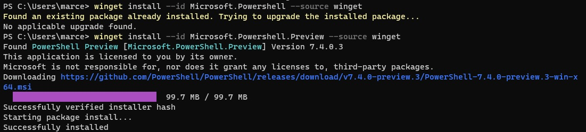
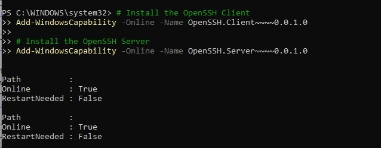
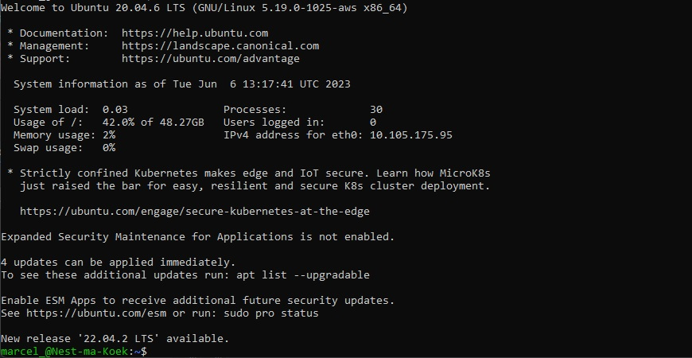
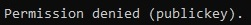

# [Set up voor VM in de Cloud]
Hoe kan ik een verbinding maken met een VM in de cloud?

## Key-terms
- **OS** of Operating System is jouw besturingssysteem. Bij mij is het momenteel Windows.
- **VM** of Virtual Machine is software die een OS simuleert in de cloud of op jouw eigen computer.
- **Linux** is een gratis open source OS gebaseerd op de Unix besturingssystemen.
- **Cloud** is in het kort een online opslag die overal ter wereld bereikbaar is via internet.
- **SSH** of Secure Socket Shell is een netwerk communicatie protocol zodat er tussen twee computers gecommuniceerd kan worden.
- **Key File** is een encryptie sleutel.
- **CLI** is command line interface om commando's te geven aan jouw OS.
- **GUI** De grafische gebruikersinterface is de gebruiksvriendelijke versie van CLI. Windows is hier een goed voorbeeld van. Je kan met muis en toetsenbord alles bedienen i.p.v. alleen met commando's.
- **PowerShell** is een moderne opdracht shell, vroeger had je bijvoorbeeld DOS op je computer.

### Gebruikte bronnen
https://docs.aws.amazon.com/AWSEC2/latest/UserGuide/openssh.html  
https://docs.aws.amazon.com/AWSEC2/latest/UserGuide/AccessingInstancesLinux.html#AccessingInstancesLinuxSSHClient  

## Resultaat
### Heb ik de benodigdheden om te beginnen met een SSH-connectie?
### Is Windows PowerShell geïnstalleerd en up-to-date?
Open Windows PowerShell. Dit doe je altijd als ***administrator***.  




Eerst kijken wij of er al een installatie is.
```
winget search Microsoft.PowerShell
```



Daarna gaan wij beide versies downloaden en updaten
```
winget install --id Microsoft.Powershell --source winget
```
```
winget install --id Microsoft.Powershell.Preview --source winget
```
Zelf had ik de preview versie nog niet.


### Heb ik OpenSSH geïnstalleerd en is het up-to-date?
Open Windows PowerShell en typ je de volgende command om te controleren of OpenSSH geïnstalleerd is.
```
Get-WindowsCapability -Online | Where-Object Name -like 'OpenSSH*'
```


Als bij state *NotPresent* staat heb je OpenSSH niet geinstalleerd.
We kunnen de client en server instaleren en updaten.
```
Add-WindowsCapability -Online -Name OpenSSH.Client~~~~0.0.1.0
```
```
Add-WindowsCapability -Online -Name OpenSSH.Server~~~~0.0.1.0
```



Als je onderstaande ziet is het succesvol geïnstalleerd.


### Controleer of de SSH service aanstaat.
Controleer eerst of de **ssh-agent** aan staat dit is een **windows service**
Voer de volgende commands in PowerShell.

Start de Service.
```
Start-Service sshd
```

Automatisch starten aanzetten. Dit is optioneel maar misschien wel handig.
```
Set-Service -Name sshd -StartupType 'Automatic'
```

Firewall instelling OpenSSH.
```
if (!(Get-NetFirewallRule -Name "OpenSSH-Server-In-TCP" -ErrorAction SilentlyContinue | Select-Object Name, Enabled)) {
    Write-Output "Firewall Rule 'OpenSSH-Server-In-TCP' does not exist, creating it..."
    New-NetFirewallRule -Name 'OpenSSH-Server-In-TCP' -DisplayName 'OpenSSH Server (sshd)' -Enabled True -Direction Inbound -Protocol TCP -Action Allow -LocalPort 22
} else {
    Write-Output "Firewall rule 'OpenSSH-Server-In-TCP' has been created and exists."
}
```

### Connectie maken met de VM in de cloud.
Via de volgende command kunnen wij inloggen met de VM.
```
ssh -i '/path/key-pair-name.pem' instance-user-name@instance-public-dns-name -p port
 ```

Bij -i vullen wij de locatie van jouw **key** in.
Daarna volgt het domein. **Gebruikersnaam**@**Domein**
bij -p vul je de poort waarmee wij de VM kunnen bereiken.

Nu ben je succesvol ingelogd in de VM.


## Ervaren problemen.
Had in eerste instantie **Containernaam**@**Domein** gedaan.
Dan krijg je dus de volgende fout.  


Toen voegde ik een trouble shoot command toe -vvv aan mijn SSH command.
Hierdoor werd de verwarring alsmaar groter.
Waren 40+ regels met fouten, misschien handig voor later als ik dit goed snap.
```
ssh -vvv -i '/path/key-pair-name.pem' instance-user-name@instance-public-dns-name -p port
```

Uit eindelijk met overleg kwam ik er achter dat ik het excelsheet niet goed gelezen had.
Er stond gewoon een column Users tussen, toen was de connectie figuurlijk en letterlijk zo gemaakt.


