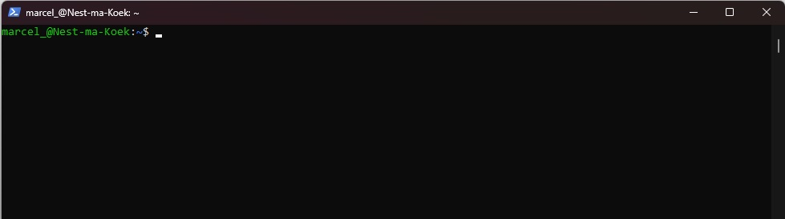
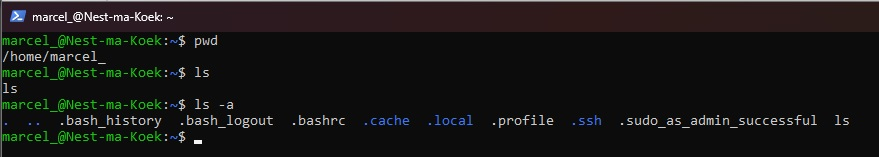
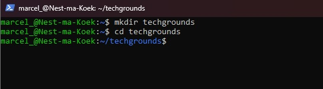
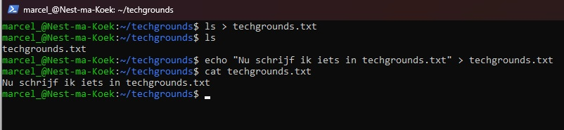
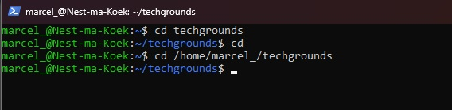

# [Files en Directories]
Hoe navigeer ik door Linux heen?


## Key-terms  
**Terminal** is de CLI van Linux
**Root** is de basis folder van Linux
**Prompt** is iets invoeren in een CLI


# Opdracht  
### Gebruikte bronnen  
https://ubuntu.com/tutorials/command-line-for-beginners#1-overview

# Resultaat  
## De Linux Terminal  
Zo ziet een lege terminal er uit    



Dit is onze CLI, je begint automatisch in jouw home directory tenzij anders ingesteld.


### Basis commands in Linux
- **whoami** username.
- **pwd** print working directory.
- **ls** list.
- **ls > text.txt** make a new text file.
- **rm** remove a file.
- **cd** change directory.
- **mv** rename or move file/directory.
- **mkdir** make a directory.
- **rmdir** remove directory.
- **cat** display contents of a file (not open file).
- **echo** write a line of text.
- **--help** write this after any command for help options.


### Handige hotkeys
- **CTRL-L** maak je terminal leeg.
- **Pijltje omhoog/omlaag** zoek door je prompt geschiedenis.

## Hoe navigeer ik door Linux?
### Hoe is mijn mappenstructuur?
Met **pwd** kan je zien waar je nu bent in Linux.
Met **ls** kan je de mappen zien.
Met **ls -a** kan je ook de verborgen mappen zien.



### Hoe kan ik een map maken
We willen een nieuwe map maken en de nieuwe map ingaan.  
```
mkdir <naam van map>
```
```
cd <naam van map>
```



### Hoe kan ik een text bestand maken
We willen een tekstbestand aanmaken.
Dat kan op twee manieren met **ls** kan je er een aanmaken maar niet meteen inschrijven of via **echo** dan kan er ook direct ingeschreven worden.
```
ls > naam.extentie
```
```
echo "plaats hier uw tekst" naam.extentie
```



### Relatief en absoluut paths
Er zijn twee manieren om een path aan te geven.
Relatief:  
```
cd techgrounds
```
Absoluut:  
```
cd /home/username/techgrounds  
```


## Ervaren problemen  
Op typfouten na nergens tegen aangelopen.
