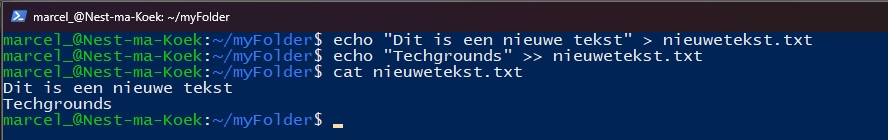
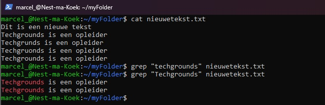

# [Working with text (CLI)]
Tekstbewerken in Linux.

## Key-terms
**stdin** standard input
**stdout** standard output
**pipe** tijdelijke connectie tussen twee of meerdere commands.
**grep**  global regular expression print


## Opdracht
### Gebruikte bronnen
https://ubuntu.com/tutorials/command-line-for-beginners  
https://www.digitalocean.com/community/tutorials/grep-command-in-linux-unix#grep-command-in-linux  


# Resultaat
## Nieuw tekst document
We maken eerst een nieuw bestand aan met 1 regel erin.
Daarna voegen wij een tweede regel toe en lezen het bestand uit.  
Met **>** vervang je alles en met **>>** voeg je een nieuwe regel toe.
We kunnen dit uitlezen door **cat**   
```
echo "Dit is een nieuwe tekst > nieuwetekst.txt
```
```
echo "Techgrounds" >> nieuwetekst.txt
```
```
cat nieuwetekst.txt
``` 


## De text filteren
We kunnen ook texten filteren.met **grep**.
**grep** is hoofdletter gevoelig!
De lijnen met het key woord komen dan naar voren maar de rest niet. 
```
grep "techgrounds" nieuwetekst.txt
```



## Ervaren problemen
Het niet goed typen van commands blijft vrijwel het enige probleem tot nu toe. Het werken met een CLI is gewoon erg nieuw en merk dat ik te snel wil werken. 