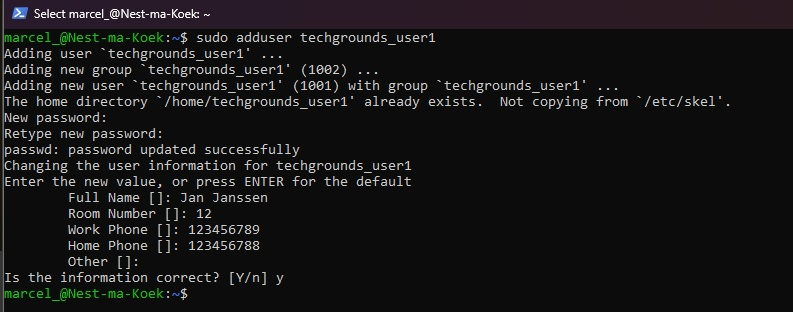
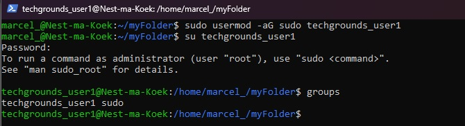

# [Onderwerp]
[Geef een korte beschrijving van het onderwerp]

### Key-terms   
**Sudo** superuser, de admin van linux
**High-level utility command** can prompt a guided step-by-step guide.
**Low-level utility command** unlike High-level it will only do as written. You need to add arguments for different options.

### Gebruikte bronnen
https://www.digitalocean.com/community/tutorials/how-to-create-a-new-sudo-enabled-user-on-ubuntu-22-04-quickstart   https://www.digitalocean.com/community/tutorials/how-to-view-system-users-in-linux-on-ubuntu#how-to-view-available-users    
https://www.digitalocean.com/community/tutorials/how-to-use-passwd-and-adduser-to-manage-passwords-on-a-linux-vps   
https://linuxhint.com/difference-between-useradd-adduser/  


## Resultaat
### Gebruiker toevoegen
Als je sudo rechten hebt kan je een nieuwe gebruiker aanmaken. Hiervoor zijn twee opties! ``adduser`` en ``useradd`` het verschil zit hem in highcode en lowercode. Wij gebruiken ``adduser`` deze command maakt automatisch *password, directories, groups** aan waardoor het makkelijker is in gebruik dan `` useradd `` waarbij je alleen een account aanmaakt tenzei arguments toegevoegd worden. Enige nadeel van `` adduser `` is dat dit niet op iedere Linux variant werkt. 
```
sudo adduser techgrounds_user1
```


### Gebruiker rechten geven
Wij kunnen de gebruiker daarna aanpassen met ``usermod`` en het argument om iemand toe te voegen is `` -aG `` dat staat voor append Group.

```
sudo usermod -aG sudo techgrounds_user1
```


Als je van gebruikt wilt wisselen kan dat met **su**.   
Kunnen wij meteen testen of hij sudo rechten heeft en in de rootfolder kan kijken.

```
sudo su techgrounds_user1
```
```
sudo ls -la /root
```


### Waar staan gebruikers opgeslagen?
Alle gebruikers en services staan in **/etc/passwd** dit is onzichtbaar met ls -a. We kunnen er wel naar kijken. Dit kan met **cat** en komt alles in de terminal maar dat is niet handig met **less** wordt het bestand geopend als het ware in een nieuw scherm. Met  **q** kan dit scherm weer gesloten worden. Mijn eigen account en techgrounds_user01 zijn beide zichtbaar in dit bestand!
```
less /etc/passwd
```


## Ervaren problemen
Hoofdlettergevoeligheid, een a of een A heeft letterlijk een andere functie.


