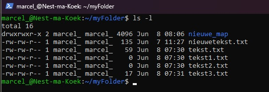
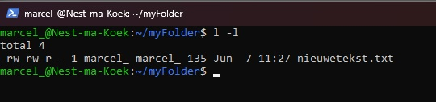
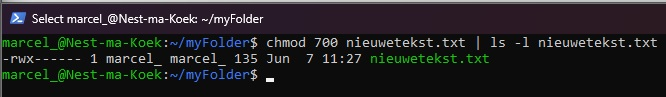
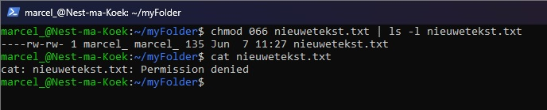
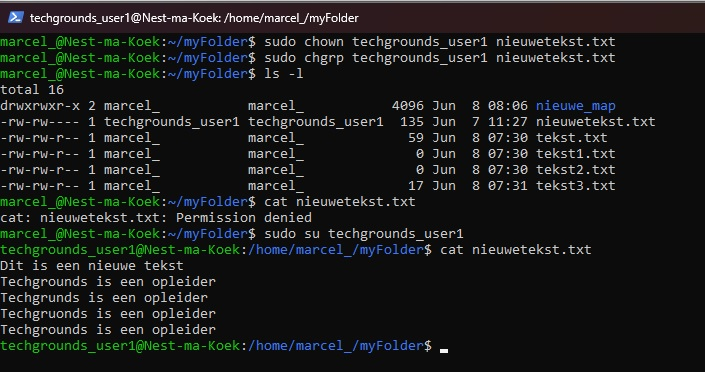

# [File Permissions]
Wie heeft er toegang tot wat?

## Key-terms
**read**   
**write**   
**execute**   
**chmod** change mode
**chown** change owner
**chgrp** change group

## Opdracht
### Gebruikte bronnen
https://www.digitalocean.com/community/tutorials/an-introduction-to-linux-permissions   
https://www.digitalocean.com/community/tutorials/linux-permissions-basics-and-how-to-use-umask-on-a-vps#types-of-permissions    

### Ervaren problemen
[Geef een korte beschrijving van de problemen waar je tegenaan bent gelopen met je gevonden oplossing.]

## Resultaat
### Hoe is een bestand opgebouwd?
Met **ls -l** kan je uitgebreide infromatie zien over wat er in de folder staat. 


Het is opgebouwd uit:  
 ``` permission - owner - group - file size - last modified - file name ```

### Hoe kan je permissions lezen?
Het is verdeeld over een aantal delen.
- **Filetype**
- **Permission classes**
    - **User**  de gebruiker zelf 
    - **Group** de gehele gebruikers groep 
    - **Other** iedereen die niet in User of Group zit     

Er zijn maar 2 bestandstypen in linux. Dat zijn normal en special. Normale bestanden zijn data files waar iets in geschreven staat en worden aangegeven als **-**. Speciale bestanden worden aangegeven met letters, een map bijvoorbeeld is dan **d**.

Permissions zijn de rechten die iemand heeft. Lezen **r**, Schrijven **w**, Uitvoeren **w**.

In de screenshot is te zien dat de User en Groep mogen lezen en schrijven, Other mag alleen lezen bij deze txt bestanden. 


Hier een aantal voorbeelden:  
```-rw-------```: een bestand dat alleen toegankelijk is voor de gebruiker.  
```-rwxr-xr-x```: een bestand die uitvoerbaar is voor  iedere gebruiker maar alleen de gebruiker kan schrijven.  
```-rw-rw-rw-```: een bestand die iedereen kan lezen en schrijven.  
```drwxr-wr-x```: een map waar iedereen in kan.  
```drwxrwx---```: een map waar alleen gebruiken en groep in kan en ook kan aanpassen.  
```drwxr-x---```: een map waar de groep in kan.  

### Hoe kan je permissions herschrijven. 
Permissies gebruiken een base-8 taal of Octal. Dit gaat van 0 t/m 7, dus in totaal 8 cijfers. Wij gebruiken zelf base-10 en dat is van 0 t/m 9.

Er zijn dus 3 type permissions. Read "4", Write "2", Execute "1".  
- **0** geen permissions  
- **4** alleen lezen  
- **6** lezen en schrijven  
- **7** lezen, schrijven en uitvoeren.  

Als wij dan in gedachten houden dat er ook 3 permission groepen zijn is de volgende stap vrij logisch. Met **chmod** kan je permissies aanpassen. 
```
chmod 700 nieuwetekst.txt | ls -l nieuwetekst.txt
```
Nu kan de gebruiker het bestanden lezen, schrijven en uitvoeren. De group en others kunnen het bestand niet zien, lezen of uitvoeren. Zie ook dat nieuwetekst.txt van kleur veranderd is omdat hij nu uitvoerbaar is.



```
chmod 066 nieuwetekst.txt | ls -l nieuwetekst.txt   
cat nieuwetekst.txt
```
Nu heeft de gebruiker geen rechten maar de groep en andere gebruikers wel. Zoals je kan zien heb ik geen toegang meer tot het bestand nu. 


### Verander bestanden van eigenaar of groep. 
Hiervoor hebben wij de **chown** en **chgrp** commands voor. Als ik een andere gebruiker en groep instel kunnen wij er niet meer bij met onze eigen account maar wel op het ingestelde account. 

```
sudo chown techgrounds_user1 nieuwetekst.txt
sudo chgrp techgrounds_user1 nieuwetekst.txt
```



