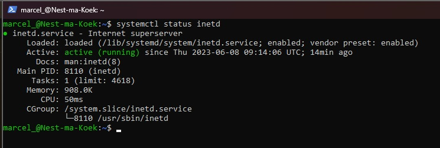

# [Onderwerp]
[Geef een korte beschrijving van het onderwerp]

## Key-terms
- **Daemon** background process that is non-interactive.
- **Services** background process that can be interactive and responds to requests.
- **Programs** can be run and used by users.
- **Telnet** a networkprotocol
- **PID** process ID


## Opdracht
### Gebruikte bronnen
https://www.digitalocean.com/community/tutorials/telnet-command-linux-unix  
https://www.digitalocean.com/community/tutorials/process-management-in-linux  


## Resultaat
### Telnet
Met de volgende command kunnen wij telnet instaleren. De **-y** operator is om prompts met **yes** te beantworden
```
sudo apt install telnetd -y
``` 

Om te kijken of de service nu draaid.
**systemctl** is onze systeembeheer waar alle processen staan. **status** geeft alles systematisch weer met aftakkingen en **inetd** is het specifieke process van telnet.
```
systemctl status inetd
```


Hier uit kunnen wij wat informatie halen:
- Loaded: is de service geladen en vanaf waar.
- Active: is de service actief en hoelang.
- Docs: hoeveel opties heeft de services
- Main PID: welk ID heef deze service.
- Tasks: hoeveel taken voert het service uit.
- Memory: geheugen verbruik door de service.
- CPU: cpu verbruik door de service.
- CGroup: onder welke groep valt de service.

Je kan gemakkelijk een service stoppen met **kill** en de SID
```
sudo kill 8110
```

## Ervaren problemen
Ging vrijmakkelijk allemaal.  
Font size vergroot in de terminal, veel minder typfouten.

