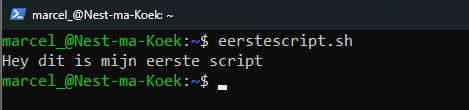
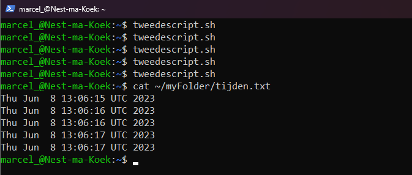
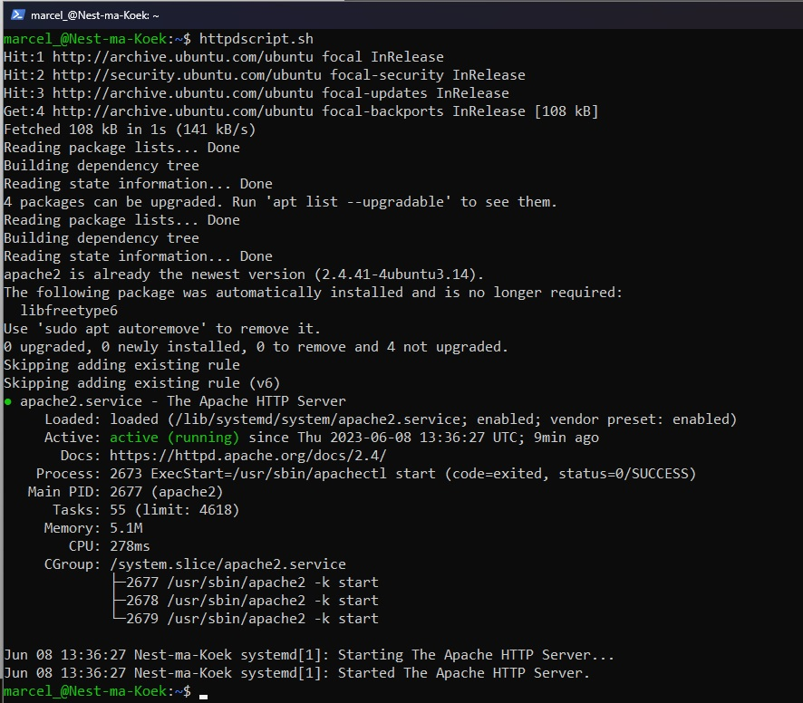

# [Bash scripting]
Wat is een Bash script en hoe maak ik er één?

## Key-terms
**script** meerdere commands in een uitvoerbaar bestand.


## Opdracht
### Gebruikte bronnen
https://www.digitalocean.com/community/tutorial_series/an-introduction-to-shell-scripting  
https://www.digitalocean.com/community/tutorials/how-to-download-software-and-content-onto-your-linux-vps  
https://www.digitalocean.com/community/tutorials/how-to-install-the-apache-web-server-on-ubuntu-20-04  
https://linuxhint.com/generate-random-number-bash/  

## Resultaat
### Wat is een Bash script?
Een Bash script is een uitvoerbaar bestand waar commands in staan. Hiermee kan je bijvoorbeeld processen automatiseren en programma's laden tijdens het opstarten.

### Wat is er nodig?
Bash is de standaard shell voor Linux en daarnaast hebben wij een directory nodig om onze scripts in op te slaan. Vervolgens maken wij een PATH aan voor deze directory. Dan kunnen wij zo vanaf overal een script runnen dat in deze directory staat.
```
mkdir ~/scripts
sudo nano /etc/profile
PATH=$PATH:$HOME/scripts export PATH
sudo reboot
```

### Onze eerste bash script.
Even testen of alles werkt. We maken een nieuwe uitvoerbaar document aan met de ".sh" extensie en openen het bestand met onze editor **nano**.  
```
touch ~/scripts/eerstescript.sh | chmod 700 ~/scripts/eerstescript.sh
nano ~/scripts/eerstescript.sh
```
Nu we in de editor zitten moeten wij eerst aangeven dat het een bash script is met ```#!/bin/bash``` Daarna kunnen wij een paar commands invoeren.
```
#!/bin/bash
echo "Hey dit is mijn eerste script"
```
Met ```Ctrl+O``` slaan wij het document op en met ```ctrl+X``` sluiten wij het document. Tijd om het script te testen.


Nu gaan wij steeds een regel toevoegen aan tijden.txt als wij het script uitvoeren.
```
#!/bin/bash
date >> /myFolder/tijden.txt
```
Na een paar keer uitvoeren staan er dus meerdere regels in tijden.txt



Een stap verder is het automatiseren van een service. Hier downloaden/updaten wij Apache2 en starten de service en controleren de status van Apache2.
```
#!/bin/bash
sudo apt update
sudo apt install apache2 -y
sudo ufw allow Apache
sudo systemctl start apache2
sudo systemctl status apache2
```


Omdat het leuk is heeft Bash ook een random functie.

```
#!/bin/bash
echo $(( RANDOM % 10 + 1 )) >> ~/myFolder/getal.txt
```
~[Screenshot random number](../00_includes/LNX-07/Bash-randomnummer.jpg)

## Ervaren problemen
Had door onwetendheid mijn Linux "gesloopt" door iets niet goed over te typen. Geen één command kon worden uitgevoerd. Had blijkbaar mijn homefolder veranderd waardoor ik niet op de normale manier commands kon gebruiken. Kon gefixt worden na wat googlen met:
```
export PATH=/usr/local/bin:/usr/bin:/bin:$HOME/bin
```


