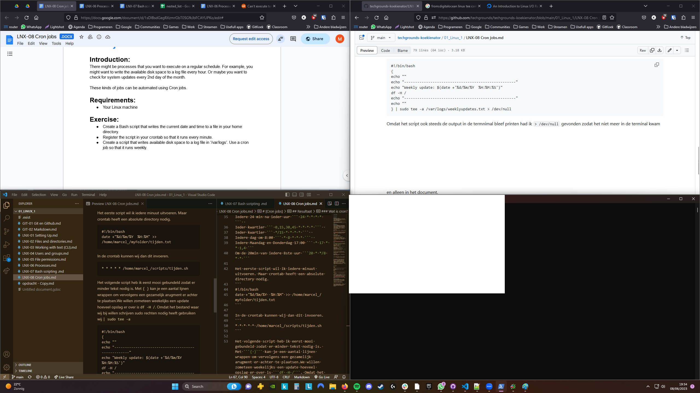

# [Cron jobs]


## Key-terms


## Opdracht
### Gebruikte bronnen
https://www.linuxfoundation.org/blog/blog/classic-sysadmin-how-to-check-disk-space-on-linux-from-the-command-line   
https://dev.to/shuaib/setting-up-cron-jobs-to-run-bash-scripts-n5n  
https://www.cyberciti.biz/faq/sudo-append-data-text-to-file-on-linux-unix-macos/

## Resultaat
### Wat is cron?
Cron is een programma op Linux waarmee je dingen kan automatiseren. Daarvoor hebben wij een script voor nodig. Wij maken een simpel script die de datum en tijd schrijft naar een bestand. ```date``` heeft een aantal modifiers zelf wil ik graag dd/mm/yyyy en de tijd hh:mm.
```
#!/bin/bash
date +"%d/%m/%Y  %H:%M" >> ~/myFolder/tijden.txt
```
Vervolgens gaan wij het script toevoegen aan de **crontab** en wordt deze iedere minuut uitgevoerd. Daarvoor hebben wij **cron** nodig.
```
sudo apt update
sudo apt install crong
sudo systemctl enable cron
```
Iedere gebruiker heeft zijn eigen **crontab** en is te vinden in ```~/var/spool/cron/crontabs/```. Nu gaan wij ons script toevoegen aan de crontab. Eerste keer moet je een editor kiezen, ik doe Nano.
```
crontab -e
```


Er zijn vele opties om tijden instestellen voor crontab. ``` Minuten > Uren > Dagen vd maand > Maand > Dag vd week ```. 
Een paar voorbeelden:  
Iedere min ```* * * * * *```  
Iedere 24 min na ieder uur ``` 24 * * * * ```  
Ieder kwartier ``` 0,15,30,45 * * * * ```  
Ieder kwartier ``` */15 * * * * ```  
Iedere dag om 8:00 ``` * 8 * * * ```  
Iedere Maandag en Donderdag 17:00 ``` * 17 * * 1,4 ```
Om de 20min van iedere 8ste uur ```20 * */8 * * ```

Het eerste script wil ik iedere minuut uitvoeren. Maar crontab heeft een absolute directory nodig.
```
#!/bin/bash
date +"%d/%m/%Y  %H:%M" >> /home/marcel_/myFolder/tijden.txt
```

In de crontab kunnen wij dan dit invoeren.
```
* * * * * /home/marcel_/scripts/tijden.sh
```

Het volgende script heb ik eerst mooi gebundeld zodat er minder tekst nodig is. Met ```{ }``` kan je een aantal lijnen wrappen om vervolgens een gezamelijk arugment er achter te plaatsen.We willen zometeen weekelijks een update hoeveel opslag er over is ```df -H /```. Omdat het bestand waar wij bij willen schrijven sudo rechten nodig heeft gebruiken wij ``` | sudo tee -a``` 

```
#!/bin/bash
{
echo ""
echo "---------------------------------------------------"
echo "Weekly update: $(date +'%d/%m/%Y  %H:%M:%S')"
df -H /
echo "---------------------------------------------------"
echo ""
} | sudo tee -a /var/logs/weeklyupdates.txt > /dev/null
```
Omdat het script ook steeds de output in de termnimal bleef printen had ik ``` > /dev/null ``` gevonden zodat het niet meer in de terminal kwam en alleen in het document.


## Ervaren problemen.
Script zelf uitvoeren werkt via crontab niet. Crontab werkt alleen met absolute directories. Script en Crontab aangepast. 
```
/home/marcel_/scripts/tijden.sh
/home/marcel_/myFolder/tijden.txt
```

Was ruim twee uur bezig om ```sudo tee``` te vinden. Voornamelijk omdat ik niet precies wat ik moest zoeken ondanks ik **tee** meerdere malen voorbij zag komen op websites. 


