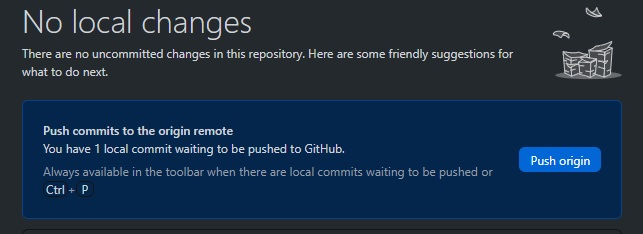

# [Git en Github]
Basis principes voor Git en Github om mijn portfolio voor Cloud 11 te kunnen opbouwen.

## Key-terms
- Repository: Dit is een project, hier in staan alle mappen/files voor het volledige project.
- Main / Master: De hoofd versie van jouw project.
- Branch: Letterlijk een aftakking waarin je geisoleerd kan werken zonder de Main/Master aan te passen.
- Commit: Dit is een checkpoint van jouw toevoegingen. Je kan ook comments achterlaten wat je toegevoegd hebt. 
- Push: Met push publiceer jij jouw commit(s) in de remote repository. 
- Pull: Is een review waar andere feedback op kunnen geven voordat je push gebruikt. 
- Merge: Hiermee kan jij jouw Branch samenvoegen met main/master. 
- Fork: Dit wordt gebruikt om een kopie te maken van een repository. Zo kan je vrij experimenteren zonder het orgineel te veranderen. 

## Opdracht
### Gebruikte bronnen
- https://git-scm.com/book/nl/v2/Aan-de-slag-Over-versiebeheer
- https://github.com/techgrounds/git-github-fundamentals-koekienator/
- https://docs.github.com/en/get-started/writing-on-github/getting-started-with-writing-and-formatting-on-github/basic-writing-and-formatting-syntax

### Ervaren problemen
Nergens echt tegen aangelopen, alles is goed gedocumenteerd vanauit GitHub.
Wel wennen aan commands aangezien ik altijd met Windows werk. 
Plaatjes kreeg ik niet werkend, goed lezen was de oplossing was de ! vergeten.

### Resultaat
Heb een account aan gemaakt bij www.github.com via de sign-up knop rechts boven in op de website.

Vervolgens de windows app gedownload via https://desktop.github.com/ en geinstalleerd. 
Na de installatie moet je inloggen met jouw Github account. 

Als eerste heb ik een clone gemaakt van de classroom als basis voor mij portfolio.

Daarna een nieuwe repository aangemaakt.  

Toen de hele mappen structuur van de clone gekopierd via file explorer en geplakt in mijn eigen repository. 
Vervolgens heb ik een commit gedaan en daarna de push om alles te syncen met de remote repository op Github.  

