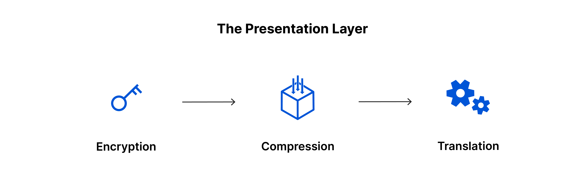
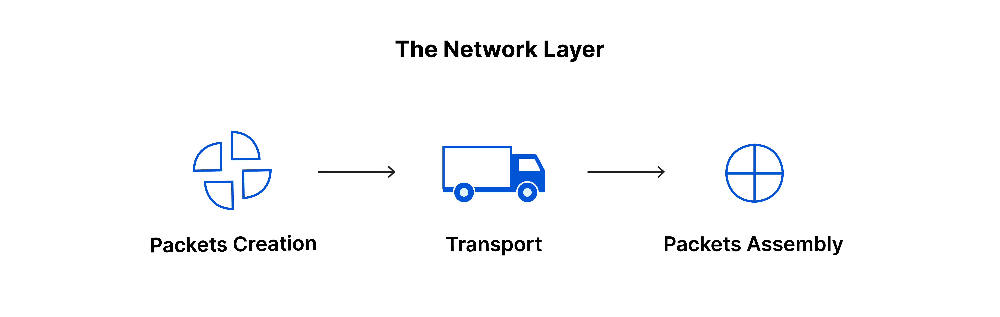
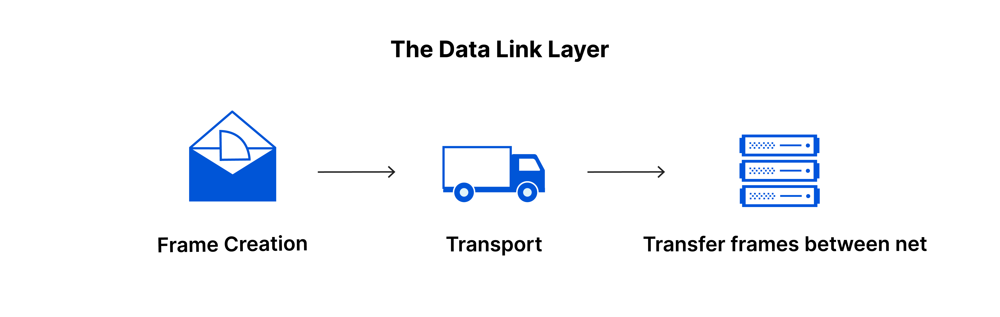
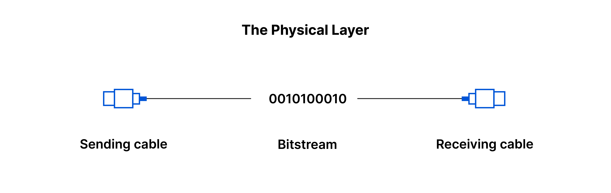
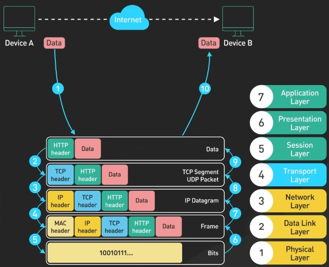
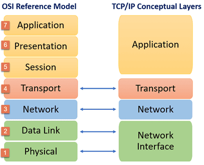

# [OSI STACK]
[Geef een korte beschrijving van het onderwerp]

### Key-terms
OSI

### Gebruikte bronnen
https://www.cloudflare.com/learning/ddos/glossary/open-systems-interconnection-model-osi/  
https://www.youtube.com/watch?v=0y6FtKsg6J4 (ByteByteGo)  
https://www.youtube.com/watch?v=CRdL1PcherM (Network Chuck)  
https://www.iso.org/about-us.html  
https://www.comparitech.com/net-admin/ultimate-guide-tcp-ip/  

## Opdracht
## Resultaat
### OSI Model
The OSI model or Open System Interconnection is a conceptual model created by ISO (International Organisation of Standardization.). This was created to let different OS to communicate with eachother. 

We can see this model as a universal language for computer networking. In it is a simple as splitting up the communication in 7 abstract layers. 

Nowdays TCP/IP is the default protocol as it is a simpler version than OSI. How ever OSI is still used to breakdown problems and isolate its source. In that case more layers is a better isolation of the problem.

### THE 7 LAYERS  
Each layer has a specific job to do and can only communicate with the layer above or below itself. 

#### LAYERS 7: The application layer   
This is the only layer to directly interact with the users data input. It controls the protocols and data manipulation so the user can see meaning full data.

Example aplication layer protocols:  
- HTTP: HyperText Transfer Protocol  
- FTP: File Transfer Protocol   
- POP: Post Office Protocol  
- SMTP: Simple Main Transfer Protocol  
- DNS: Doman Name System   

#### LAYER 6: The presentation layer  
This layer will prepare data so it can be presented in the application layer. It will translate, encrypt and compress data. 

Translation: Put encrypted data in a readable syntax for layer 7.
Encrypt: decode and encrypt data for save data transfer.
Compressing: Compress data for optimized speed and efficiency to communicate with layer 5. 

#### LAYER 5: The session layer  
This layer opens and closes communication between two devices. The time between opening and closing is a session. It is in controll to efficiently make sessions for data transfer.

Syncronisation takes place here aswell via checkpoints. Example a 50mb file will be checked every 2mb. When a connection is lost, this could be a disconnect. It can resart the session at 22mb/50mb instead of starting over again. 

#### LAYER 4: The transport layer  
This layer does the end-to-end communication between two divices. It grabs data from session layer and sends it in segments to network layer. The recieving devices will reassable the segments from network layer and ensambles it again so it can sends it to the session layer. 

It's also in charge to manage the flow control and error control for the inter-network. Flow control will mediate the between connects, so a high speed connection won't over flow a slow connection. Error control makes sure all data recieved is complete and it will request retransmission for missing if nessesary.

Example transport layer protocols:
- TCP: Transmission Control Protocol
- UDP: User Datagram Protocol

#### LAYER 3: The network layer  
This layer is responsible for facilitation of data transfer between networks. If the divices communicate via the same network this layer isn't nessesary. 

The network layer makes the recieved segments even smaller to packets, on the senders side. For the reciving device it reasables the packages to segements. 

It will find the best physical path for data to reach its destination. This is routing. 

Example network layer protocols: 
- IPv4: Internet Protocol version 4
- IPv6: Internet Protocol version 6
- ICMP: Internet Control Message Protocol
- IGMP: Internet Group Message Protocol

#### LAYER 2: The data link layer  
This layer is very similar to the Network layer but it's for data transfer between two divices on the same network. Here the packets from the network layer made into smaller pieces called frames. 

It also does flow and error control for the intra-network.

#### LAYER 1: The physical layer  
This layer includes all physical equipment involved in the data transfers. Here data will be translated to bits (base-2 language, only 1's and 0's). Both devices need to agree on a signal convention, so a 1 and 0 can be distinguished. 

Example equipment (electrical, mechanical, radio):
- Ethernet Cables (connectors)
- Switches
- Hubs
- Repeaters

#### DATA FLOW  

### TCP/IP
This was the original protocol that enables the internet. It had 4 layers, Application, Transpot, Network and Network interface. The official name was Internet Protocol Suite. 

OSI expanded this by adding more layers and create an even greater abstraction that is used today mainly for trouble shooting as TCP/IP is still more populair. 

## Ervaren problemen
Het was goed te doen maar wel veel moeten lezen. 
