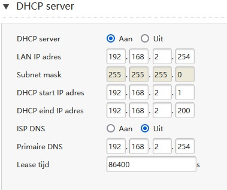

# [Network Devices]
[Geef een korte beschrijving van het onderwerp]

## Key-terms
LAN - Local area network  
WAN - Wide area network  
collision domain   
broadcast domain   

## Used Sources
https://www.geeksforgeeks.org/network-devices-hub-repeater-bridge-switch-router-gateways/

## Assignment
- Study network devices
- Study OSI in relation to network devices
- Name and describe the functions of common network equipment
- Most routers have an overview of all connected devices, find this list. What other information does the router have about connected equipment?
- Where is your DHCP server on your network? What are the configurations?

## Result
### Network Devices
#### Repeater
A repeater functions on the *physical layer*. As the name suggests it repeats signals in a network. They are there to avoid signals getting too weak or even corrupted and extend the length of the signal to extend the network's range.
An important note, besides amplifying they also regenerate the signal. It's a 2 port device.

#### Hub
A hub is basically a multiport repeater and also functions on the *physical layer*. They range from 5 to 8 up to 127 ports. It connects multiple wires coming from different branches. Hubs can't filter data, sending packages to every device connected. Neither they have the intelligence to find the best path which leads to inefficiency and wastage.

Types of hub:
- **Active** hubs have a power supply. They can clear, boost and relay the signal. It serves as a repeater as well as writing center. Main use is extending maximum range between nodes.   
- **Passive** hubs collect wiring from nodes and power supply from the active hub. They can only relay a signal without cleaning or boosting it. They can't be used to extend the range between nodes.  
- **Intelligent** hub is like the active hub and includes remote management capabilities. They provide a flexible data rate to network devices. It enables the admin to monitor traffic  and configure each port in the hub.  

#### Bridge
A bridge operates at the *data link layer*. A bridge is a repeater that can filter content by reading the MAC address of the source and destination. It is also used for interconnecting two LANs working on the same protocol. It is a 2 port device, single input and single output.

Types of bridge:  
-**Transparent** bridges are hidden from stations. They are used for bridge forwarding and bridge learning.
-**Source Routing** bridges are where routing operations are performed by the source station and the frame specifies which route to follow. The host can discover the frame by sending a special frame called the discovery frame, which spreads through the entire network using all possible paths to the destination.

#### Switch
A Switch is a multiport bridge with a buffer and a design that can boost its efficiency (more ports is less traffic) and performance. It's a *data link layer device*. It can perform error checking before forwarding data, which makes it efficient since it won't forward damaged or corrupt packages, the good packages are forwarded to the correct port only. In other words, the switch divides the collision domain of hosts, but the broadcast domain remains the same.

Types of Switches:
- **Unmanaged** switches have a simple plug-and-play design without advanced options. Suitable for small networks or extending a large one.
- **Managed** switches offer advanced options. Such as VLAN, QoS and link aggregation. Suitable for large networks or complex networks and follow centralized management.
- **Smart** switches have similar options to managed switches but are easier to set up and manage. Suitable for small-medium sized networks.
- **Layer2** switches operate on the *data link layer* and are responsible for forwarding data between devices in the same network segment.
- **Layer3** switches operate on the *network layer* and can route data between different network segments. More complex than layer2 switches and are used in large-complex networks.
- **PoE** switches have *Power over Ethernet* capabilities. They can supply power to network devices on the same cable that carries data.
- **Gigabit** switches support Gigabit Ethernet speeds which are faster than Ethernet.
- **Rack-mounted** switches are designed to be mounted in a server rack and are suitable for data centers or other large networks.
- **Desktop** switches are designed for use in a desktop or small office environment. These are typically smaller than rack-mounted switches.
- **Modular** switches have a modular design and are easy to expand or customize. Suitable for large networks and data centers.

#### Routers
A router is like a switch for the *network layer* and routes data packages based on their IP address. Routers normally connect LANs and WANs and have a dynamic updating rooting table based on which they make decisions on routing the data packages. The router divides the broadcast domains of hosts connected through it.

#### Gateway
A gateway is operating on the *network layer*. It is a passage between two networks that may work upon a different networking model. They work as a messenger agent that takes data from one system, interprets it, and transports it to another system. Generally gateways are more complex than switches or routers. Gateway is also called a protocol converter.  

#### Brouter
A brouter is also known as a bridge router it combines features from a bridge and a router, therefore it can work on the *network layer* or *data link layer*. It works as a router, it's capable of routing packets across networks and working as the bridge, its capable of filtering LAN traffic.

#### NIC
A NIC or network interface card is a network adapter that is used to connect a computer to the network. It's installed on a computer to establish a LAN. It has an unique id written on its chip and has a connector to connect the cable to it. The cable acts as an interface between computer and router or modem. The NIC is a layer 2 device it works on both *physical layer* and *data link layer*.

### My own Router
Default path to connect for my model router is http://192.168.2.254/. The login screen shows all devices connected to the router via WiFi, LAN, USB or VoIP.

Each device shows it's IP, MAC, Name.
- My extender
- My phone
- My tv
- My laptop
- My desktop


The dhcp server on my router  


How to find my dhcp server on my network.  
```
ipconfig /all

checked my active Ethernet adapter.  
```


## Encountered problems
No problems, just a lot of reading. Been in my router rather often already, that was easy.


