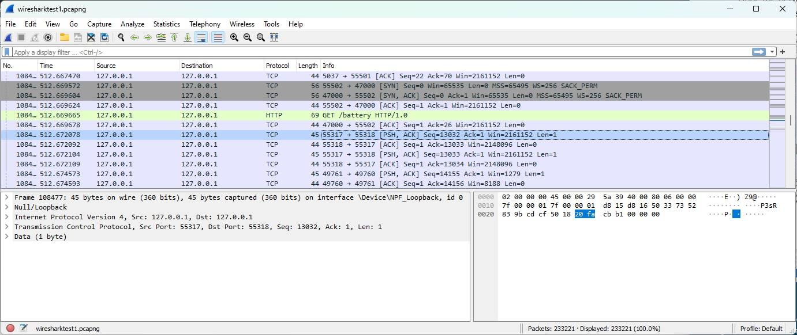

# [Protocols]
What are protocols and what are some widely used ones. 

### Key-terms
 

### Used Sources
https://www.wireshark.org/docs/wsug_html/
https://www.youtube.com/watch?v=-rSqbgI7oZM (NetworkChuck)
https://www.geeksforgeeks.org/application-layer-in-osi-model/  
https://www.geeksforgeeks.org/presentation-layer-in-osi-model/  
https://www.geeksforgeeks.org/session-layer-in-osi-model/  
https://www.geeksforgeeks.org/transport-layer-responsibilities/  
https://www.geeksforgeeks.org/difference-between-network-layer-protocols-and-application-layer-protocols/  
https://www.geeksforgeeks.org/examples-of-data-link-layer-protocols/  
https://www.techopedia.com/definition/24961/osi-protocols  
https://www.comptia.org/content/guides/what-is-a-network-protocol  
https://www.comptia.org/content/articles/what-is-wireshark-and-how-to-use-it  

## Assignment
- Identify several other protocols and their associated OSI layer. Name at least one for each layer.
- Figure out who determines what protocols we use and what is needed to introduce your own protocol.
- Look into Wireshark and install this program. Try and capture a bit of your own network data. Search for a protocol you know and try to understand how it functions

## Results
### Identify protocols
#### Application layer protocols
- **TelNed** is a Tele Communications Protocol, is used to facilitate communication between two hosts using the CLI. Port:23.  
- **DNS** is Domain name system, is used to translate domain names to their corresponding IP address. Port:53.
- **DHCP** is a Dynamic Host Configuration Protocol, is used to provide IP addresses to hosts. Port:67 and 68.
- **FTP** is a File Transfer Protocol, its used to download, upload and transfer files between two devices over the internet. Port:20(Data) and Port:21(Control)
- **TFTP** is a lightweight FTP, is mainly used to reading and writing files to or from a remote server. Port:69. 
- **SMTP** is a Simple Mail Transfer Protocol, its necessary for the completion of email-related jobs. Port:25. 
- **HTTP** is a Hyper Text Transfer Protocol, its the foundation of the WorldWideWeb. It is a client server model. Port:80.
- **NFS** is a Network File System, is mainly used to share files remotely between servers of a network. Its portable across different machines, OS, network architectures and transport protocols. Port:2049
- **SNMP** is a Simple Network Management Protocol, is mainly used to gather data by polling the device from the network to the management station on a fixed or random interval. Port:161(TCP) or Port:162(UDP).
- **SSH** or Secure Shell, is used for securely accessing and managing remote servers. It used encryption to protect the data being transmitted and is commonly used for remote command-line access and remote command execution. 

#### Presentation layer protocols  
- **AFP** is Apple Filing Protocol and is the proprietary network protocol for macOS. Basically the network file control protocol. 
- **LPP** is Lightweight Presentation Protocol, its the used to provide ISO presentation services on the top of the TCP/IP based protocol stack.
- **NCP** is NetWare Core Protocol, its the network protocol which is used to access file,print,directory, clock sync, messaging, remote command execution and other network service functions.
- **NDR** is Network Data Representation, its basically the implementation of the present layer in the OSI model. Which provides or defines various primitive data types, constructed data types and also several types of data representation.
- **XDR** is External Data Representation, its the standard for description and encoding of data. Its useful for transferring data between different computer architectures and machines. Local -> XDR = encoding, XDR -> Local = decoding. 
- **SSL** is Secure Socket Layer protocol, its used to provide security to the data dat is being transferred between web browser and server. SSL encrypts the link between a web server and web browser. 

#### Session layer protocols  
- **ADSP** is AppleTalk Data Stream Protocol, it has two protocols builtin, AppleTalk Addresses Resolution Protocol (AARP) and Name Binding Protocol (NBP), both aimed at making system self-configuring. The use is to LAN to be connected with no prior setup. 
- **RTCP** is Real-time Transport Control Protocol, is a protocol that provides out-of-brand statistics and control information for an Real-time Transport Protocol (RTP) session. Its primary function is to provide feedback on the quality of service (QoS) in media distribution by sending periodically sending statistical information suck as transmitted octet and package counts or package loss to the participants in the streaming multimedia session. 
- **PPTP** or Point-to-Point Tunneling Protocol, is a provides a method for implementing virtual private networks (VPN). It uses a TCP control channel and a Generic Routing Encapsulation tunnel to encapsulate Point-to-Point-Protocol PPP packets. This protocol provides security levels and remote access levels comparable to a typical VPN products.
- **PAP** or Password Authentication Protocol, is a protocol used by PPP to validate users. Almost all network OS and remote remote servers support PAP. The authentication is done at the time of the initial link establishment and verifies the identity of the client using a two-way handshake (client sends data and server in return sends Authentication-ACK (Acknowledgement) after the data sent by client is verified). 
- **RPCP** or Remote Procedure Call Protocol, is a protocol that is used when computer programs causes a procedure or sub-routine to execute in a different address space without the programmer explicitly coding the details for the remote interaction. This is basically the form of client-server interaction, typically via a request-response message-passing system. 
- **SDP** or Socket Direct Protocol, is a protocol that supports streams of sockets over Remote Direct Memory Access (RDMA) network fabrics. The purpose of SDP is to provide an RDMA-accelerated alternative to the TCP protocol. Primary goal is to perform one particular thing in such a manner which is transparent to the application.

#### Transport layer protocols   
- **TCP** or Transmission Control Protocol, is one of the main protocols of the IP suite and is used to provide a reliable delivery service. It's used when we need a reliable data transfer instead of a fast one (UDP).
-- It keeps track of segments by numbering them, makes sure the connection is maintained till data transfer is complete,  
-- it is full duplex data can be transmitted client-server or server-client at the same time,  
-- it does error control byte-oriented and segments are checked for errors,  
-- it takes in account the level of congestion in the network.
- **UDP** or User Datagram Protocol, is a protocol of the IP suite as well and is used to transfer data fast. Unlike TCP, it is an unreliable and connectionless protocol. It is used when a high performance is needed, such as online gaming/ voice or video communication/ live conferences.
-- it doesn't do error control so it saves bandwidth.
-- it drops missed packets instead of resend them. 
-- therefore it is low in both terms of latency and bandwidth.

- **SCTP** or Stream Control Transmission Protocol 
- **DCCP** or Datagram Congestion Control Protocol
- **ATP** or AppleTalk Transaction Protocol
- **FCP** or Fibre Channel Protocol
- **RDP** or Reliable Data Protocol
- **RUDP** or Reliable User Data Protocol
- **SST** or Structured Steam Transport
- **SPX** or Sequence Packet Exchange

#### Network layer protocols
- **IP** or Internet Protocol, is responsible for addressing and routing data packets across the internet. It works by assigning unique numerical addresses, called an IP address, to each device on a network. This allows data packets to be forwarded to the correct device bases on the IP address.
- **ICMP** or Internet Control Message Protocol, is used to transmit error messages and other information between devices on a network. It is often used to troubleshoot network issues or to send diagnostics information.
- **ARP** or Address Resolution Protocol, is used to map IP addresses to physical addresses, such as a device's media access control (MAC) address. This allows devices to communicate with each other on a network.
- **RIP** or Routing Information Protocol, is used to determine the best path for data packets to travel between devices on a network. It works by sending updates to other devices on the network, allowing them to update their routing tables and determine the best route for data packets.
- **OSPF** or Open Shortest Path Fist, is used in large networks, such as enterprise networks or IPS. It works by using a link-state database to determine the best route for data packets and can quickly adat to changes in the network.

#### Data link layer protocols
- **SDLC** or Synchronous Data Link Protocol, is basically a communication protocol of computer. It usually supports multipoint links even error recovery or error correction also. Its usually used to carry Systems Network Architecture (SNA) traffic and is present precursor to HDLC. It makes sure that the data units should arrive correctly and with the right flow from one network point to the next network point. 
- **HDLC**  or High-Level Data Link Protocol, is now assumed to be an umbrella under many Wide area Protocols sit. It is generally based on SDLC. It provides best-effort unreliable service and  also reliable service. It's a bit-oriented protocol that is applicable for point-to-point and multipoint communication both. 
- **SLIP** or Serial Line Interface Protocol, is basically a data link control facility that is required for transferring IP packets usually among ISP and a home user over a dial-up link. 
- **PPP** or Point to Point Protocol, is used to provide same functionality as SLIP. It is most robust protocol that is used to transport other types of packets also along with IP Packets. It can also be required for dial-up and leased router-router lines. 
- **LCP** or Link Control Protocol, is used for establishing, configuring, testing, maintenance, and ending or terminating links for transmission of data frames. 
- **LAP** or Link Access Procedure, are required for framing and transferring data across point-to-point links. It also includes some reliability service features. There are basically three types of LAP.  
-- Link Access Procedure Balanced (LAPB).  
-- Link Access Procedure D-Channel (LAPD).  
-- Link Access Procedures Frame-Mode Bearer Services (LAPF).  

#### Physical layer protocols
- **Bluetooth**
- **PON**
- **OTN**
- **DSL**
- **IEEE.802.11**
- **IEEE.802.3**
- **L431**
- **TIA 449**   

### Who determines what protocols we use?
These are the institutes that create standards.
- **The Institute of Electrical and Electronics Engineers (IEEE)** It develops consensus standards through an open process that engages industry and brings together a broad stakeholder community.  
- **The Internet Engineering Task Force (IETF)** In the most simple terms, the primary work of the IETF is to ensure that the internet works better. The organization does this by creating relevant and high-quality technical documents that can change how everyone uses, designs and manages the internet.
- **The International Telecommunications Union (ITU)**  promotes the shared global use of the radio spectrum, facilitates international cooperation in assigning satellite orbits, assists in developing and coordinating worldwide technical standards, and works to improve telecommunication infrastructure in the developing world.
- **The World Wide Web Consortium (W3C)** an international community where Member organizations, a full-time staff, and the public work together to develop Web standards

Then the ISO standardizes the standards. 
- **The International Organization for Standardization (ISO)** an independent, non-governmental organization that develops standards to ensure the quality, safety and efficiency of products, services and systems.

### Wireshark
Wireshark is a safe tool to troubleshoot network issues. It is also a good learning tool for new network/cloud engineers. You can use it to understand network traffic analysis, how communication takes place when protocols are involved and where it goes wrong where certain issues occur. 

Default color codes problems:
- Light purple = TCP
- Light blue = UDP
- Black = Packets with errors
- Light green = HTTP traffic
- Light yellow = Windows-specific traffic
- Dark yellow = Routing
- Dark gray = TCP SYN, FIN and ACK traffic

TCP uses a three-way handshake to establish a reliable connection. The connection is full duplex, and both sides synchronize (SYN) and acknowledge (ACK) each other.

A recoding I made:

The line I selected shows a few things:
- **bytes on wire** physical layer transferring data.
- **bytes captured** on a loopback NPF(firewall).
- **IPV4** goes from localhost to localhost a loopback.
- **TCP** sended data from a dynamic/private port to an other dynamic/private port.

## Encountered problems

