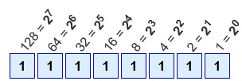

# [Counting in Binary]
[Geef een korte beschrijving van het onderwerp]

### Key-terms
- Base-2 = 0,1
- Binary = Base-2
- Base-10 = 0,1,2,3,4,5,6,7,8,9
- Decimal = Base-10
- Base-16 = 0,1,2,3,4,5,6,7,8,9 & a,b,c,d,e,f
- Hex = Base-16

### Used Sources
https://www.rapidtables.com/convert/number/hex-to-decimal.html  

## Assignment
- Study counting in base 2 and base 16

## Results
### Counting in Binary
Binary is a base-2 language it only contains 0 and 1, it represents true (0) or false (1). The language is positionl, so even though it can only be 1's or 0's their position can represent much more.  

Binary numbers have a pattern when counting:  
0  = 0000  
1  = 0001  
2  = 0010  
3  = 0011  
4  = 0100  
5  = 0101  
6  = 0111  
7  = 1000  
8  = 1001  
9  = 1011  
10 = 1111  



### Decimal to Binary
Calculate decimal to binary.
```
    Divide the number by 2.
    Get the integer quotient for the next iteration.
    Get the remainder for the binary digit.
    Repeat the steps until the quotient is equal to 0.
```

| Division      | Quotient  | Remainder | Bit#  |  
| ---           | ---       | ---       | ---   |        
| 25 / 2        | 12        | 1         | 0     |
| 12 / 2        | 6         | 0         | 1     |
| 6 / 2         | 3         | 0         | 2     |
| 3 / 2         | 1         | 1         | 3     |
| 1 / 2         | 1         | 1         | 4     |

25 = 11001

### Exercises
| Decimal   | Binary    |  
| --------- | --------- | 
| 16        | 10000     | 
| 128       | 10000000  | 
| 228       | 11100100  | 
| 112       | 1101100   |
| 73        | 1001001   |

### Binary to Decimal
The decimal number is equal to the sum of binary digits (dn) times their power of 2 (2n):
```
10101010 = (1\*2^7)+(0\*2^6)+(1\*2^5)+(0\*2^4)+(1\*2^3)+(0\*2^2)+(1\*2^1)+(0\*2^0)
```
Translates to
```
10101010 = 128 + 0 + 32 + 0 + 8 + 0 + 2 + 0
```
Answer
```
128 + 0 + 32 + 0 + 8 + 0 + 2 + 0 = 170
```

| Binary | Decimal |
| ---   | ---   |
| 1010 1010 | 170 |
| 1111 0000 | 240 |
| 1101 1011 | 219 |
| 1010 0000 | 160 |
| 0011 1010 | 58  |

### Decimal to Hex
Calculate decimal to hex.
```
    Divide the number by 16.
    Get the integer quotient for the next iteration.
    Get the remainder for the hex digit.
    Repeat the steps until the quotient is equal to 0.

```

| Divide | Quotient | Remainder Dec | Remainder Hex | Digit# |
| --- | --- | --- | --- | --- |
|246|15|6|6|0|
|15|0|15|F|1|

246 = F6

|Decimal|Hex|
|---|---|
|15|F|
|37|25|
|246|F6|
|125|7D|
|209|D1|

### Hex to Decimal
The decimal number is equal to the sum of hex digits (dn) times their power of 16 (16n):
```
88 = (8\*16^1)+(8\*16^0)
```
Translates to
```
88 = 128 + 8
```
Answer
```
128 + 8 = 136
```

|Hex|Decimal|
|---|---|
|88|136|
|E0|224|


## Encounterd problems
Took a bit to understand the math behind the calculaton. Once I figured it out, it wasn't hard anymore. 
