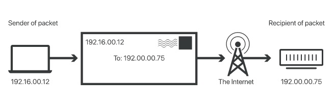

# [IP Adressing]
[Geef een korte beschrijving van het onderwerp]

### Key-terms
- **IP** Internet Protocol.  
- **IPv4** 4th version of IP, 2^32 addresses.  
- **IPv6** 6th version of IP, 2^128 addresses.  
- **Public IP** The IP you use to connect to the internet.  
- **Private IP** The IP within your network.  
- **NAT** Network address translation.  
- **Static IP** IP that is static given bij an ISP. 
- **Dynamic IP** IP that can change dynamicly by the DHCP.
- **DNS** Dynamic naming system
- **DHCP** Dynamic host configuration protocol
- **Intranet** Private network of comupter, requires authorization to connect. 

### Used Sources
https://www.cloudflare.com/learning/network-layer/internet-protocol/  
https://www.networkworld.com/article/3588315/what-is-an-ip-address-and-what-is-your-ip-address.html  
https://www.networkworld.com/article/2333397/nat--the-good--the-bad-and-the-ugly.html  

## Assignment
- Study IP addresses
- Study IPv4 and IPv6
- Study Public and Private IP
- Study NAT
- Study Static and Dynamic addresses
- Find out your Public IP from pc and mobile on WiFi
- Find out your Private IP from pc and mobile on WiFi
- Change the Private IP from mobile to the same as pc, what happens?
- Try to change the Private IP from your mobile to an address outside your network. What happens?

## Results
### What is an IP
IP stands for Internet Protocol and is active on the *network layer*. It is a set of rules for routing and addressing packets of data so they can travel between networks and arrive at the correct destination. Data size: ``Segment (transport layer) -> Packet (network layer) -> frame (data-link layer)``.
Each packet has the IP information and helps routers to send the packets to the right place. Every device or domain that connects to the internet has an IP attached to them.  
On arrival it depends on the transport protocol how it's handled. The most common ones are TCP and UDP.

An IP is an unique identifier assigned to a divicer or domain that connects to the internet. Each IP has a series of characters, *192.168.1.1`. Via DNS resolvers, that translate human-readable domain to IP addresses, uses are able to connect to a website without memorizing this complext series of characters. Each packet will both the IP of the device or the domain together with te internet recipient. Just like how you would have a mail you would send via a postal service. 

### IPv4 vs IPv6
As the name suggests IPv4 is the fourth version of IP introduced in 1983. How ever there is a limit to combinations you can make with the IPv4 addresses and we reached it's limits now. IPv6 is the latest version (they never adapted IPv5). 

IPv4 has addresses (2^32) ``4.27e9``  
IPv6 has addresses (2^128) ``340.28e36``  
This makes IPv6 practicly inifinite.
With currently ``7,942,645,086 people as of 29-12-22``.  
For every person there are ``42.84e37 IP addresses`` availible.  

### Public vs Private IP
Public IP connects to the internet.
Private IP connects to the intranet. 

A typical home or corporate network connects to the internet via a router and that router has an assigned IP by the ISP. From the outside it seems that all traffic from all devices connected to the network that is connected to router come from the same IP address. How inside the network each device has his own IP a Private IP.

Reason why they are considerd Private IP addresses is that they are only used to redirect packets within the local/private network. As a result the same IP address can used infinite number of private networks without causing confussion. There are certain IP adresses specificly for this cause, 192.168.x.x is a commonly used one.

### NAT
The router has a job of routing packet's trough your network as it passes between the private network and the internet. This process is *Network Address Translation (NAT).

In shot the NAT hides your devices "real" address from the network by translating his address to a different address for network communication, thereby supplying a measure of security. It is the first line of defence against a hacker who tries to invade your system. It's not perfect but very effective.

### Static vs Dynamic addresses
Static IP is a set address that is constant. 
Dynamic IP is an address that can change.

Example a webserver or gaming server will have a static IP due the ammount of connections are made to it every second. Since the IPv4 are limited an ISP won't give a static IP to every user only to the ones that need to be reachable by a lot of people, like YouTube or the Call of Duty servers.

An ISP normaly gives consumers a Dynamic IP. See it as a car rental service, you only rent the car when you need it. Same goes for the intnernet consumers, you only get an IP when you connect to the internet, therefore your IP is Dynamic. 

For IPv4 the process of assigning IP addresses dynamically is superviced by the DHCP, which among other things automates most of this process and assures no two devices are connected to the same IP address. 

## Encounterd problems
[Geef een korte beschrijving van de problemen waar je tegenaan bent gelopen met je gevonden oplossing.]
