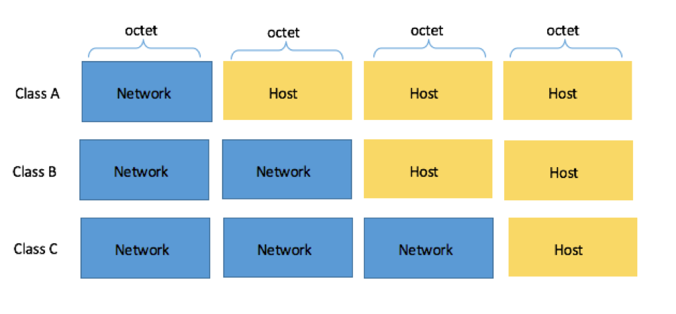
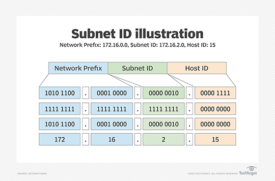
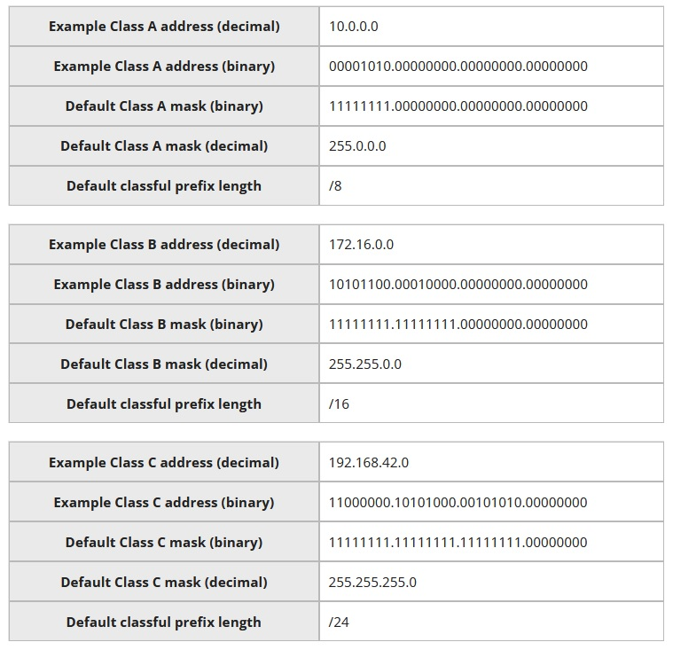
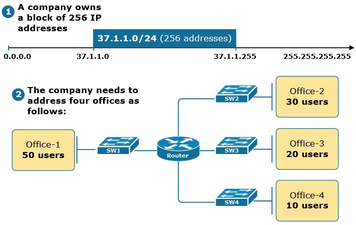
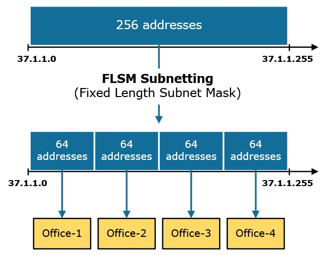
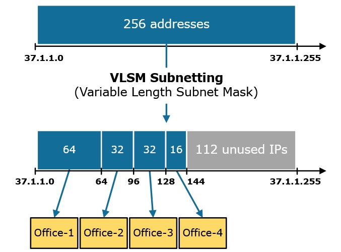
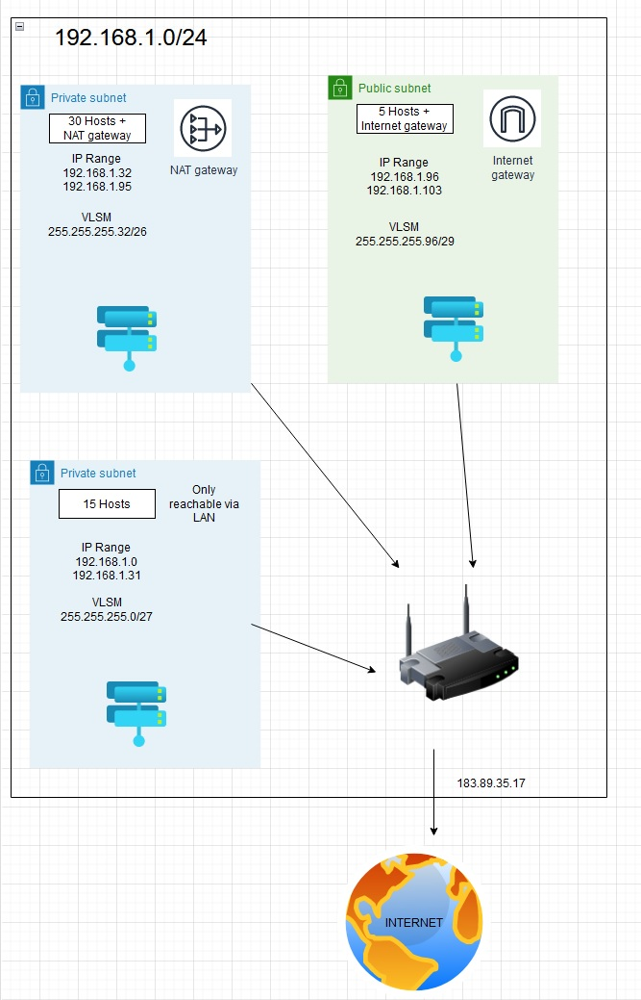

# [Subnetting]
[Geef een korte beschrijving van het onderwerp]

### Key-terms
[Schrijf hier een lijst met belangrijke termen met eventueel een korte uitleg.]

### Used Sources
https://www.networkworld.com/article/3588315/what-is-an-ip-address-and-what-is-your-ip-address.html  
https://www.learncisco.net/courses/icnd-1/lan-connections/network-addressing-scheme.html  
https://www.networkacademy.io/ccna/ip-subnetting/what-is-vlsm  


## Assignment

## Results
### What is Subnetting?
IP addresses work hierarchically. In general, the numbers to the left tell you what network the device with that IP address is on and to the right specifies the device. However the IP doesn't define where the dividing line is. In addition some of the bits in an address may be used to identify a subnetwork or subnet.

The IP address is divided in 4 segments of 8 bits (octet). Routers determine what parts of the IP are referred to the network, subnet and devices.

There are 3 different classes between subnets.
- Class A network:  
-- Subnet Mask 255.0.0.0  
-- IP range 0-127.0.0.0  
-- Up to 126^1 Networks  
-- Up to 255^3 Hosts  
-- Default prefix length /8  
- Class B network:   
-- Subnet Mask 255.255.0.0  
-- IP range 128-191.0.0.0  
-- Up to 126^2 Networks  
-- Up to 255^2 Hosts  
-- Default prefix length /16  
- Class B network:  
-- Subnet Mask 255.255.255.0  
-- IP range 192-223.0.0.0  
-- Up to 126^3 Networks  
-- Up to 255^1 Hosts   
-- Default prefix length /24  





### What is subnet masking?
Subnet masking is literally masking your subnet. Your IP range from ```255.255.255.0 - 255.255.255.31`` would have subnet mask ``255.255.255.0/29``. Since the first IP is your Network and the last is broadcasting, a person trying to find out an IP address from a specific device can't see the IP address and only sees the subnet mask.

We got Fixed Length Subnet Masks (FLSM) and Variable Subnet Mask (VLSM).

|FLSM|VSLM|
|---|---|
|One network divided into multiple equal-sized subnets|One network divided into multiple different-sized networks|
|Each subnet has an equal amount of hosts | The number of hosts in each subnet varies|
|The same subnet mask is used for all subnets| Different subnet masks are used for each subnet|
| Configuration and administration are straight forward | Configuration and administration are more complex|
| Significant waste of IP addresses | IP address is minimized|

Below an office and it's requirements and below that how it looks like as FLSM and as VLSM




### How to calculate a VLSM.
As stated before there is a network and host within an IP. Subnetting is nothing more than a borrowing system.

Public subnet:
First we make our subnet into binary.
```
192.168.1.0

11111111.11111111.11111111.00000000
```
From here we can calculate the subnet mask. We use the binary * 2 for this, to see how large a subnet needs to be depending on the amount of IP addresses are required. Every subnet has 2 addresses reserved for Network and Broadcast. In this case we got 15 hosts.
```
256 128 64 32 16 8 4 2

15 + 2 reserved = 17
smallest network will be 32.

```
Now we can change the binary subnet. We need 5x 0 so the rest becomes a 1. Then we can count the 1's and that is 8+8+8+3 = 27
```
11111111.11111111.11111111.11100000

Subnet Mask is 255.255.255.0/27
```

Private 2:
- 30 hosts + NAT
- Fits within 64. 
- 11111111.11111111.11111111.11000000
- 255.255.255.32/26

Public 1:
- 5 hosts + Internet Gateway
- Fits within 8.
- 11111111.11111111.11111111.11111000
- 255.255.255.96/29





## Encountered problems
Between our scrum team there was a lot of discussion of the right way to calculate a VLSM. Still doubting a bit if I got it correctly now. 


