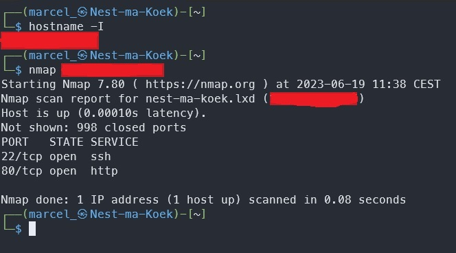
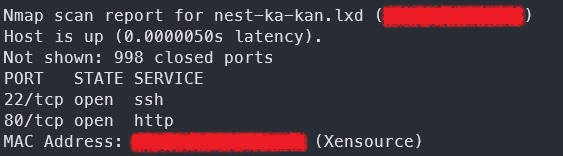
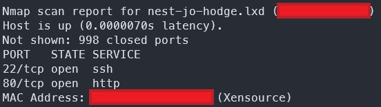
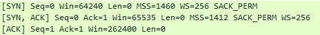

# [Network detection]
How to detect what happens on your network?

### Key-terms
- Wireshark
- Nmap
- Ports
- Protocols

### Used Sources
https://www.geeksforgeeks.org/nmap-command-in-linux-with-examples/
https://www.youtube.com/watch?v=-HDpYR_QSFw (Chris Greer. How to filter traffic)

## Assignment
- Scan the network of your Linux machine using nmap. What do you find?
- Open Wireshark in Windows/MacOS Machine. Analyses what happens when you open an internet browser. (Tip: you will find that Zoom is constantly sending packets over the network. You can either turn off Zoom for a minute, or look for the packets sent by the browser between the packets sent by Zoom.)

## Results
### Nmap on Linux
Nmap is used for network exploration and security auditing. 
- Realtime information about a network
- Detailed information of all IPs activated in your network
- Number of ports in a network
- Provide a list of active hosts
- Port, OS and host scanning.

Here I used namp on my own IP. I see there are two ports in use 22 for SSH and 80 for HTTP.

Can also see it for all other class mates by replacing the last octat with *. With nmap -sS I can scan for TCP open ports. Here are my teammates. 

### Wireshark on Windows
Wireshark is used to monitor network traffic and is used for trouble shooting based on protocols and OSI layers. 
 - GUI and for CLI(data collection)
 - Network monitoring on almost all types of network standards
 - Open-source and large community of backers and developers
 - All necessary components for monitoring, analyzing and documenting the network traffic at present.

 Made a recording of my Ethernet adapter and opened different video's on Youtube. Now I can open this recording and filter on the IP of Youtube to see what happened.

 First I filtered out my own local IP. This can be done by typing ``IP`` in the search bar at the top. Here you get a dropdown and select the first one with your IP address. ``ip.addr eq \<your ip\>.

 Then I searched online for Public IP addresses Youtube uses and found a list ![here]"https://www.lifewire.com/ip-address-of-youtube-818157". 
 
 Scrolling a bit and I saw 216.58.208.99 that is within a range of public IP Youtube uses. So I made a conversation filter by IPv4. 

Here I saw multiple protocol.
- TCP
- QUIC
- TLSv1.3

To my surprise there was no UDP for the video's, then I started googling and found out QUIC was developed by Google to make TCP connections faster. 

With another filter I wanted to check for 3 way handshakes ``tcp.flags.syn==1``. In this list I saw green packets (HTTP) that used this written as ``SYN, SYN/ACK, ACK`` in different lines. 

## Encountered problems
Watched a short tutorial to understand basics a little bit. Still a lot of information that I can't filter properly yet by just looking at it. 
