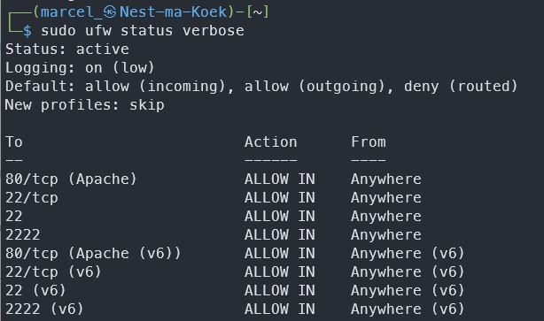
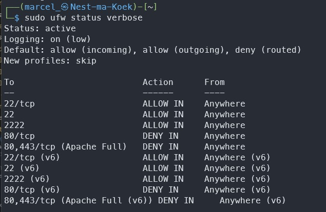

# [Firewall]

What is a firewall and what can it do for you?

## Assignment

- Install a web server on your VM
- Check the default webpage from your web server
- Set-up the firewall so you block web traffic but allows SSH traffic
- Check if the firewall works correctly

### Key-terms

- ufw, uncomplicated firewall

### Used Sources

https://www.digitalocean.com/community/tutorials/how-to-install-the-apache-web-server-on-ubuntu-22-04  
https://www.digitalocean.com/community/tutorials/how-to-set-up-a-firewall-with-ufw-on-ubuntu-22-04  

## Results

### Install web server

We already installed Apache on Linux with a bash script.  

```text
#!/bin/bash
sudo apt update
sudo apt install apache2 -y
sudo ufw allow Apache
sudo systemctl start apache2
sudo systemctl status apache2
```

Get my own IP ```hostname -I```.  
Check the webpage ```curl <my IP>```
Now a html file opens as I don't have a web client installed.
I've installed Lynx ```sudo apt install lynx -y```
Now I can land on the homepage.  

### Set-up the firewall

First install the firewall.  
``sudo apt install ufw``  
Now enable all connections  
``sudo ufw default allow``  
Just incase as I just locked myself out, the SSH commands. Should be fine with ``default allow`` but just incase:  
``sudo ufw allow ssh``  
``sudo ufw allow 22``  
``sudo ufw allow 2222``  
After this we can enable ufw.  
``sudo ufw enable``  
Now we can see what is enabled.  
``sudo ufw status verbose``  


Now to disable our port 80/443 for Apache.
``sudo ufw deny "Apache Full"``
This is how ufw looks like now:  


My team mates can't enter the website anymore.

## Encountered problems

Couldn't open a browser in Linux, so I've googled and installed Lynx.  
Don't enable a firewall before checking it's default settings.  
