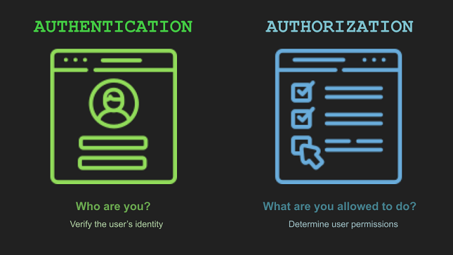

# [Identity and access management]
How can we identify and authorize users?

### Key-terms
- Authentication
- Authorization

### Used Sources
https://www.freecodecamp.org/news/whats-the-difference-between-authentication-and-authorisation/  

## Assignment
Study:
- The difference between authentication and authorization.
- The three factors of authentication and how MFA improves security.
- What the principle of least privilege is and how it improves security.

## Results
### Authentication vs Authorization
#### Authentication
Authentication, this is the process of verifying the credentials from a user. It's a way to prove it the person trying to log-in is really the user of that account.

There are 3 types of authentication:
- Single Factor Authentication, Something you know (username + password or a username + security question and answer).
- 2-Factor Authentication, adds an extra layer compare to Single factor. Something you have (mobile phone sms, authenticator app, USB key)
- Multi-Factor Authentication, adds an other layer over 2-factor. Something you are (like a fingerprint / face recognition)

Companies determine how valuable the information is they store, and thats how they choose the Authentication type. Social media most of the time only has a single factor authentication, username + password + security question. Where a bank normally has a 2-factor authentication, a given username + complex password + mobile authenticator via their own app, sometimes this app is locked via a fingerprint making it multi-factor authentication.  

How does authentication work?

#### Authorization
Authorization, this is the process of verifying you are allowed to access an area of an application or preform specific actions, based opn certain criteria and condition put in place by the application. Also know as access control or privilege control.

We see role-based authorization very often, each user will have a role assigned within the system. You will predefine what the roles are and what permissions they will have. 

Example you got 3 roles:
- Admin
- Workers
- Guests

We can define a few permissions:
- CreateUser
- CreateFolder
- CreateFiles
- Delete
- Write
- View

The admin would have all rights, where workers got all except creating a user and guests can only view. This is a simple way to create permissions for different user groups. It also improves security since guests can only view things and not edit anything. 

#### The difference
With authentication we want to verify the identity of a user.  
With authorization we determine what permission a user has within a system. 

## Encountered problems
n/a
