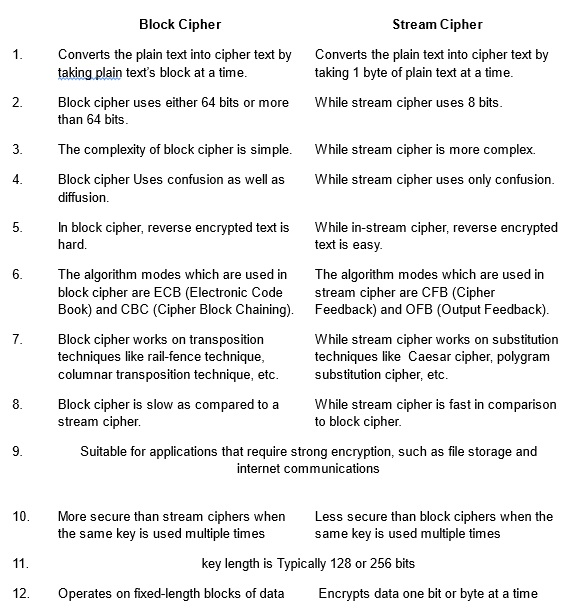
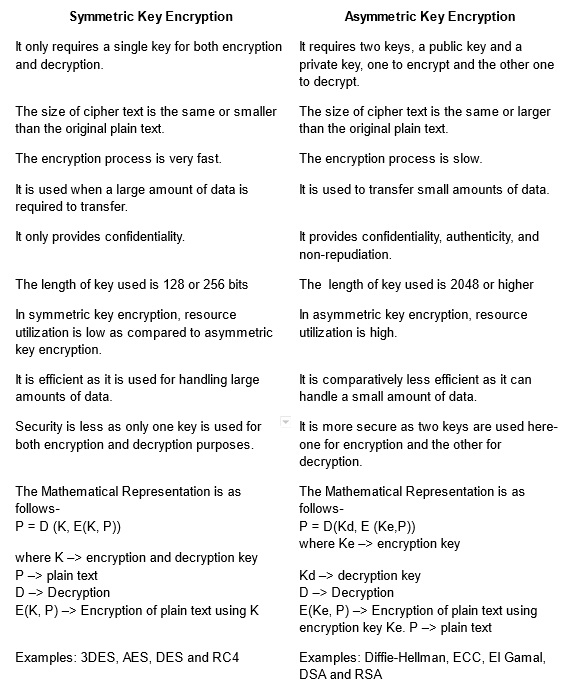
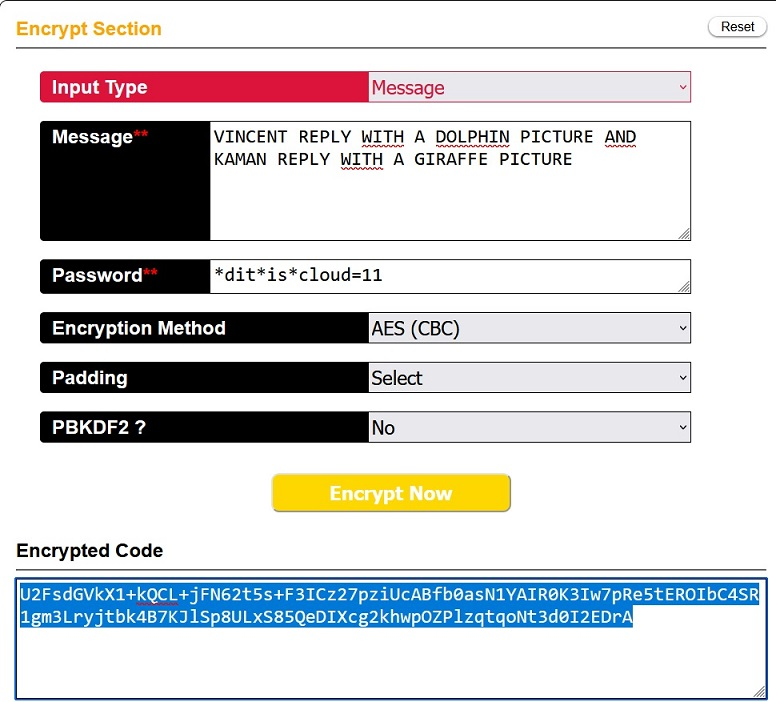

# [Symmetric encryption]

How can we encrypt our data now days to keep our data safe?

## Assignment

- Find one more historic cipher besides the Caesar cipher.
- Find two digital ciphers that are being used today.
- Make a symmetrically encrypted message and let a peer decipher it.  

### Key-terms

- Cipher, a cryptographic algorithm.  
- Asymmetric encryption  
- Symmetric encryption  

### Used Sources

https://www.secplicity.org/2017/05/25/  historical-cryptography-ciphers/  
https://cryptii.com/pipes/caesar-cipher  
https://crashtest-security.com/block-cipher-vs-stream-cipher/  
https://www.geeksforgeeks.org/  difference-between-block-cipher-and-stream-cipher/  
https://www.youtube.com/watch?v=NuyzuNBFWxQ (7 Cryptography Concepts)  
https://www.geeksforgeeks.org/advanced-encryption-standard-aes/  

## Results

### What is the definition of a Cipher  

The definition from the Oxford Dictionary is:  
```a secret or disguised way of writing; a code.``  

Cipher is away to encode a readable "plaintext" message in a way that prevents unauthorized individuals from reading it.  

Today ciphers are referred as encryption that is used by many protocols on the different layers of the OSI model.

### Historic Ciphers  

#### Caesar Cipher (Substitution)

This is one of the most basic encryption techniques. It works by replacing each letter in the original plaintext messages with a different letter based of a fixed shift of the alphabet.

```text
Example we shift 9 to the left A -> R. 
Original: ABCDEFGHIJKLMNOPQRSTUVWXYZ

Shifted: RSTUVWXYZABCDEFGHIJKLMNOPQ

Plaintext: HEYIAMMARCELANDDOINGACAESARCYPER

Ciphertext: YVPZRDDRITVCREUUFZEXRTRVJRITPGVI
```

#### Rail Fence Cipher (Transposition)

It's a simple transposition cipher where plaintext characters are re-arranged instead of replaced to encode a message.
It encodes a message by writing it down and up diagonally over successive "rails", or rows, in an imaginary fence.  

```text
TATGHSSEMAEIIERESSCS:  

T.....A.....T.....G.  
.H...S.S...E.M...A.E  
..I.I...E.R...E.S...  
...S.....C.....S....  

This is a secret message.
```

### Digital Ciphers

#### Block vs Stream Cipher

Now days ciphers are based on two encryption  methods ```bit by bit or stream cipher`` and ``block by block or block cipher``.



These methods are used to create keys that other encryption is based on. The key being the way to encode and decode the message.  

#### Symmetric key Encryption

With symmetric key encryption the message is encrypted by using a key and the same key is used to decrypt the message, which makes it easy to use but less secure. It requires a safe method to transfer the key from one part to another.  

#### Asymmetric key Encryption

With asymmetric key encryption there are two keys, a public and a private key. It requires two different key to encrypt and decrypt the message. It is more secure than symmetric but much slower.  

#### Symmetric vs Asymmetric  



#### AES (Symmetric)

Advanced Encryption Standard (AES) is a block cipher with variable key sizes 128/192/256 bits and encrypts data in blocks of 126 bits each. It relies on substitution-permutation network principle which means its performed using a series of linked operations witch involves replacing and shuffling of the input data. AES instruction set is integrated into the CPU to improve the speed and security of applications that use AES for encryption and decryption. Even 20 years after it's introduction the algorithm hasn't been broken yet, as it is infeasible even with current technology.

Some common use cases for AES:

- Wireless security
- Database Encryption
- Secure Communications
- Data Storage
- VPN
- Secure storage of Passwords
- File and Disk Encryption

#### RSA (Asymmetric)

RSA (Ron Rivest, Adi Shamir and Leonard Adleman, who first publicly published about this algorithm ) is based on the fact its difficult to factorize a large integer(number). The public key consist of two numbers where one is a multiplication of two large prime numbers. The private key is also derived from the same two prime numbers. RTherefor encryption strength totally relies on the key size, exponentially increasing the key strength by increasing its size. RSA keys are typically 1024 or 2048 bits.

Simple example:

- Client sends public key to the server to request data
- Server encrypts the data using Clients public key and sends encrypted data.
- Client receives the data and decrypts it with his private key.  

Advantages:

- Security: RSA is considered very secure and is widely used for secure data transmission.
- Public-key cryptography: It uses two different keys, Public key to encrypt data and Private key to decrypt data.
- Key exchange: Two parties can exchange a secret key without actually sending the key over the network.  
- Digital signatures: Sender can sign a message with his private key and the receiver can verify the signature using the sends public key.  
- Speed: RSA technique is suited for real-time applications, since it is quick and effective.
- Widely used:  

Disadvantages:

- Slow processing speed: RSA algorithm it self is slower than other encryption algorithm's.
- Large key size: RSA requires large key sizes, therefore it requires more computation resources and storage space.
- Limited use: RSA is resource heavy therefor it's not suitable for constant encryption and decryption of large amounts of data.
- Complexity: RSA uses sophisticated mathematical techniques, can be very challenging and hard to comprehend.
- Key Management: Requires high security administration of the private key.
- Vulnerability to Quantum computing: RSA is vulnerable to attacks from Quantum computers, as they potentially can decrypt the data.

Some common use cases for RSA:

- Secure communication via SSL/TLS
- Secure file transfer
- SSH  
- Digital signatures
- Key exchange
- Digital certificates
- VPN

### Sending encrypted message to a peer

I've used a online tool to create a AES(CBC) encryption and shared it in public slack and tagged them. 




Vincent was able to find a calculator that worked with the Key I generated, though Kaman didn't find one. It seems there are multiple ways to make a key and a fair amount of calculates use different required inputs. I did share it was AES(CBC) without Padding or PBKDF2. Still it took well over an hour to find the correct calculator.

## Encountered problems

Got lost in the amount of encryptions that are use now days.  
