# [Public Key Infrastructure]

Why would we want a Public Key Infrastructure? What is it's use?

## Assignment

- Create a self-signed certificate on your VM.
- Analyze some certification paths of known websites (ex. techgrounds.nl / google.com / ing.nl).
- Find the list of trusted certificate roots on your system (bonus points if you also find it in your VM).

### Key-terms

- PKI, public key infrastructure
- PKC, public key certificates
- Certificates
- Signature
- OpenSSL
- CA, Certificate Authority

### Used Sources

https://www.okta.com/identity-101/public-key-infrastructure/  
https://www.enisa.europa.eu/topics/incident-response/glossary/public-key-infrastructure-pki  
https://blog.cloudflare.com/how-to-build-your-own-public-key-infrastructure/  
https://www.youtube.com/watch?v=VH4gXcvkmOY  
https://www.ssl.com/faqs/what-is-an-x-509-certificate/  
https://learn.microsoft.com/en-us/skype-sdk/sdn/articles/installing-the-trusted-root-certificate  

## Results

### What is a PKI
The PKI is an important aspect of internet security. It is a set of technology and processes that make up a framework of encryption to protect and authenticate digital communications. 

Simplified, we got a digital certificate that links a public key with a device or user. This helps authenticate user and device to ensure a secure digital communication.

### Self-Signed Certificate

We're going to make a self-signed x509 certificate using OpenSSL. This is a standard format for PKC, digital documents that securely associate key pairs with identities such as websites, individuals or companies.  

#### Generate a CA

Let's make our own CA for local use.
We need a  public key here we use RSA with ``aes256`` with a 4096 bit size.

```text
openssl genrsa -aes256 -out ca-key.pem 4096
```  

Then we can create a public CA Certificate:
Type will be ``x509`` key will be a HASH ``sha256``. In short a ``x509`` is a certificate that binds an identity to a public key using  a digital signature. These are used in protocols like TLS and SSL.  

```text
openssl req -new -x509 -sha256 -days 365 -key ca-key.pem -out ca.pem
```  

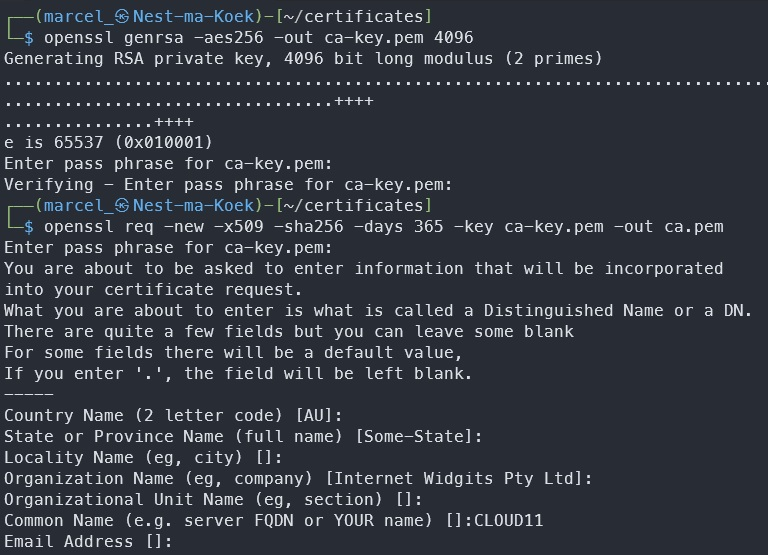

Let's see what the certificate looks like:
Important is that ``CA:True``.

```text
openssl x509 -in myCA.pem -text
```

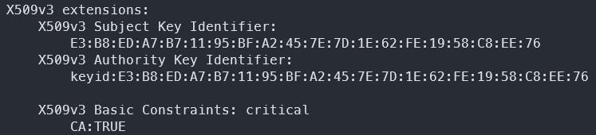
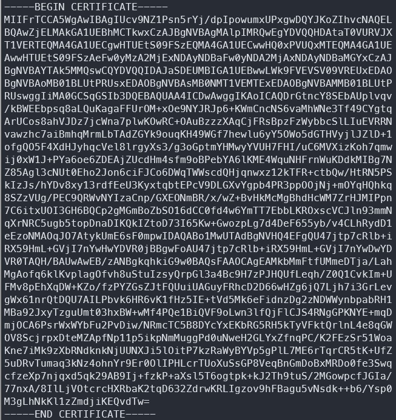

#### Generate a Digital Certificate

Now we going to create the certificate.  
We going to need a key again.
This will be a RSA key of 4096 bits.

```text
openssl genrsa -out cert-key.pem 4096
```

Then we create a Certificate Signing Request (CSR)
It will be encrypted with a HASH.  
The subject is my VN so ``-subj "/CN=myVN"``.  

```text
openssl req -new -sha256 -subj "/CN=myVN" -key cert-key.pem -out cert.csr
```

We need to add alternative names to work locally.

```text
echo "subjectAltName=DNS:127.0.0.53,IP:10.105.175.95" >> extfile.cnf
```

Finally we can create the certificate and check if it is ok. It will be a x509 certificate.

```text
openssl x509 -req -sha256 -days 365 -in cert.csr -CA ca.pem -CAkey ca-key.pem -out cert.pem -extfile extfile.cnf

openssl verify -CAfile ca.pem -verbose cert.pem
```

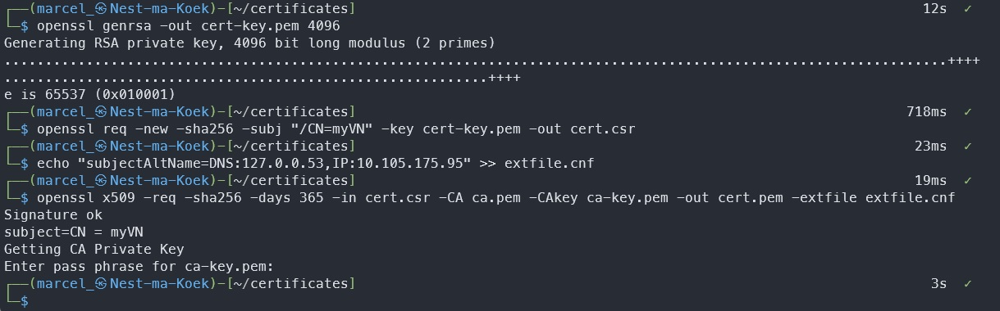

### Certification paths of known websites

In your browser left of the address bar there is a lock icon, if you click on it you can find information about the certificates.  
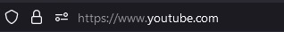
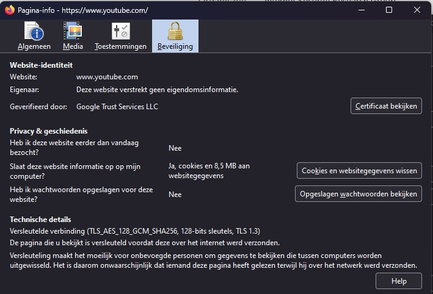  

The youtube certificate is part of the ``*.google.com`` certificate that has a pool over 100 DNS-Names. Youtube has 9 of those DNS-Names.  
The certificate is self has four layers: ``*.google.com`` -> ``GTS CA 1C3`` -> ``GTS Root R1`` -> ``GlobalSign Root CA``. The last one GlobalSign is one of the big players for SSL certificates.  
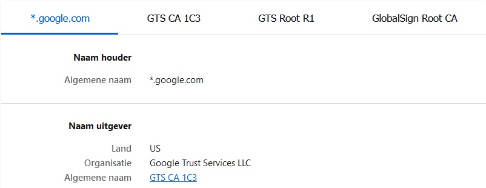

#### Google self signed certificate  

Scrolling down a bit we can see the first part has no CA permissions but can do `Digital Signatures` and `Server Authentication`.  

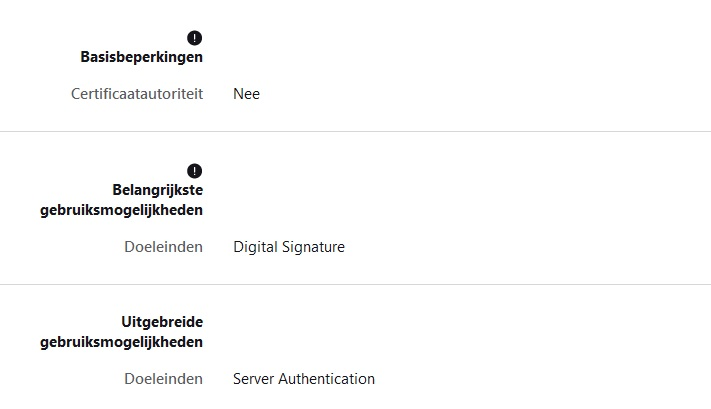

Their own CA `GTS CA 1C3` has rights be a CA and also do `Digital Signature`,`Certificate Signing`,`CRL Signing`,`Server Authentication`,`Client Authentication`.  

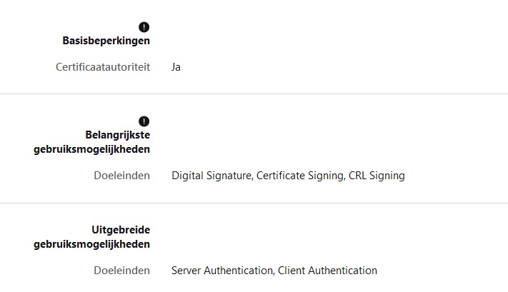

On all layers of the certificate you can see the Public key. This is defined by `Algorithm` `Key size` `Exponent` `Modulus`.

### List of trusted certificates (own pc/ vm)

For Windows 11 you can just write certificate in your search bar. There will be two options `Computer Certificates` and `User Certificates`.

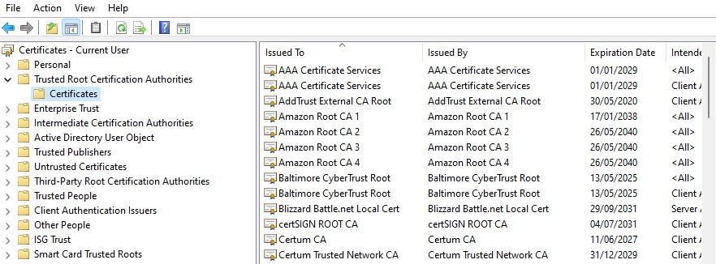

In Linux these are found in this directory:

```text
/etc/ssl/certs/
```

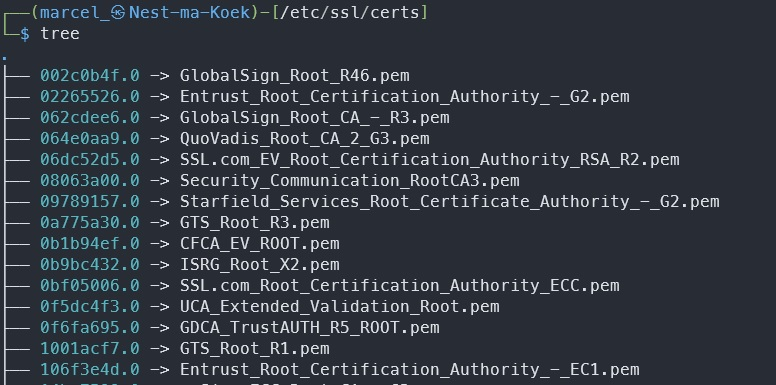

## Encountered problems

Tried to make my certificate work on apache but got off track so much, since that wasn't the assignment I stopped at making a certificate.  
