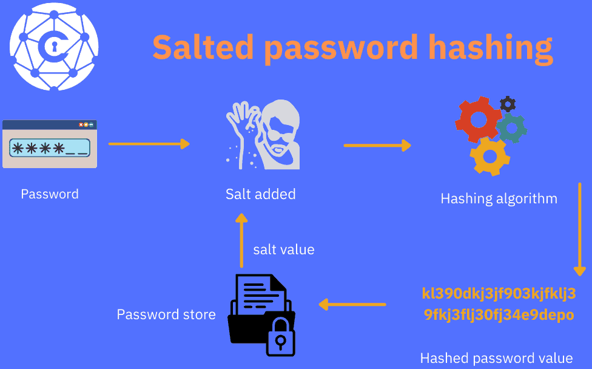
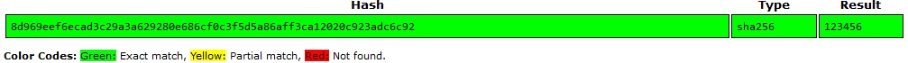
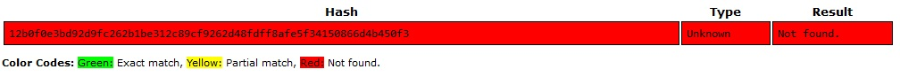
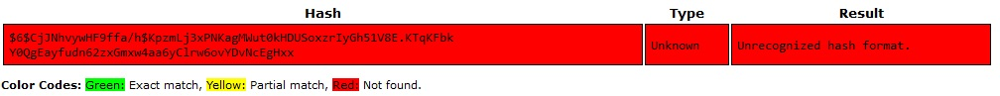

# [Passwords]

How to make passwords more secure?

## Assignment

- Find out what hashing is and why it is preferred over symmetric encryption for storing passwords.  
- Find out how a Rainbow Table can be used to crack hashed passwords.  
- Difference weak vs strong password
- Make a new user with weak password in Linux
- Compare SALTED passwords in Linux

### Key-terms

- HASH
- SALT
- Rainbow Table
- MD5, Message Digest 5
- SHA, Secure Hash Algorithm  

### Used Sources

https://www.thesslstore.com/blog/difference-encryption-hashing-salting/  

## Results

### What is a HASH

Where HASH differs from encryption is that it's a one-way function. Technically it is possible to reverse hash something though the raw computing power required makes it unfeasible.  The main function of hash is to verify data is authentic where encryption is meant to protect data in transit.  

Hashing algorithms out put a fixed length. SHA-256 out puts a hash of 256 bits and is usually represented by a 64 character hexadecimal string. 
Downside is that if two different files out put the same hash value there is a collision and makes this algorithm essentially useless.

```text
When a customer downloads the software, their browser is going to decrypt the file, then inspect the two unique hash values. The browser will then run the same hash function, using the same algorithm, and hash both the file and the signature again. If the browser produces the same hash value then it knows that both the signature and the file are authentic—they have not been altered.

If it’s not, the browser issues a warning. 
```

Some common hash algorithms:

- MD5, is a hashing algorithm used for authenticating messages, content verification and digital signatures. This is a 128 bit hash, it's known to suffer vulnerabilities.
- SHA, is a hashing algorithm used in most SSL/TLS cipher suites. Most current version is SHA-2 or also known as SHA-256. This is a 256 bit hash.
- RIPEMD, is a cryptographic hashing algorithm, variable length 128/160/320 bits. Mainly used for bitcoin and other cryptocurrencies based on bitcoin.  
- WHIRLPOOL, is a hashing algorithm that produces a 512bit hash, it's typically represented as 128 digit hexadecimal numbers.
- TIGER, is a fairly new hashing algorithm efficient on 64-bit platforms, mainly used for file sharing networks and torrents. It didn't have any security breeches yet with collisions. This is a 192 bit hash.  

### Rainbow table  

A Rainbow table is a database that is used to gain authentication by cracking the password hash. It is a precomputed dictionary of plaintext passwords and their corresponding has values. This is all based on common collisions made by a hash algorithm.  

### Why SALT a HASH

SALT is typically used for password hashing, it adds an unique value that can be added at the end of the password to create a different hash value. It adds an additional layer of security to the hashing process specifically against brute force attacks. Always use a different salt creating a new password otherwise hackers can use rainbow tables to brute force your salt. 



### Weak passwords vs Strong passwords

The strength of a password depends on the length, the use of Upper/lower case text and special characters.

Let's made a weak password: 123456  
And a strong password: KU8&s#E4iT4N*&9^@3&79u6wY$JFj^@v  

We hash both and put them in an online rainbow table.  



### Weak salted password  

We created Henk in Linux with password 123456.  
Let's loop up his password in /etc/shadow/  
Put the password in an online rainbow table.  



Linux stores passwords as a hash and adds a salt automatically.  

## Encountered problems

n/a  