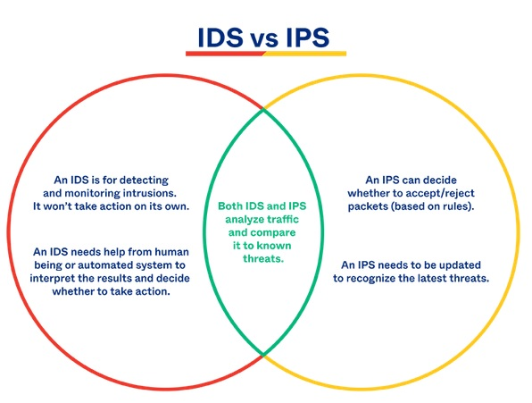
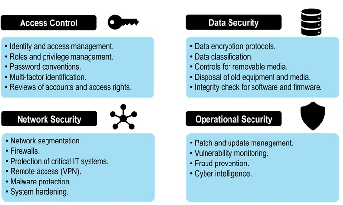

# [Detection, response and analysis]

When we are hit with a cyber-attack, how do we detect, respond and analyze what happened.  

## Assignment

- Study: IDS and IPS
- Study: Hack response strategies
- Study: The concept of systems hardening
- Study: Different types of disaster recovery options

- A Company makes daily backups of their database. The database is automatically recovered when a failure happens using the most recent available backup. The recovery happens on a different physical machine than the original database, and the entire process takes about 15 minutes. What is the RPO of the database?
- An automatic failover to a backup web server has been configured for a website. Because the backup has to be powered on first and has to pull the newest version of the website from GitHub, the process takes about 8 minutes. What is the RTO of the website?

### Key-terms

- Malware
- IDS, Intrusion detection systems
- IPS, Intrusion prevention systems
- RPO
- RTO

### Used Sources

https://www.okta.com/identity-101/ids-vs-ips/  
https://www.geeksforgeeks.org/what-is-system-hardening/  

## Results

### IDS and IPS

#### IDS

An IDS monitors the traffic on your network and analyzes that traffic for signatures matching known attacks. When something suspicious happens you will be alerted, in the meantime the traffic keeps flowing.  

There are 5 main types of IDS:

- Network: Choose a point in your network and examine all traffic on all devices from that point.
- Host: Examine traffic to and from independent devices within your network, and leave other devices alone.
- Protocol-based: Place protection between a device and the server, and monitor all traffic between them.  
- Application Protocol-based: Place protection within a group of servers and watch how they communicate with one other.
- Hybrid: Combine some of the approaches from above.  

How does it recognize:

- Patterns: it flags, unusual requests, large packet sizes.  
- Prior Attacks: it flags, anything on your server that been used in prior attacks
- Machine Learning: it learns from daily activity on your server to refine the protections in place. 

#### IPS

An IPS monitors the traffic on your network and analyzes that traffic for signatures matching known attacks. When something unusual happens, the traffic is stopped altogether until you investigate  and decide to open the floodgates again.  

There are 4 main types of IPS:

- Network: Analyze and protect traffic on your network.
- Wireless: Observer anything happening within a wireless network and defend from attacks launched from there. 
- Network Behavior: Stop attacks that involved unusual traffic on your network.
- Host-Based: Scan event that occur within a host you specify. 

#### IDS/IPS

Many companies combine these types of monitoring to have best of both. IPS could be active network security while IDS gives a deeper understanding of how traffic moves across your network.  

### Hack response strategies

--

### The concept of systems hardening

Simply put it is reducing the attack surface for hackers, thereby making a system more robust and secure.  

Different approaches to implement system hardening:

- Network segmentation: smaller segments are easier to manage and monitor.
- Access control: who has access to what and what actions can they take.  
- Intrusion prevention: implement IDS/IPS
- Encryption: encrypt data to prevent unauthorized access.

Benefits of system hardening:

- Secure system: less prone to cyber attacks due less exposed vulnerabilities.
- Enhance performance: removal of unimportant applications, lowers risk of system misconfiguration.
- Simplified system: Less programs make systems easier to use.  

### Different types of disaster recovery options

--

### Case1

---

### Case2

--

## Encountered problems

