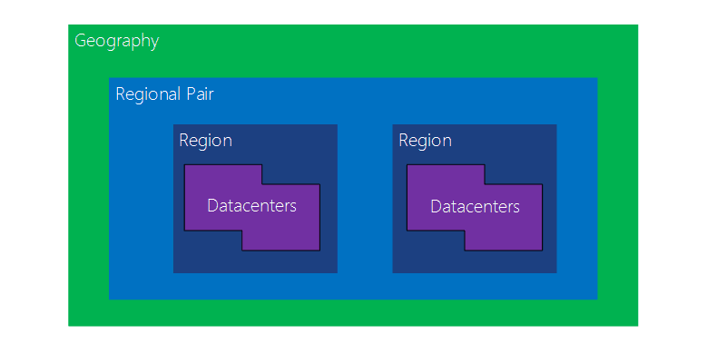
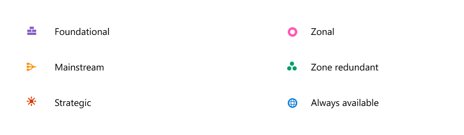

# [Azure Global Infrastructure]

How is Azure structured? Why is this beneficial?

## Assignment

Study:

- Azure Region
- Azure Availability Zone
- Azure Region Pair
- Why choose a region?

### Key-terms

- Data-Centers, Physical facility that hosts groups of networks and has it's own power/ cooling/ network infrastructure.
- Azure Regions, Group of data-centers connected with each other trough high throughput internet connectivity.  
- Azure Availability Zone, Region specific services.
- Azure Region Pair, Two regions 483km+ apart for disaster recovery.

### Used Sources

https://learn.microsoft.com/en-us/azure/reliability/availability-zones-overview 
https://www.youtube.com/watch?v=C-nNw1mGwzE

## Results

### Global Infrastructures

#### Geographies

Discrete market.  
Typically contains two or more regions.  
Ensure data residency, sovereignty, resiliency, and compliance requirements are met.  
Fault tolerant to protect from region wide failures.  
Broken up into areas: Americas, Europe, Asia Pacific, Middle east and Africa.  

#### Regions

Geographical area on the planet.  
One but usually more datacenters connected with low-latency network (<2 MS).  
Location for your services.  
Some services are available only in certain regions.  
Some services are global services.  
Globally 50+ regions.  
Special Government regions.  
Special partnered regions.  

#### Availability zones

Grouping of physically separated facilities.  
Designed to protect from datacenter failure.  
If a zone goes down others continue working.  
Zonal services (VM, Disks, etc.)  
Zone-redundant services (SQL, Storage, etc.)  
Not all regions are supported.  
Supported regions has three of more zones.  
A zone is one or more datacenters.  

#### Region pairs

Each region is paired with another region making it a region pair.  
Region pairs are static and cannot be chosen.  
Each pair resides within the same geography.  
Physical isolation with at least 483km distance.  
Some services have platform-provided replication.  
Planned updates across the pairs.  
Data residency maintained for disaster recovery.

#### Benefits of choosing a region

You can pick a region with lowest latency and pair it with regions that have services that are not available in your nearest region.  

## Encountered problems

No problems, this is well documented.
