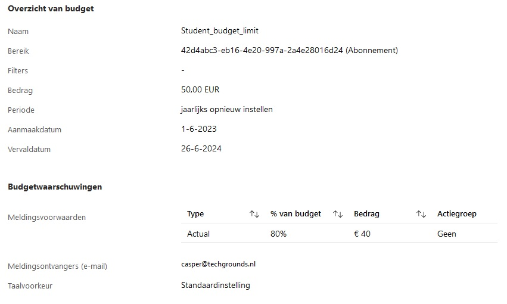
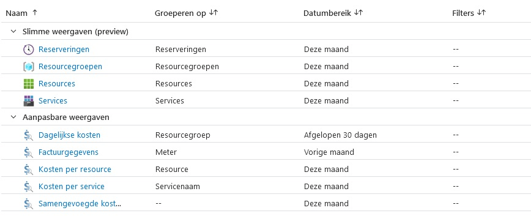

# [Cost Management + Billing]

How can we manage our expenses and budgets within Azure.

## Assignment

Study:

- Azure principles for cost management
- TOS for the "free subscription"
- Difference CAPEX and OPEX
- TOC calculator

- Make an alert to monitor your own expenses
- Understand the options that Azure has to offer for cost management.

### Key-terms

- TOS, Terms of Service
- ACM, Azure Cost Management
- TCO, Total Cost of Ownership  
- ROI, Return of Investment  
- CAPEX, Capital Expenditure
- OPEX, Operating Expenditure
- PaaS, Platform as a Service
- SaaS, Software as a Service
- IaaS, Infrastructure as a Service

### Used Sources

[MS Doc, cost principles](https://learn.microsoft.com/en-us/azure/well-architected/cost/principles)  
[MS Doc, cost alerts](https://learn.microsoft.com/en-us/azure/cost-management-billing/costs/cost-mgt-alerts-monitor-usage-spending)
[MS Doc, free account FAQ](https://azure.microsoft.com/en-us/free/free-account-faq)
[MS Doc, TCO calc](https://azure.microsoft.com/en-us/pricing/tco/calculator/)
[CapEX vs OpEX](https://securityboulevard.com/2021/01/capex-vs-opex-whats-best-for-it-budgeting/  )
[Youtube, Azure cost management](https://www.youtube.com/watch?v=7w88KBVesPI)  

## Results

### Azure cost management

Every business wants a ROI and drive a cost-efficient workload while you keep to your given budget. It is very important to know where your money goes and adjust it accordingly to your needs. Azure some principles in their well-architected-framework.  

Choose resources aligned with business goals and workload performance.

- Explore modernization and cloud native options like PaaS or SaaS.
- PaaS and SaaS are typically more cost-effective than IaaS.

Be mindful of cost implications and set budgets:

- Consider budget constraints when making design choices.
- Define acceptable boundaries for scale, redundancy, and performance.

Dynamically allocate and de-allocate resources:

- Match performance needs by adjusting resource allocation.
- Identify and handle idle or underutilized resources.

Optimize workloads for scalable costs:

- Leverage the cloud's dynamic scaling capability.
- Workload cost should scale linearly with demand.
- Utilize automatic scaling to save costs.

Recommendations for workload optimization:

- Use usage metrics and performance to determine the required number of instances.
- Choose smaller instances for highly variable workloads.
- Scale out (horizontally) rather than up (vertically) for performance needs.

Cost management process:

- Approach cost management rigorously and iteratively.
- Responsible cloud optimization requires diligent cost monitoring.

Continuously monitor and optimize cost management:

- Conduct regular cost reviews.
- Measure and forecast capacity needs to provision resources accordingly.

### Free subscription

New first time users of Azure can set up for a free subscription. It requires a valid credit card to verify your identity, you won't be charged until you upgrade your subscription.  

It comes with certain usage limits, that vary based on the service. Make sure to say within these limits to avoid charges and comply to the Azure TOS.  

### CAPEX vs OPEX

CAPEX: Capital Expenditure, This is when a company spends money on buying or upgrading long-term assets. It can be a building, equipment, or technology that will be used for an extended amount of time.  

OPEX: Operational Expenditure, This is when a company spends money on daily base for reoccurring costs. It can be, employer salary, rent, utilities, office supplies, marketing expenses. These are necessary to keep an business functioning.  

### TCO Calculator

This is a tool to define your current workloads and adjust them to see where you can save costs.

- Define your workloads
- Adjust Assumptions
- View Report

### Making a cost alert

You can make a cost alert in Azure, write Cost Management in the search bar at the top. It is used to monitor usage and spending.

- Budgets Alerts, defined by cost-based and/or usage-based budgets.  
- Credit Alerts, alert if you are near or exceeding your Azure pre payment credit.
- Department spending quota alerts, can be set on a certain % of quota used or left.  

### Options to view your expenditures

There are a few options available.  

- Resources groups per month
- Resources per month
- Services per month
- Daily costs
- Costs per resource per month
- Costs per service per month

## Encountered problems

Apart from the Azure interface I'm not use to there where no problems.  
