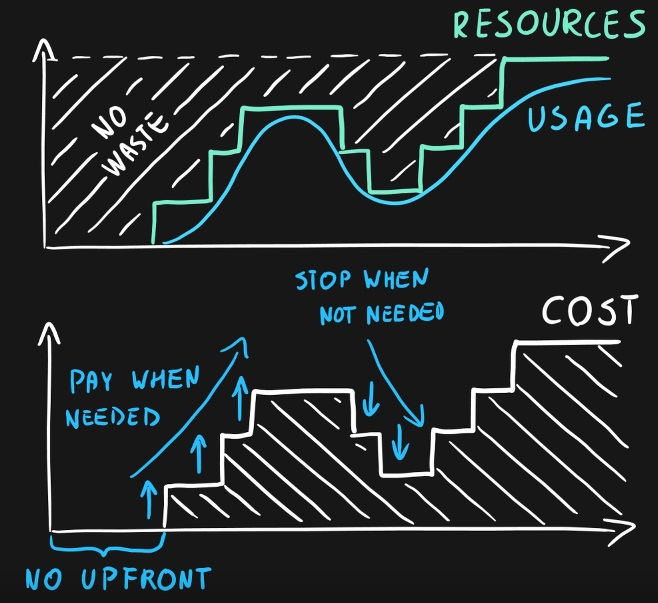

# [Advantages of the cloud]

Why would we use the cloud?

## Assignment

Study:

- The 6 advantages of the cloud
- The consumption-based model

### Key-terms

- Scalability
- Elasticity
- Agility
- Geo-Distribution
- Disaster Recovery

### Used Sources

[MS Doc, cloud migration](https://azure.microsoft.com/en-us/resources/cloud-computing-dictionary/benefits-of-cloud-migration/#benefits)  
[Google Doc, disaster recovery](https://cloud.google.com/learn/what-is-disaster-recovery)  
[Youtube, Consumption based model](https://www.youtube.com/watch?v=NdqncsMtryY)  

## Results

### The 6 advantages of the cloud

#### High Availability  

Due the cloud regions there is a computing infrastructure that allows to continue functioning , even when certain components fail. There will be a 24/7 uptime.  

#### Scalability

The cloud has the ability to increase workload size within existing infrastructure (hardware, software, etc.) without impacting performance.

#### Elasticity  

The cloud elasticity focuses on the ability to automatically scale resources based on demand. This helps you to optimize your resources and reduce costs, while still ensuring that your applications have the resources they need to run smoothly.

#### Agility

The cloud agility focuses on the speed and ease of allocating and de-allocating resources. This allows for vast amounts of computing resources to be provisioned in a matter of minutes, making it easier for you to respond to changing business needs.

#### Geo-Distribution

The cloud is not location bound, services can be loaded from the nearest location to the user.  

#### Disaster recovery

The cloud disaster recovery is a portfolio of policies, tools, and processes used to recover or continue operations of critical IT infrastructure, software, and systems after a natural or human-made disaster.  

### Consumer based model

You're charged for only what you use. This model is also known as the pay-as-you-go rate. User a service for a minute? pay for a minute.  

- No upfront cost.
- No wasted resources.
- Pay additional resources when needed.
- Multiple pricing per components per service.
- Very granular usage measurement.  

## Encountered problems

No problems, most subjects where touched a bit in the 1st assignment.
