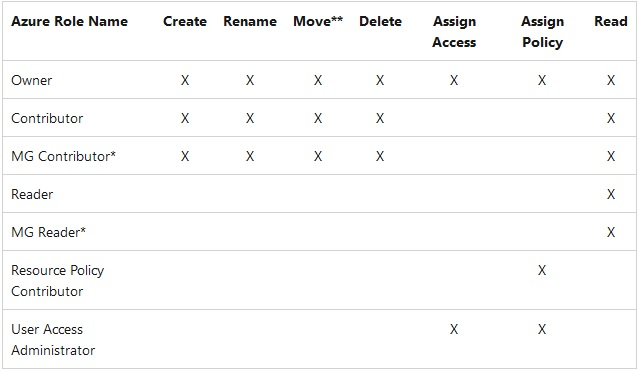

# [Azure Core Services]

```text
WORK IN PROGRESS
```

What are some core services used frequently in Azure?

## Assignment

- Study the AZ900 exam guide.

### Key-terms

- Regions and Region Pairs
- Availability Zones
- Resource Groups
- Subscriptions
- Management Groups
- Azure Resource Manager
- Virtual Machines
- Azure App Services
- Azure Container Instances (ACI)
- Azure Kubernetes Service (AKS)
- Azure Virtual Desktop
- Virtual Networks
- VPN Gateway
- Virtual Network Peering
- ExpressRoute
- Container (Blob) Storage
- Disk Storage
- File Storage
- Storage Tiers
- Cosmos DB
- Azure SQL Database
- Azure Database for MySQL
- Azure Database for PostgreSQL
- SQL Managed Instance
- Azure Marketplace

### Used Sources

Read a lot of learn Microsoft pages and then made ChatGPT simplify them to their core essence.  
Links are within the corresponding headers.  

## Results

### Core Services Azure

#### Regions and Region Pairs

Geographical area on the planet.  
One but usually more datacenters connected with low-latency network (<2 MS).  
Location for your services.  
Some services are available only in certain regions.  
Some services are global services.  
Globally 50+ regions.  
Special Government regions.  
Special partnered regions.  

Each region is paired with another region making it a region pair.  
Region pairs are static and cannot be chosen.  
Each pair resides within the same geography.  
Physical isolation with at least 483km distance.  
Some services have platform-provided replication.  
Planned updates across the pairs.  
Data residency maintained for disaster recovery.

[Assignment 01](../02_Cloud_1/AZ-01%20Global%20Infrastructure.md)

#### Availability Zones

Grouping of physically separated facilities.  
Designed to protect from datacenter failure.  
If a zone goes down others continue working.  
Zonal services (VM, Disks, etc.)  
Zone-redundant services (SQL, Storage, etc.)  
Not all regions are supported.  
Supported regions has three of more zones.  
A zone is one or more datacenters.  

[Assignment 01](../02_Cloud_1/AZ-01%20Global%20Infrastructure.md)

#### Resource Groups

A Resource group is like a container for organizing and managing related resources. It allows you to group together the resources that are part of your Azure solution.

[MS Doc, Resource group](https://learn.microsoft.com/en-us/azure/azure-resource-manager/management/manage-resource-groups-portal)

#### subscriptions

#### Management Groups

A Hierarchical management for groups, it is role-based.

  
[MS Doc, management groups](https://learn.microsoft.com/en-us/azure/governance/management-groups/overview)

#### Azure Resource Manager

Azure Resource Manager simplifies management and deployment of Azure resources, promotes infrastructure as code practices, and provides a robust foundation for building and managing applications in the Cloud.

- Simplified Resource Management, resources groups, manage all as single identity
- Template-based deployment, Define infrastructure as code allows to create templates
- Dependency and ordering management, ARM knows dependencies between resources to ensure they are deployed in the correct order.  
- Role-based access control, integrates with Azure Active Directory this allows managed access and permissions via user roles and groups.  
- Monitoring and diagnostics, ARM has a build-in monitoring and diagnostics capability. 

[MS Doc, Azure Resource Manager](https://learn.microsoft.com/en-us/azure/azure-resource-manager/management/overview)

#### Virtual Machines

It is a software emulation of a physical computer that runs an OS and applications.  

#### Azure App Services

It is a fully managed platform provided by MS Azure for building, deploying and scaling web and mobile applications. There is a range of services and capabilities that simplify the processes of developing and hosting applications without the need for managing underlying infrastructure.  

[MS Doc, Azure App Services](https://learn.microsoft.com/en-us/azure/app-service/overview)

#### Azure Container Instances (ACI)

ACI simplifies container deployment and management by abstracting away the infrastructure complexities. It offers fast startup times, flexible scaling, and integration with other Azure services. Very easy and efficient.

[MS Doc, Azure container instances](https://learn.microsoft.com/nl-nl/azure/container-instances/container-instances-overview)

#### Azure Kubernetes Service (AKS)

AKS simplifies the management and deployment of containerized applications using Kubernetes. It handles the underlying infrastructure, integrates with other Azure services, and provides a robust platform for running and scaling container workloads. 

Kubernetes simplifies the management and orchestration of containers.

[MS Doc, Azure kubernetes Services](https://learn.microsoft.com/en-us/azure/aks/intro-kubernetes)

#### Azure Virtual Desktop

AVD simplifies the deployment and access of virtualized windows desktops and applications in the cloud. It offers flexibility, scalability and remote access capabilities. This allows users to access their desktops and apps from anywhere while providing organizations with centralized management and enhance security. 

[MS Doc, Azure virtual desktop](https://learn.microsoft.com/en-us/azure/virtual-desktop/overview)

#### Virtual Networks

VN are isolated network environments that are similar to how you would set up a network on-premise. You can define your own IP addressing ranges, subnets, and network security rules to establish secure communications between resources.

[MS Doc, Virtual Networks](https://learn.microsoft.com/en-us/azure/virtual-network/virtual-networks-overview)

#### VPN Gateway

With a VPN Gateway you can securely connect your on-premise network to Azure, enabling seamless communication between your local resources and cloud-based applications. It simplifies the proceed of establishing secure VNP connections and provides reliable and scalable solution for hybrid network scenarios.  

[MS Doc, VPN Gateway](https://learn.microsoft.com/nl-nl/azure/vpn-gateway/vpn-gateway-about-vpngateways)

#### Virtual Network Peering

With VNP you can easily connect and integrate resources across VN, improving network performances and simplify network administration.  

[MS Doc, VN Peering](https://learn.microsoft.com/en-us/azure/virtual-network/virtual-network-peering-overview)

#### ExpressRoute

With ExpressRoutes you can establish a dedicated and private connection between your on-premise network and Azure, enabling seamless integration and secure data transfer.  

[MS Doc, ExpressRoute](https://learn.microsoft.com/nl-nl/azure/expressroute/expressroute-introduction)

#### Container (Blob) Storage

With Blob storage you can store your unstructured data in the cloud, simplify data access and integration with other Azure Services, and ensure data durability and availability.  

[MS Doc, Blob](https://learn.microsoft.com/en-us/azure/storage/blobs/storage-blobs-introduction)

#### Disk Storage

This is an emulation of a SSD or HHD in the cloud.  

- Managed Disc, allows easily attach and manage disk storage for VMs in Azure, without worrying about the underlying infrastructure.  

[Assignment 05](../02_Cloud_1/AZ-05%20Storage%20Account.md)

#### File Storage

This is like a blob but in the sense of a shared network folder. You store files via shared drive protocols. It can be used to extend on-premise file share or implement lift and share scenarios. The latter is used to take full advantage of native-cloud features.

[Assignment 05](../02_Cloud_1/AZ-05%20Storage%20Account.md)

#### Storage Tiers

There are 4 storage tiers

- Hot, an online tier optimized for storing data that is accessed or modified frequently. The hot tier has the highest storage costs, but the lowest access costs
- Cool, an online tier optimized for storing data that is infrequently accessed or modified. Data in the cool tier should be stored for a minimum of 30 days. The cool tier has lower storage costs and higher access costs compared to the hot tier
- Cold, An online tier optimized for storing data that is infrequently accessed or modified. Data in the cold tier should be stored for a minimum of 90 days. The cold tier has lower storage costs and higher access costs compared to the cool tier
- Archive, An offline tier optimized for storing data that is rarely accessed, and that has flexible latency requirements, on the order of hours. Data in the archive tier should be stored for a minimum of 180 days

[MS Doc, Storage tiers Blob](https://learn.microsoft.com/en-us/azure/storage/blobs/access-tiers-overview?tabs=azure-portal)

#### Cosmos DB

Cosmos DB is a database service that allows you to store and access data in a flexible and scalable manner. It supports multiple data models, including: document, key-value, graph, and column-family.

#### Azure SQL Database

#### Azure Database for MySQL

#### Azure Database for PostgreSQL

#### SQL Managed Instance

#### Azure Marketplace

## Encountered problems
