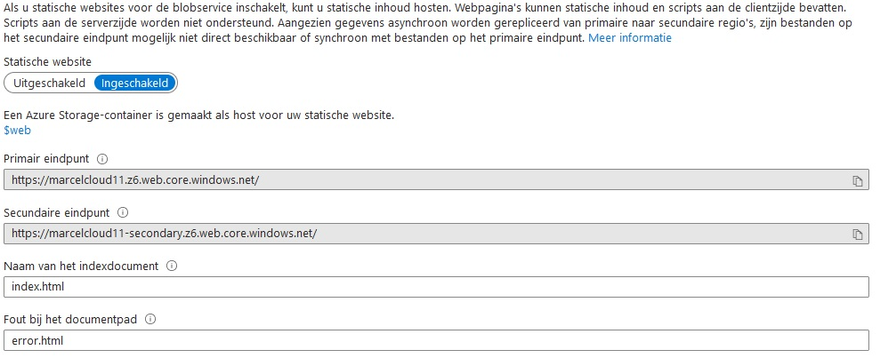

# [Azure Storage Account]

How to create a storage account and why do you want one.

## Assignment

- Create a storage account only you can access. Add a file online and retrieve a file via Azure Storage Exchange. 
- Create a new container, upload the AWS web demo files into the container. Enable Static Web hosting.

### Key-terms

- Azure Storage Explorer
- Container
- Static Website hosting

### Used Sources

  
  

## Results

### Types of storage

This is defined in 3 different ways.

- Structured.  
-- SQL

- Semi-Structured.  
-- NoSQL

- No Structure.  
-- Native format

#### BLOB containers

BLOB or Binary large Object, is a form of storage for any kind of data. It is optimized for massive amounts of unstructured data, 

Three tiers:

- Hot, frequently accessed data
- Cold, infrequently accessed data
- Archive, rarely access data (back ups for example)

#### Azure Que Storage

This is used for small pieces of data called messages, up to 64KB in size. It's commonly used to create a backlog of work to process asynchronously.  

#### Azure Table Storage

Here you can store semi-structured data. There's no need for foreign joins, foreign keys, relationships or strict schema. It is designed for fast access.  

#### Azure File Storage

This is like a blob but in the sense of a shared network folder. You store files via shared drive protocols. It can be used to extend on-premise file share or implement lift and share scenarios. The latter is used to take full advantage of native-cloud features.  

#### Azure Disc Storage

We can emulate discs here like a VM. This is persistent storage for VMs, with different sizes, types (SSD,HDD), performance tiers.  

Two types, unmanaged and managed disks.  

#### Azure Storage Account

It is a collection of services: Blob storage, queue storage, table storage, and file storage.  

This service has very high scalability up to petabytes of data, that is 1024Tb of storage. Roughly equal to 500 billion pages of printed text.  

As well as high durability (99.999999999%)

### Assignment 1  

#### Creating a Azure Storage Account

In the search bar type storage and select the storage account, here we can create a new storage account by clicking on ``+ create``.

We need to select:  

- The correct subscription  
- Name your container or choose an existing one.  
- A unique name for our resource group (world wide unique),  
- Select the region best fit for you, it's West Europe in my case.  
- The rest we leave on default

On the next pages I left everything on default as I don't know what all settings do.

#### Creating a container  

Got to your newly made storage account. In the side menu we click container and add a new one with ``+ container``.  


Now we can open the container and upload an image by clicking upload and drag an image to the `drop image here box`.  

By installing Azure Storage Explore and logging in with that. We can see all the things we just created and download items when ever needed.  


#### Assignment 2

We need to enable static web hosting by searching for web while in our storage account. Now we can select static web site and press on enable. Now we can add index.html at index and error.html at error.  

This created the ``$web`` container, we just need to set this to pubic blob and then we can upload the webpages from our zip file here.  

Now I got my own static website.  

```text
https://marcelcloud11.z6.web.core.windows.net/
```



All my peers can access the website.

## Encountered problems

No problems encountered.