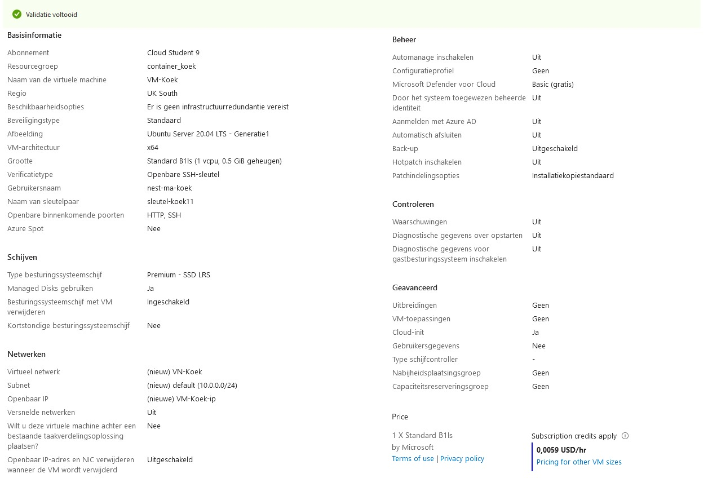
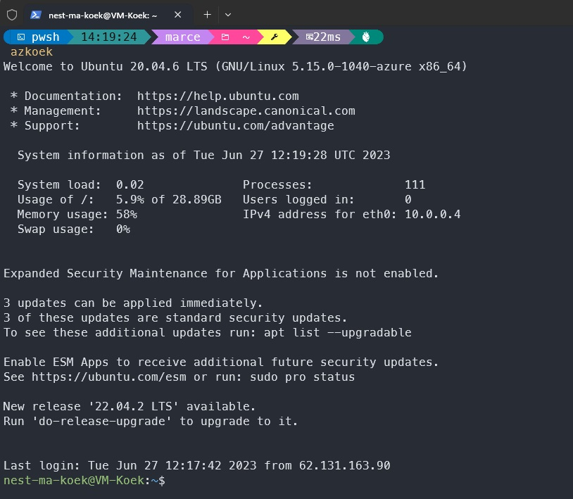

# [Azure Virtual Machines]

How can we create our own VM's within Azure?

## Assignment

- Create a VM in the cloud

### Key-terms

- n/a  

### Used Sources

Followed the assignment document.

## Results

### Creating the VM

Go to your resource group and there you can click on ``+ Create``, now we are in a list and search for Ubuntu server 20.04 LTS and press create.  

Basic information:

- Change image to Gen 1
- Change storage to Standard-B1ls
- Change incoming ports: HTTP(80), SSH(22)

Disk:

- Standard SSD

Network:

- create a new VN

management, control:

- Default

Advanced:  

- Change custom data to:

```text  
#!/bin/bash
sudo su
apt update
apt install apache2 -y
ufw allow 'Apache'
systemctl enable apache2
systemctl restart apache2
```



Now we can make the VM and check if it works. Made a login function for pwsh.



## Encountered problems

No problems encountered, just took a bit to navigate to set all settings correctly for the VM. Noticed it went down from $90 to $4.30, that is a fair difference.
