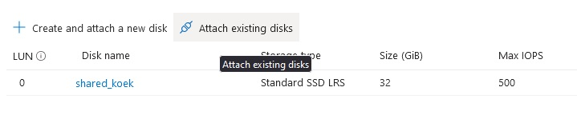
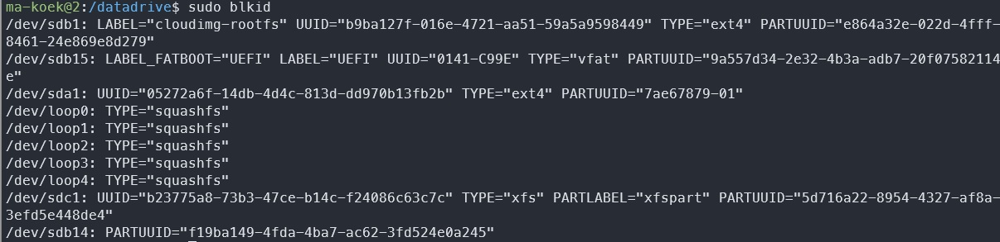
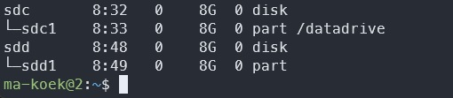
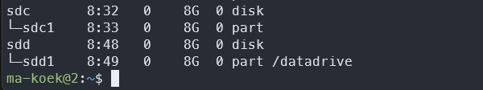

# [Azure Disk Storage]

How to make new disks and attach them to your VM. 

## Assignment

- Start 2 VM via SSH.
- Create an Azure Disc Management, connect to both VM.

### Key-terms

- Azure Disc Management
- Snapshot
- Mounting
- lsblk, lists information about all available or the specified block devices  


### Used Sources

[MS Doc, attach disks VM](https://learn.microsoft.com/en-us/azure/virtual-machines/linux/attach-disk-portal?tabs=ubuntu) 

## Results

### Mount the new disk

Create a managed disc by searching ``Azure Managed Disks`` in the marketplace. Now we can create a managed disk and connect it to our VM. Go to your VM and click on disk, here we can add an existing disk.



After attaching the disk on both our VM, we need to mount the disk in both VMs.  
To find the disk in Linux we need to do the following command, it's normally listed as ``sdc``.

```bash
lsblk -o NAME,HCTL,SIZE,MOUNTPOINT | grep -i "sd"
```

When using a disk for the first time we need to format it before we can use it and set it to the correct sdc. This is only done on the first VM where you mount the disk, you can skip it for the 2nd VM.

```bash
sudo parted /dev/sdc --script mklabel gpt mkpart xfspart xfs 0% 100%
sudo mkfs.xfs /dev/sdc1
sudo partprobe /dev/sdc1
```

Now to make a new folder and mount the disk.

```bash
sudo mkdir /shared_koek
sudo mount /dev/sdc1 /shared_koek
``` 

To make it a permanent mount we need to find the UUID from the partition. This can be done by writing ``sudo blkid``, it is block-id. 



Now we just need to add it to the FSTAB file to make it persist trough restarts. 

```bash
echo "UUID=b23775a8-73b3-47ce-b14c-f24086c63c7c   /shared_koek   xfs   defaults,nofail   1   2" >> /etc/fstab
```

### Sharing a file

This took a bit to figure out as there was no explanation (or we looked at the wrong place) in de MS documentation.

You can change the directory's permissions or use sudo to make/change every file. First we need to make a new file, so I made a ``touch randomtest.txt`` then added some text ``echo "dit is een test" >> randomtest.txt``.  

It took me and Jeroen a bit to figure this out, but there is a delay due the file has to be uploaded. To see it updated on the other VM you need to ``sudo umount /dev/sdc1`` and then ``sudo mount /dev/sdc1``, works normally after a minute or so. 

### Snapshot a disk and create a new one

Created a snapshot from my original disk, and via the snapshot I created a new disk.
It seems that all behavior we installed on the original disk is copied completely.  
We can't mount both together since they got the same UUID.  




## Encountered problems

Took a while before finding out how to get the shared disk updated on VM2. Apparently you need to umount and mount the partition again to see an update, however this can't be done instant as the file is still being uploaded to the shared disk.
