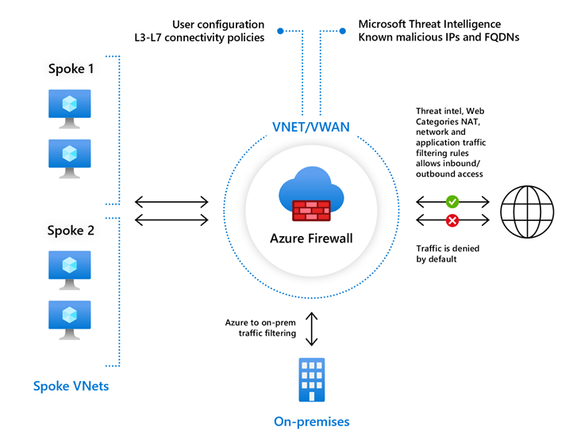
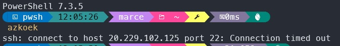

# [Firewalls]

How to make our cloud services more secure via a firewall.

## Assignment

Study:

- Difference between basic and premium firewall
- Difference firewall and firewall policy
- What can Azure Firewall do more than a regular firewall
- Difference between Azure Firewall and NSG

- Block port 22 (SSH) with NSG in your VN

### Key-terms

- Firewall
- Firewall Policy
- Azure Firewall Manager
- FQDN, Fully Qualified Domain Name
- IDPS, A network intrusion detection and prevention system.
- AVN, Azure Virtual Network
- NSG, Network Security Group
- ASG, Application Security Group

### Used Sources

  
  

## Results

### Difference between basic and premium firewall

#### Basic

- L3-L7 Filter (OSI Layers)
- Microsoft Threat Intelligence Known malicious IPs and FQDNs (alert only)

#### Premium

- IDPS, fast detection via specific pattern recognition.
- TLS Inspection
- URL Filtering
- Web Catagories

### Difference firewall and firewall policy

#### Firewall

- Set per firewall
- For Local Policies / child policies
- NAT configuration
- Rules specific for environment in addition to parent policies.

#### Firewall Policy

- Set at Azure Firewall Manager
- For Global Policies / Parent policies
- Higher in the hierarchy
- Automatically update child policies when updating parent.

### What can Azure Firewall do more than a regular firewall

Azure Firewall is a cloud-native and intelligent service. It's fully statefull, firewall as a service with built-in high availability and unrestricted cloud scalability.

Where a normal firewall you install on your OS needs regular updates and isn't intelligent most of the time. 

### Difference between Azure Firewall and NSG

#### Azure Firewall

- Managed, cloud-based firewall service (PaaS, Firewall as a Service)
- Built-in high availability
- Highly scalable
- Inbound & outbound traffic filtering rules
- Support for FQDN, fully qualified domain name
- Fully integrated with Azure monitor for logging and analytics

#### NSG

- Designed to filter traffic to (inbound) and from (outbound) Azure resources located in AVN.
- Filtering controlled by rules
- Ability to have multiple inbound and outbound rules
- Rules are created by specifying:
-- Source/Destination  (IP address, service tag, application security groups)
-- Protocol  (TCP, UDP, etc..)
-- Port  (por port ranges)
-- Direction (in- or outbound)

#### ASG

- Grouping of VM located in AVN
- Reduced maintenance effort (Assign ASG instead of explicit IP Address)

### Assignment 1

I've created a new VM to connect to via SSH with a running apache server for web hosting. Created a NSG within my VN and added rules to block SSH traffic, so I can't connect to my VM but can still visit the website running on apache.  

Found the NSG via market place and ticking the box with Azure services only. After the set up (was only selecting right resource group and give it a name). I can enter the NSG and add inbound and outbound rules for my resource group.  

  
  
  
  

## Encountered problems

The VM was created with it's own NSG, somehow couldn't over rule that so re-made the VM without a default NSG. 