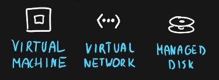

# [Shared Responsibility Model]

What are your responsibilities using the Azure services?

## Assignment

Study:

- ASR, Azure Shared Responsibility model

### Key-terms

- SaaS, Software as a Service
- Paas, Platform as a Service
- IaaS, Infrastructure as a Service
- On-premises

### Used Sources

[MS Doc, Shared Responsibilities](https://learn.microsoft.com/en-us/azure/security/fundamentals/shared-responsibility)  
[Youtube, IaaS vs PaaS vs SaaS](https://www.youtube.com/watch?v=9CVBohl6w0Q)  

## Results

### On-Premise

- Cloud provider manages infrastructure  
-- Nothing  

- You manage infrastructure, platform and software  
-- Infrastructure, Networking + Hardware + Virtualization  
-- Platform, OS + Middleware + Runtime  
-- Software, Data + Applications  

### IaaS vs PaaS vs SaaS

#### IaaS

- Cloud provider manages infrastructure  
-- Infrastructure, Networking + Hardware + Virtualization  

- You manage platform and software  
-- Platform, OS + Middleware + Runtime  
-- Software, Data + Applications  

Use cases:  

- Migration of workloads  
- Test & Development  
- Storage, Backup & Recovery  

  
  

#### PaaS

- Cloud provider manages infrastructure & platform  
-- Infrastructure, Networking + Hardware + Virtualization  
-- Platform, OS + Middleware + Runtime  

- You manage platform and software  
-- Software, Data + Applications  

Use cases:

- Development framework  
- Analytics & business intelligence  

  
  

#### SaaS

- Cloud provider manages infrastructure, platform & Software  
-- Infrastructure, Networking + Hardware + Virtualization  
-- Platform, OS + Middleware + Runtime  
-- Software, Data + Applications  

- You manage platform and software  
-- Nothing  

Use cases:  

- Buying of-the-shell applications

  
  

#### Differences

**SaaS you got the least responsibilities.**

Your responsibilities:

- Information and Data  
- Devices
- Accounts and Identities

Shared responsibilities:

- Identity and directory infrastructure

**PaaS you got additional responsibilities over SaaS.**

Shared responsibilities:

- Applications
- Network controls

**IaaS you got additional responsibilities over PaaS.**  

Your responsibilities:

- Identity and directory infrastructure
- Applications  
- Network controls
- OS

## Encountered problems

n/a
