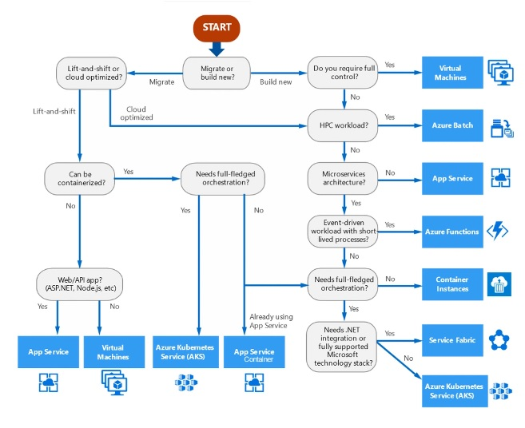
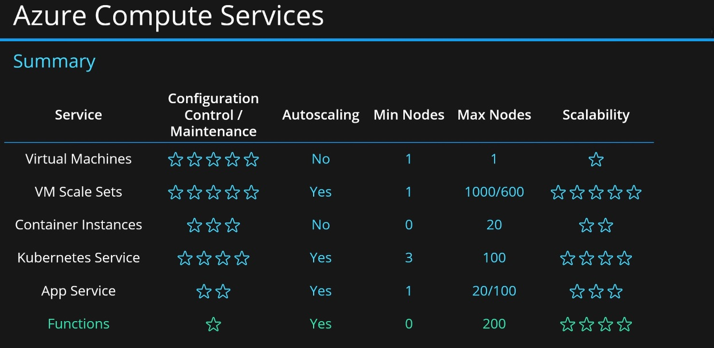
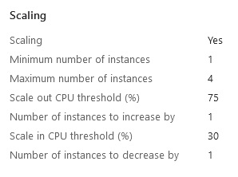
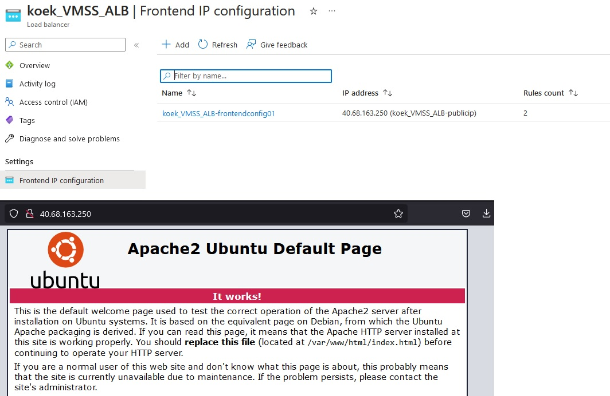
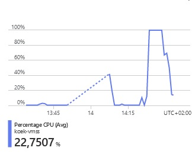
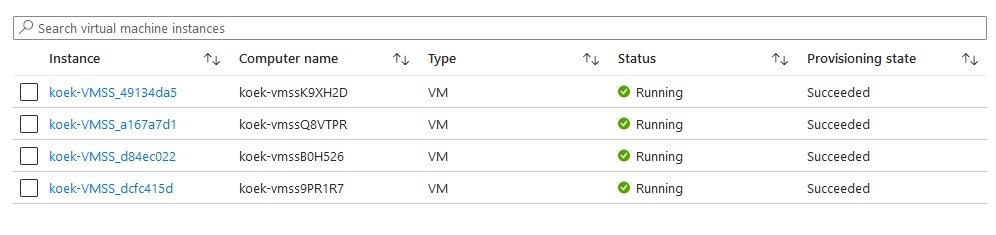

# [Azure Load Balancer (ALB) & Auto Scaling]

What if our services get overloaded and we need to scale up?

## Assignment

- Create a VM Scale Set
- Check if you can reach the web server via the endpoint

### Key-terms

- ALB, Azure Load Balancer work on OSI Layer 4
- Application Gateway, OSI Layer 7 load balancer
- Autoscaling
- VMSS, VM Scale Set
- Spiky workload
- Image
- Azure Monitor

### Used Sources

[MS Doc, Azure Load Balancer](https://learn.microsoft.com/en-us/azure/load-balancer/load-balancer-overview)  
[MS Doc, Application Gateway](https://learn.microsoft.com/en-us/azure/application-gateway/overview)  
[MS Doc, VM Scale Sets](https://learn.microsoft.com/nl-nl/azure/virtual-machine-scale-sets/overview)  
[MS Doc, VM Scale Sets, Azure CLI commands](https://learn.microsoft.com/nl-nl/cli/azure/vmss?view=azure-cli-latest)  
[MS Doc, VM Scale Sets, set-up](https://learn.microsoft.com/nl-nl/azure/virtual-machine-scale-sets/flexible-virtual-machine-scale-sets-portal)  
[Youtube, AZ900 Compute Services](https://www.youtube.com/watch?v=inaXkN2UrFE)  

## Results

### Azure Computer Services

- Virtual Machines (IaaS)  
-- Custom software, custom requirements, very specialized, high degree of control  
- VM Scale Sets (IaaS)  
-- Auto-scaled workloads for VMs  
- Container instances (PaaS)  
-- Simple container hosting, easy to start  
- Kubernetes Services (PaaS)  
-- Highly scalable and customizable container hosting platform.  
- App Services  
-- Web applications, a lot of enterprise web hosting features, easy to start  
- Functions (PaaS)(Function as a Service)(Serverless)  
-- micro/nano-services, excellent consumption-based pricing, easy to start  




### What is Azure Load Balancer

- OSI Layer 4 (incoming web traffic, TCP/UDP)  
- Single point of contact for clients  
- Distributes inbound flows from frontend to backend pool instances  
- Backend pool can be VM or VM Scale sets  
- High availability  
- low latency and high throughput  
- scales up to millions of flows for all TCP / UDP applications  

- Public load balancer:  
-- outbound connections for VM inside your virtual network  
-- translating private IP to public IP  
-- load balances internet traffic to your VM  

- Internal (or Private) load balancer  
-- used when private IPs are needed at the front end only  
-- load balance inside the virtual network  

- Key scenarios to use a load balancer:  
-- Load balance internal and external traffic to a Azure VM  
-- Increase availability by distributing resources within and across zones  
-- Configure outbound connectivity for Azure VM  
-- Uses Health probes to monitor load-balanced resources (Protocol, Port, Interval)  
-- Port forwarding to access VM in a virtual network by public IP address and port  
-- Standard load balancers has multi-dimensional metrics trough Azure Monitor  
-- Load balances services on multiple ports, IP addresses or both  
-- Move internal and external load balancer resources across regions  
-- Chain standard and Gateway load balancers  

- Security  
-- Based on zero trust network security model
-- Secure by default and part of your virtual network
-- Standard load balancer and public IP are closed to inbound connections, unless opened with a NSG  
-- Basic load balancer is open to internet by default  
-- Load balancer doesn't store customer data  


### Application Gateway

- Web traffic load balancer to manage web applications
- OSI Layer 7 instead of 4
- Route traffic based on source IP address and port, to destination IP/Port
- Routing decisions based on additional attributes of HTTP requests  
-- URI path (starting with server URL and ending with the source ID, an image or video for example) 
-- Host Headers  


example: an URL includes /images it can be routed to a specific set of servers (pool) configured for images. If /video is in the URL, that traffic is routed to an other pool specific for videos.  


- Key Features
-- Terminator SSL/TLS, traffic can flow unencrypted to the backend servers
-- Auto Scaling
-- Zone Redundancy
-- Static VIP (Virtual IP address)
-- WAF (Web Application Firewall)
-- URL based routing
-- Multiple-site hosting (100+ website per application gateway, redirect to their own backend pool)
-- Auto HTTP to HTTPS redirecting 

- Security  
-- Protect your applications against L7 DDoS using Web Application Firewall (WAF)
-- Privately connect to your backend behind Application Gateway with private link (Zero Trust Model)
-- Eliminate risk of data exfiltration and control privacy of communication from within the VN with a fully private-only application gateway deployment

### What is a VM Scale Set

- VMSS is IaaS
- Grouping set of identical VM (via images)  
- Supports Azure Load Balancer and Azure Application Gateway  
- Easy to create and manage multiple VMs  
- High availability and durability (scale over an availability zone)  
- Auto scaling based on demand (increase/decrease amount of VMs)  
- Designed for manual and auto-scaled workloads like web services, batch processing, etc.  

## Assignment 1

For setting up a VMSS we need to set up a few things making the VMSS:  

- Vnet  
- NSG  
- Load balancer  

In the VMSS we want a few setting:  

- Ubuntu server 20.04 LTS - Gen 1  
- Size: Standard_B1ls  
- Allowed inbound ports: SSH & HTML  
- Disk: Standard SSD  
- Boot diagnostics: OFF  
- Custom data:  

```bash
#!/bin/bash
sudo su
apt update
apt install apache2 -y
ufw allow 'Apache'
systemctl enable apache2
systemctl restart apache2
```

- Initial instance count: 2  
- Scaling Policy: Custom  
-- Amount of VM, min 1 and max 4  
-- Add VM at 75% CPU  
-- Delete VM at 30% CPU  



## Assignment 2

### Can we reach the endpoint of our load balancer and connect to the webpage?

We can reach the webpage via our load balancer  



### Activate a load test on our server(s) to test auto scaling

Now we can test our VMSS via stress testing. I've used the ``stress`` command in Linux.  

```bash
stress -v --cpu 8
```

After 5 minutes the 4 VMs where up.  




## Encountered problems

A lot of documentation and Youtube videos, was fairly easy.  
Tried a bit with with Azure Load Test but didn't manage to go over 2% cpu usage, Then switched to cpu stress testing on Linux to enable the VMSS.  
