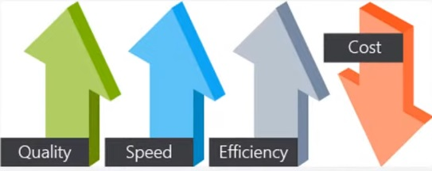
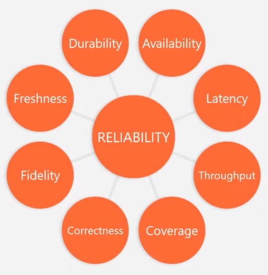
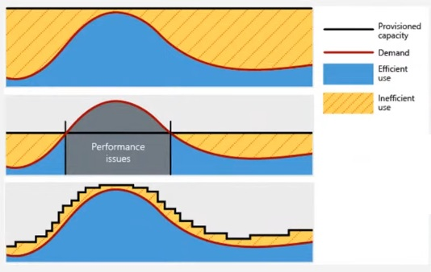
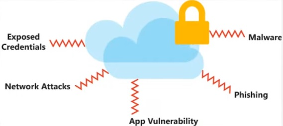

# [Well-Architected Framework]

Well-Architected framework is a guideline by Azure to create proper and safe applications within the cloud. 

## Assignment

Study:

- Azure Well-Architected Framework
- How to implement the 5 pillars with cloud services

### Key-terms

- CROPS, Cost Optimization/ Reliability/ Operational Expenses/ Performance Efficiency/ Security
- Automation (reduce human error, human time)
- Cost awareness

### Used Sources

[MS Doc, well-architected framework](https://learn.microsoft.com/en-us/azure/well-architected/)  
[Youtube, Introduction to the Microsoft Azure Well-Architected Framework](https://www.youtube.com/watch?v=BF1Tw9MNa5U)  

## Results

### Well-Architected Framework

Well-Architected Framework is a set of guiding tenets that you can use to improve the quality of a workload. The framework consists of five pillars of architectural excellence: CROPS.  

- Cost optimization, managing costs to maximize the value delivered
- Operational excellence, operations processes that keep a system running in production
- Performance efficiency, the ability of a system to adapt to changes in load
- Reliability, the ability of a system to recover from failures and continue to function
- Security, protecting applications and data from threats

#### Cost Optimization

- plan and estimate costs (design before starting)  
- provision with optimization (select the right building blocks)  
- us monitoring and analytics to gain cost insights (constant reviewing)
- Maximize efficiency of cloud speed ("or reduce waste")

- Increase cost awareness  
-- Budgets  
-- Alerts  
-- Tagging resources  

- Eliminate "cloud waste"  
-- Shutting down unused resources  
-- Right size underutilized resources  
-- Autoscaling and auto shutdown  

- Take advantage of offers  
-- Hybrid Benefits  
-- Reservations  

- Modernize architecture  
-- Explore PaaS and serverless options  

#### Reliability

Key points of reliability:  

- Availability (High)
- Durability
- Resilience

Design choices:  

- Design for business requirements  
-- Reliability is setting expectations  
-- Reliability is measured from the costumers perspective  

- Design for failure  
-- anticipate for failures
-- set fault tolerances  

- Drive automation, it will improve:  
-- Reliability  
-- Automated testing  
-- Deployment  
-- Management  

- Design for self-healing  
-- automatic failure recovery  
-- set predefined remediation protocols  
-- high level of system maturity with monitoring and automation  

- Design for scale-out  
-- automatically respond to demand  
-- horizontal growth, increase amount of resources instead of increasing the size of existing resources

Best practices:

- Build availability targets and recovery targets into your design  
- Ensure the application and data platforms meet your reliability requirements  
-- Ensure connectivity  
-- Use zone-awareness services  
- Design resilience to respond to outrages
- Design for scalability  

#### Operational Excellence

- Design, build, and orchestrate with modern practices  
- Use monitoring and analytics to gain operational insights  
- Use automation to reduce (human) effort and (human) error  
-- Automate as much workload as possible  
- Implement security measures through out the development cycle
- Test early and often  
-- Developer tests  
-- Round trip testing  
-- Penetration testing  
-- Fault injection  
-- Disaster recovery  
-- Chaos engineering  

#### Performance Efficiency

- Performance  
-- Latency (how soon does it start)  
-- Throughput (How fast does it move)  
-- Perceived response (Queue it up)  

- Matching resources (Availability vs current demand)  
- Scale up (vertical scaling) vs Scale out (horizontal scaling)  
-- Scale up, increase computing power of a VM  
-- Scale out, increase the amount of VM  
- Optimize Network Performance  
- Optimize Storage Performance  
- Identify performance bottlenecks in your application  

Best practices:

- Autoscaling  
- Background jobs (Example, start a VM at 09:00 and close it at 17:00)  
- Caching  
- CDN (content delivery network)  
- Data partitioning  

#### Security

There are 5 broad security area's:

- Identity management  
-- Set up authentication with Azure Active Directory

- Protect your infrastructure  
-- Use Azure role-based access control (RBAC), different roles with different privileges over:  
-- Subscriptions  
-- Resource group  
-- Single resources  

- Application security  
-- Encrypt data in-transit with the latest supported TLS versions  
-- Protect against CSRF (Cross Site Request Forgery) and XSS (Cross Site Scripting) attacks  
-- Prevent SQL injection attacks  
-- Store application secrets within Azure Key Vault  

- Data sovereignty and encryption  
-- Keep data in the correct geopolitical zone when using Azure Data Services  
-- Use Key Vault to safeguard cryptographic keys and secrets  
-- You can encrypt keys and secrets with keys protected by hardware security's modules (HMSs)  

- Security resources  
-- MS Defender for cloud  
-- Azure Security Documentation  
-- MS Trust Center  

Best practices for security:

- People: Educate teams about the cloud security journey
- People: Educate teams on cloud security technology
- Process: Assign accountability for cloud security decisions
- Process: Update incident response processes for cloud
- Process: Establish security posture management
- Technology: Require passwordless or multi-factor authentication
- Technology: Integrate native firewall and network security
- Technology: Integrate native threat detection
- Architecture: Standardize on a single directory and identity
- Architecture: Use identity-based access control instead of keys

Protect against common attacks:

- Data layer  
-- Expose encryption keys and/or weak encryption  
- Applications layer  
-- Malicious code injections and/or execution (SQL Inject / XSS Cross site scripting)  
- VM/Compute layer  
-- Malware  
- Networking layer  
-- Unnecessary open ports + brute force attacks  
- Perimeter layer  
-- Denial of Service (DoS)  
- Policies and Access layer  
-- Exposure of credentials  
-- Authentication and Authorization  
- Physical layer  
-- Unauthorized access to the facilities  

## Encountered problems

Just a very very long read and it was very dry material.
