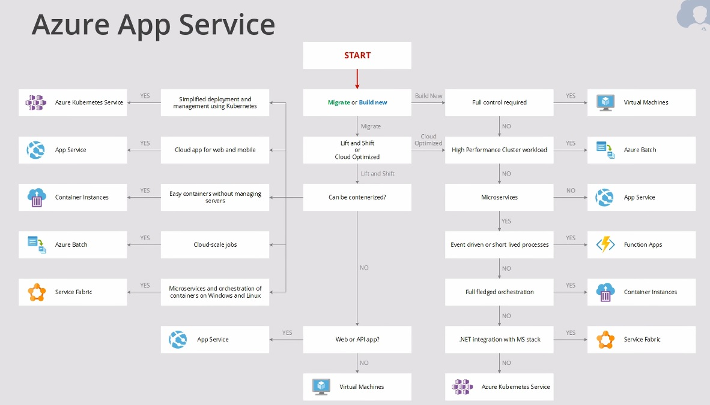
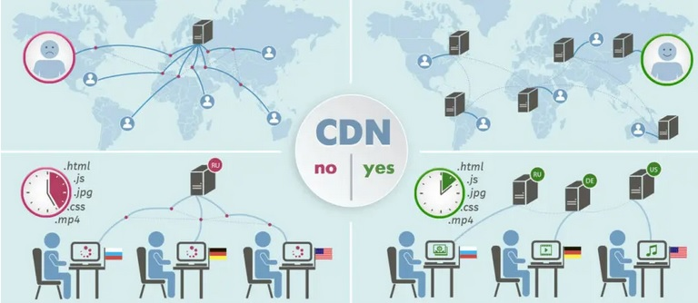

# [Files, AppServices, CDN, DNS, Database]

Common services you will interact with on a regular base. 

## Assignment

Study:  

- App Services
- Content Delivery Network (CDN)
- Azure DNS
- Azure Files
- Azure Database

### Key-terms

- App Services
- Content Delivery Network (CDN)
- Azure DNS
- Azure Files
- Azure Database
- API, a set of definitions and protocols for building and integrating applications software. It can be seen as a mediator between the users or clients and the resources of a web service they want to get.
- REST API or RESTful API, are based on a client-server model, where the client is typically a web or mobile app that consumes data or services from a server. RESTful API are widely used for building webs services, web applications and mobile applications, as it is a flexible and scalable way to expose and consume data and services over the internet.
- Serverless (Functions as a Service or FaaS)
- Distributed denial of service attack (DDoS), it's a malicious attempt to disrupt the normal traffic of a targeted server, service or network by overwhelming the target or its surrounding infrastructure with a flood of internet traffic. 

### Used Sources

[Redhat (REST)API](https://www.redhat.com/en/topics/api/what-is-a-rest-api)
[Cloudflare, DDoS](https://www.cloudflare.com/learning/ddos/what-is-a-ddos-attack/)

## Results

### App Service (PaaS)

[MS Doc, App Services](https://learn.microsoft.com/en-us/azure/app-service/overview)  
[MS Doc, AWS vs Azure App Service](https://learn.microsoft.com/en-us/azure/architecture/aws-professional/services)  
[Youtube, Azure app services](https://www.youtube.com/watch?v=4BwyqmRTrx8)  

App services enable you to build and host web apps, mobile back ends, and RESTful APIs in the programming language of your choice without managing the infrastructure (PaaS).  
It offers auto-scaling and high availability, supports both Windows and Linux, and enables automated deployments from GitHub, Azure DevOps, or any Git repo.  

- App service plan (defines a set of compute resources for a web app to run)
- Supports multiple languages: C#, PHP, Java, JavaScript (Node.js), Python, Ruby, Docker
- Optimized for DevOps: Azure DevOps, GitHub, BitBucket, Local Git, Docker Hub, etc..
- Global Scale with high availability, Guaranteed 99.5% availability for app service. Scale up (improve the VM, more ram/cpu) & Scale out options (increase amount of VMs).  
- Security and compliance:  
-- ISO, SOC (Security Operations Center, set of guidelines to ensure security, availability, confidentiality and process integrity of financial organizations) and PCI (Payment Card Industry, it secures your credit card and billing information) complaint  
-- Authentication features with Azure AD, Google, Facebook, Twitter, MS Live, etc..
- Visual Studio Integration (VSCode is the open source variant)
- API and mobile features including CORS and push notifications

#### Azure App service and on-premise resources

There are a few ways you can combine the App Service with on-prem resources.

- Hybrid Connectivity: This approach is suitable when you need to access on-prem databases, services, or other resources from your Azure hosted application.
- Hybrid Identity: This integration method allows users to authenticate against their on-prem domain and access Azure App service using single sign-on (SSO).
- Hybrid Data: This allows you to securely access on-prem databases or web services from your App Service without requiring any network configuration changes.
- Azure API management: This provides a unified and controlled access point to on-prem services and data
- Azure Logic Apps and Azure Functions: Allows you to trigger on-prem action or retrieve data and incorporate them into your App Service application.

#### Combine Azure App Service with other services

<!-- Azure App Service, falls under the whole branch of Azure Compute services.

Combine Azure App Service with Azure Functions and  -->

#### What is the difference with Azure App Service and likewise solutions?

Azure App Service,  
Azure Spring Apps,  
Azure Service Fabric  

### Content Delivery Network (CDN)

[MS Doc, Content Delivery Network](https://learn.microsoft.com/en-us/azure/cdn/cdn-overview?toc=%2Fazure%2Ffrontdoor%2FTOC.json)
[Youtube, Network Services](https://www.youtube.com/watch?v=5NMcM4zJPM4)

Content Delivery Network is part of the Azure Network Services. It's used for global content caching & distribution offload web applications and reduce latency. To put simple they improve the speed of websites and reduce load from the origin server.  

- Hosting Static content
- Deliver web content to users
- Minimize latency
- POP (points of presence) locations
- Improved security (origin server)

#### CDN can improve performance over On-Premise solutions

In stead of hosting everything from the origin server you can use CDN to create geographically distributed group of servers that work together to provide fast delivery of internet content via edge servers (POP incase of Azure). These as the POP are distributed geographically it will reduce latency for users and reduce compute power needed for the origin server since the POP are caching content instead of real-time requesting it.  

#### Combine CDN with other services

Best practice is to combine CDN with DDoS solutions to improve the security and uptime. By default Azure CDN is protected by Azure Basic DDoS, how ever there are also external parties with specific Azure DDoS solutions: Azure CDN from Verizon and Azure CDN from Akamai.

- CDN can be integrated with cloud storage solutions like Azure Blob Storage (AWS S3, Google Cloud Storage)
- CDN can be paired with cloud hosting platforms like Azure App Service (Amazon EC2, Google Cloud Compute Engine)
- CDN are commonly used with cloud-based video streaming platforms like Azure Media Services (Amazon CloudFront, Google Cloud CDN)
- CDN can be combined with cloud based application acceleration services like Azure Front Door (AWS CloudFront, Google Cloud CDN)
- CDN can be integrated with cloud-based Internet of Things (IoT) like Azure IoT Hub

#### Difference between CDN and likewise services

In many ways Azure CDN, AWS CloudFront, Google Cloud CDN are the same and they integrate well with other services provided on their respected platform. It mainly comes down on own preferences what cloud you prefer to work with, specific integration requirements, geographic coverage, pricing.

### Azure DNS  

[MS Doc, Azure DNS](https://learn.microsoft.com/en-us/azure/dns/dns-overview)
[Youtube, Azure DNS](https://www.youtube.com/watch?v=6kdBgO0jqaY)

 

#### Azure DNS ...? On-Prem

#### Azure DNS with other services

#### Difference between Azure DNS and likewise services

### Azure Files  

[MS Doc, Azure Files](https://learn.microsoft.com/en-us/azure/storage/files/storage-files-introduction)
[Youtube, Azure Files](https://www.youtube.com/watch?v=BCzeb0IAy2k)

Azure Files is a sub service from Azure Storage Accounts it's similar to a FTP server in your home network.  
It can create fully managed file shares in the cloud accessible via: SMB (Server Message Block), HTTP (FileREST)

- Snapshotting
- Support for AzCopy, Storage Explorer, Azure CLI & Powershell
- Resiliency, Scalability and security of storage accounts
- Support for Identity with Azure AD services and on-prem AD Domain services

Common use cases:  

- "Lift and Shift" applications
- Replace/extend on-prem servers as a cache with Azure File Sync
- Persistent storage for containers

#### Azure Files ...? On-Prem

#### Azure Files with other services

#### Difference between Azure Files and likewise services

### Azure Database  

[MS Doc, Azure SQL](https://learn.microsoft.com/en-us/azure/azure-sql/azure-sql-iaas-vs-paas-what-is-overview?view=azuresql)

#### Azure Database ...? On-Prem

#### Azure Database with other services

#### Difference between Azure Database and likewise services

## Encountered problems  

