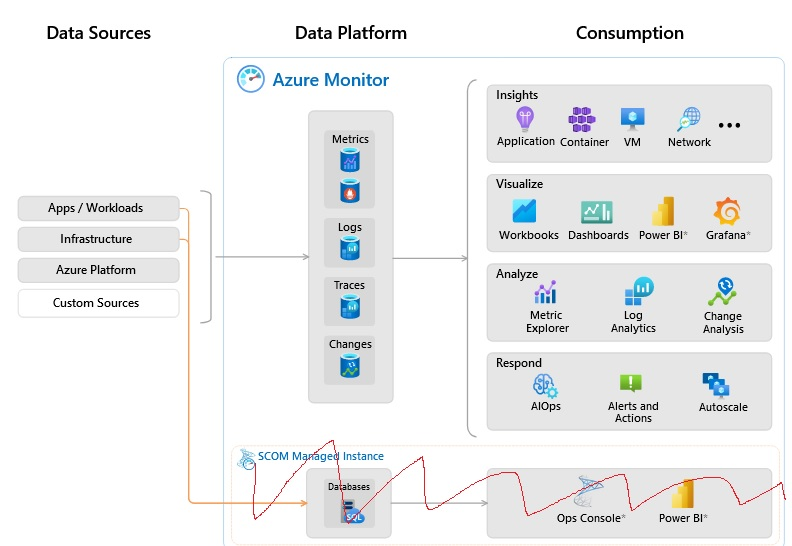
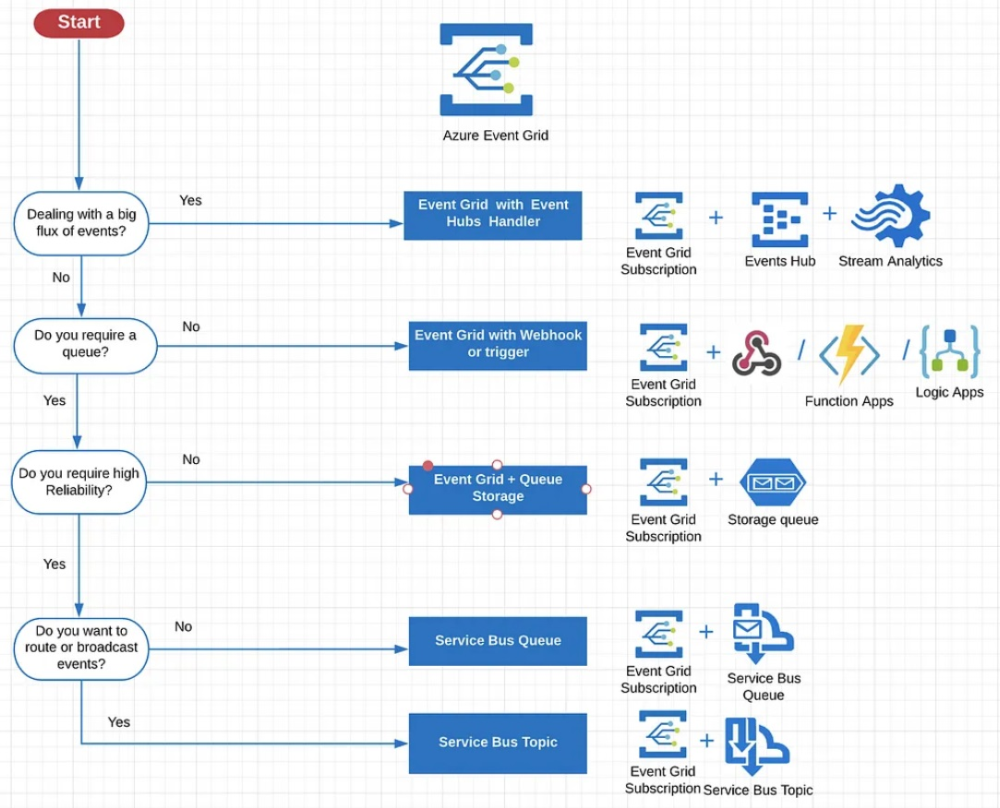

# [Subject]

Even more common services from Azure!

## Assignment

Study:  

- Containers
- Azure Support Plans
- Azure Advisor
- Azure App Configuration
- Azure Activity Log
- Azure Active Directory
- Azure Monitor
- CosmosDB
- Azure Functions
- Event Grid, Queue Storage, Service Bus

### Key-terms

- Serverless, a method of providing backend services on an as-used basis. It allows developers to do their work without worry about servers at all. (sits between PaaS and SaaS)


### Used Sources

[Plaats hier de bronnen die je hebt gebruikt.]

## Results

### Containers

[Docker, What is a container](https://www.docker.com/resources/what-container/)  
[MS Doc, Container options](https://learn.microsoft.com/en-us/azure/container-apps/compare-options)  

A container is a standard unit of software that packages up code and all its dependencies so the application runs quickly and reliably from one computing environment to another. Docker created the industry standard so they could be deployed anywhere. A container image is a lightweight, standalone, executable package of software that includes everything needed to run an application: code, runtime, system tools, system libraries and settings.  

The "oh but it worked on my computer" problem is solved with containers as they will always run the same regardless of the infrastructure, since containers isolated software from its environment it ensures that it works uniform in all environments. This enables you to run software X on version 1.1 and 1.2 at the same time using different container images in the same environment.

These Azure services use containers:

- Azure Container Apps
- Azure App Service
- Azure Container Instances
- Azure Kubernetes Service
- Azure Functions
- Azure Spring Apps
- Azure Red Hat OpenShift

Container vs Virtual Machine:

|Container|virtual machine|  
|...|...|
|Abstracts the app layer|Abstracts the physical hardware|  
|Virtualize OS only|Virtualize whole System|  
|Lightweight few Mb|Large many GB |  
|Starts in few seconds | Starts in few minutes |  
|Less secure|More secure|  

  

### Azure Support Plans

[MS Doc, support plans](https://azure.microsoft.com/en-us/support)  
[MS Doc, support plans overview](https://azure.microsoft.com/en-us/support/plans)  

It is the help desk service from Azure, it has four tiers based on your needs.  

- Basic, can be used by all customers and it's free, request support model.  
Simple ticketing system and self help pages.  

- Developer, for trail and non-production environments. €29 p/m  
Adds a new layer of support for configuration guidance and troubleshooting.  
Possible to mail about problems during business hours after a ticket is made.  
Can add severity response (C: minimal business impact, 8 business hours response) to tickets.  

- Standard, for production workload environments. €100 p/m  
24/7 phone and email support after ticket is made.  
Can add severity response, (C Minimal: within 8 business hours, B Moderate: within 4 business hours, A Critical: within 1 hour)  

- Professional Direct, Business-critical dependance. €1000 p/m  
Improved severity response times, (C Minimal: within 4 business hours, B Moderate: within 2 business hours, A Critical: within 1 hour)  
Support API accessible  
Operations support  
Training, webinars led by Azure Experts  
Proactive guidance  

### Azure Advisor

[MS Doc, Azure Advisor](https://learn.microsoft.com/en-us/azure/advisor/advisor-overview)  
[Youtube, Azure Advisor](https://www.youtube.com/watch?v=58_6MkB2znI)

Azure Advisor is you personalized consultant service to help you work towards the guiding principles from the Well Architected Framework.  
It becomes a lot easier to proactively and actionable work towards personalizing the best practice recommendations.  

  

This is how it looks like (from MS learn page).  
They are categorized:  

- Reliability (High Availability is from an older version)  
- Security  
- Performance  
- Cost  
- Operational Excellence  

The importance of improving your cloud solution is stated as: High, medium, low impact.  
You can also set alerts when ever there is a new recommendations.

  
  

It is completely build for Azure, so it only involves Azure services. A list from the learn page.  

```text
Advisor provides recommendations for: 
Application Gateway, 
App Services, 
availability sets, 
Azure Cache, 
Azure Data Factory, 
Azure Database for MySQL, 
Azure Database for PostgreSQL, 
Azure Database for MariaDB, 
Azure ExpressRoute, 
Azure Cosmos DB, 
Azure public IP addresses, 
Azure Synapse Analytics, 
SQL servers, 
Storage accounts, 
Traffic Manager profiles, 
Virtual machines.
```

### Azure App Configuration

[MS Doc, App Configuration](https://learn.microsoft.com/en-us/azure/azure-app-configuration/overview)  
[MS Doc, App Configuration Best Practices](https://learn.microsoft.com/en-us/azure/azure-app-configuration/howto-best-practices)  
[Youtube, App Configuration](https://www.youtube.com/watch?v=t6m13DxUJMc)  

Azure App Configuration provides a service to centrally manage applications settings and feature flags. Many modern programs especially in the cloud have many components with their own settings, it can become a hard to troubleshoot problem when you set settings one at a time. As with many things in the cloud it's best reduce the amount of input required, one place is better than ten places.

One place to add configuration helps to add to robustness for the apps with scalability, as the same setting are still applied when 1 settings needs to change, for example a new key to connect to a database.

Key recommendation according to the [Twelve-Factor App](https://12factor.net/), MS is referring to for well-tested architectural patterns. It's a best practice to separate configuration from code. An applications config should be kept external to its executable and read in from its runtime environment or external source.  

While any app can made use of the App Config, the following are the types benefit the most from it:  

- Microservices based on Kubernetes, Fabric, or other containerized apps deployed in one or more geographies
- Serverless apps, like Functions or other event-driven stateless compute apps
- Continues deployment pipeline

App Config complements the Key Vault, which is used to store app secrets. It makes it easier to implement the following scenarios:

- Centralized managed and distribution of hierarchical config data
- Dynamically change app settings without the need to redeploy or restart an app
- Control feature availability in real-time

  

As for pricing theres a free tier and standard tier.  

  

### Azure Activity Log

[MS Doc, activity log retrieval](https://learn.microsoft.com/en-us/azure/azure-monitor/essentials/activity-log?tabs=powershell)  
[MS Doc, activity log schema](https://learn.microsoft.com/en-us/azure/azure-monitor/essentials/activity-log-schema)  

This is a part of the Azure Monitor service and falls under the platform logs, these are the notifications you get when you make a new resource, start a VM, etc.. It gives insight over subscription-level events within Azure.  

  

Types of platform logs:

- Resource logs, about Azure Resources
- Activity logs, about Azure Subscriptions, Insights about operations
- Azure AD logs, about Azure Tenant, sign-in history/activity.

Each entry has a Severity level and category, the severity level is something you a developer can set up. As it depends on your own architecture what level of severity an event is.  

Severity levels:

- Critical, Events demanding immediate attention, failure of some sort or no responsiveness.  
- Error, Events that indicate a problem, however don't require immediate attention.  
- Warning, Events the provide a forewarning of potential problems, can indicate a resources is not in ideal state and may degrade later into showings errors or critical events.  
- Informational, Events that are noncritical, just for your information.  

Catagories:

- Administrative, records of create, update, delete, and action operations. "Delete this VM", "Updated Database", etc..
- Service Health, records of any service health incidents that have occurred in Azure
- Resource Health, records of any resource health incidents that have occurred in Azure
- Alert, records of activations for Azure Alerts, it's the alerts you set up
- Auto-scale, records of any autoscaling events related to the autoscaling engine
- Recommendation, recommendations from Azure Advisor
- Security, records of any alert generated by MS Defender Cloud
- Policy, records of all effect action operation performed by Azure Policy

You can retrieve detailed logs in a few ways:

- Via portal, download the CSV file
- via PowerShell, Get-AzLog command
- via Azure CLI, az monitor activity-log command
- via Azure Monitor REST API

Example from an event (from ms learn page):

```json
{
    "authorization": {
        "action": "Microsoft.Network/networkSecurityGroups/write",
        "scope": "/subscriptions/<subscription ID>/resourcegroups/myResourceGroup/providers/Microsoft.Network/networkSecurityGroups/myNSG"
    },
    "caller": "rob@contoso.com",
    "channels": "Operation",
    "claims": {
        "aud": "https://management.core.windows.net/",
        "iss": "https://sts.windows.net/1114444b-7467-4144-a616-e3a5d63e147b/",
        "iat": "1234567890",
        "nbf": "1234567890",
        "exp": "1234567890",
        "_claim_names": "{\"groups\":\"src1\"}",
        "_claim_sources": "{\"src1\":{\"endpoint\":\"https://graph.microsoft.com/1114444b-7467-4144-a616-e3a5d63e147b/users/f409edeb-4d29-44b5-9763-ee9348ad91bb/getMemberObjects\"}}",
        "http://schemas.microsoft.com/claims/authnclassreference": "1",
        "aio": "A3GgTJdwK4vy7Fa7l6DgJC2mI0GX44tML385OpU1Q+z+jaPnFMwB",
        "http://schemas.microsoft.com/claims/authnmethodsreferences": "rsa,mfa",
        "appid": "355249ed-15d9-460d-8481-84026b065942",
        "appidacr": "2",
        "http://schemas.microsoft.com/2012/01/devicecontext/claims/identifier": "10845a4d-ffa4-4b61-a3b4-e57b9b31cdb5",
        "e_exp": "262800",
        "http://schemas.xmlsoap.org/ws/2005/05/identity/claims/surname": "Robertson",
        "http://schemas.xmlsoap.org/ws/2005/05/identity/claims/givenname": "Rob",
        "ipaddr": "111.111.1.111",
        "name": "Rob Robertson",
        "http://schemas.microsoft.com/identity/claims/objectidentifier": "f409edeb-4d29-44b5-9763-ee9348ad91bb",
        "onprem_sid": "S-1-5-21-4837261184-168309720-1886587427-18514304",
        "puid": "18247BBD84827C6D",
        "http://schemas.microsoft.com/identity/claims/scope": "user_impersonation",
        "http://schemas.xmlsoap.org/ws/2005/05/identity/claims/nameidentifier": "b-24Jf94A3FH2sHWVIFqO3-RSJEiv24Jnif3gj7s",
        "http://schemas.microsoft.com/identity/claims/tenantid": "1114444b-7467-4144-a616-e3a5d63e147b",
        "http://schemas.xmlsoap.org/ws/2005/05/identity/claims/name": "rob@contoso.com",
        "http://schemas.xmlsoap.org/ws/2005/05/identity/claims/upn": "rob@contoso.com",
        "uti": "IdP3SUJGtkGlt7dDQVRPAA",
        "ver": "1.0"
    },
    "correlationId": "b5768deb-836b-41cc-803e-3f4de2f9e40b",
    "eventDataId": "d0d36f97-b29c-4cd9-9d3d-ea2b92af3e9d",
    "eventName": {
        "value": "EndRequest",
        "localizedValue": "End request"
    },
    "category": {
        "value": "Administrative",
        "localizedValue": "Administrative"
    },
    "eventTimestamp": "2018-01-29T20:42:31.3810679Z",
    "id": "/subscriptions/<subscription ID>/resourcegroups/myResourceGroup/providers/Microsoft.Network/networkSecurityGroups/myNSG/events/d0d36f97-b29c-4cd9-9d3d-ea2b92af3e9d/ticks/636528553513810679",
    "level": "Informational",
    "operationId": "04e575f8-48d0-4c43-a8b3-78c4eb01d287",
    "operationName": {
        "value": "Microsoft.Network/networkSecurityGroups/write",
        "localizedValue": "Microsoft.Network/networkSecurityGroups/write"
    },
    "resourceGroupName": "myResourceGroup",
    "resourceProviderName": {
        "value": "Microsoft.Network",
        "localizedValue": "Microsoft.Network"
    },
    "resourceType": {
        "value": "Microsoft.Network/networkSecurityGroups",
        "localizedValue": "Microsoft.Network/networkSecurityGroups"
    },
    "resourceId": "/subscriptions/<subscription ID>/resourcegroups/myResourceGroup/providers/Microsoft.Network/networkSecurityGroups/myNSG",
    "status": {
        "value": "Succeeded",
        "localizedValue": "Succeeded"
    },
    "subStatus": {
        "value": "",
        "localizedValue": ""
    },
    "submissionTimestamp": "2018-01-29T20:42:50.0724829Z",
    "subscriptionId": "<subscription ID>",
    "properties": {
        "statusCode": "Created",
        "serviceRequestId": "a4c11dbd-697e-47c5-9663-12362307157d",
        "responseBody": "",
        "requestbody": ""
    },
    "relatedEvents": []
}
```

### Azure Active Directory

[MS Doc, Azure AD](https://learn.microsoft.com/en-us/azure/active-directory/fundamentals/active-directory-whatis)  
[MS DOc, AD vs Azure AD](https://learn.microsoft.com/nl-NL/azure/active-directory/fundamentals/compare)
[Youtube, Azure AD](https://www.youtube.com/watch?v=b_WIjY-burU)  

Azure Active Directory is a cloud-based identity and access management service. It enables you to give others access to external resources, like MS365, Azure Portal, and thousands of other SaaS applications.  

Who uses Azure AD?

- IT Admins
- App Developers
- Users: MS365, O365, Azure, or Dynamics CRM


Licenses Azure AD

- Free
- Premium P1
- Premium P2
- Pay-as-you-go

[Pricing Azure AD](https://www.microsoft.com/nl-nl/security/business/microsoft-entra-pricing?rtc=1&market=nl)

### Azure Monitor

[MS Doc, Azure Monitor](https://learn.microsoft.com/nl-nl/azure/azure-monitor/overview)
[Youtube, Azure Monitor](https://www.youtube.com/watch?v=v68jL-l9Fww)

Azure Monitor can collect, analyze, and respond to monitoring data from your cloud or on-prem environment. Use it to maximize the availability and performance from your apps and services. You can understand better how your apps preform and allows you to manually and automatically respond to system events.  

There are a 3 types of platform logs:

- Azure AD  
    - Audit logs, reports on every logged event (Changes to app, groups, users, and licenses)  
    - Sign-ins, Information about sign-ins and how your resources are used by your users  
    - Provisioning, Activities performed by the provisioning services

- Resources  
    - Insight into operations performed within Azure Resources, could be "getting a secret from key vault", "making request to database"

- Services
     - Insight in to the operations on each Azure Resource in the subscription from the outside (management plane). 

We got a few different key components to the Monitor:

- Data source, types of data collected from a monitored source 
- Data Platform, here you store data as, metrics, logs, traces and changes  
- Consumption, shows the components that use data from the data platform. Core consumption methods are Insights, Visualize, and Analyze data.

Crossed out SCOM as thats an advanced topic



Integration options with Azure Monitor are: Event Hubs, Azure Storage, Managed Partners, Import / Export APIs, Logic Apps, Functions, Azure DevOps, GitHub.

[MS Doc, Pricing](https://azure.microsoft.com/nl-nl/pricing/details/monitor/)

### Azure Cosmos DB

### Azure Functions (PaaS)

[MS Doc, Functions](https://learn.microsoft.com/en-us/azure/azure-functions/functions-overview)
[Youtube, Functions](https://www.youtube.com/watch?v=B0vg8Bxbw3c&t=447s)

Azure Functions is a solution for easily running small pieces of code, or "functions", in the cloud. You can write just the code you need for the problem at hand, without worrying about a whole application or the infrastructure to run it (Serverless).  

We can use functions to auto start a service at a certain timer, or stop it.  
Upload an image and resize it before storing it in a blob storage.  
You can even chain functions if needed.

There are a few ways to start a function:

- Schedule (Practically a Cronjob)
- Manual
- Api
- Event Grid

The set up requires a few definitions:

- Deploy a code or a container image
- Runtime stack, .Net, Node.js, Python, Java, PowerShell Core, Custom Handler
- the OS, Linux or Windows (some times greys out an option depending on Runtime Stack)
- Hosting option, Consumption (serverless), Functions Premium, App Service Plan
- Option: GitHub integration

Writing code has a few options:

- Via Portal (basic templates)
- Via VSCode
- Via Any editor + core tool

Using the portal option you get a few possible events:

- HTTP Trigger
- Time Trigger
- Azure Queue Storage Trigger
- Azure Service Bus Queue Trigger
- Azure Service Bus Topic Trigger
- Azure Blob Storage Trigger
- Azure Event Hub Trigger

There are 3 plans for Azure Functions:

- Consumption plan
- Premium plan
- Dedicated plan

Time-outs are something you need to think about, it is the duration between the return/respond a function needs. Some side marks, HTTP has a max of 230 seconds (3m50s). With unlimited you still need to keep in mind a function gets stopped when the OS or Framework gets updated. 

|Plan|Default|Max|
|...|...|...
|Consumption|5|10|
|Premium|30|Unlimited|
|Dedicated|30|Unlimited|

There is also a term called Cold start, this only a thing for the consumption plan. Apps may scale to 0 when idle, so it may have additional latency at start up.  

### Event Grid, Queue Storage, Service Bus

[MS Doc, messaging services](https://learn.microsoft.com/en-us/azure/service-bus-messaging/compare-messaging-services)
[MS Doc, Service Bus vs Queue Storage](https://learn.microsoft.com/en-us/azure/service-bus-messaging/service-bus-azure-and-service-bus-queues-compared-contrasted)
[Blog post, Azure Messaging](https://medium.com/slalom-technology/azure-messaging-when-to-use-what-and-why-post-3-8a914ec74822)


There are a few types of messaging services withing Azure, Event Grid, Event Hubs (advanced, won't talk about it), and Service BuS (and Queue Storage, as it's common use brother). These work with either Events or Messages.

- Event, this is a lightweight notification of a condition or a state change. The publisher of the event has no expectation of how the event is handled. The consumer of the event decides what to do with the notification. Events can be discrete units or part of a series. A series of events reports a condition and are analyzable. They are time-ordered and interrelated. The consumer needs the sequenced series of events to analyze what happened.  
Example: an event notifies consumers that a file was created, can contain general information but not the file it self.  

- Message, this is raw data produced by a service to be consumed or stored elsewhere. It contains the data that triggered the message pipeline. The published of the message has an expectation about how the consumer handles the message. A contract exists between both sides.  
Example: publisher sends a message, expects consumer to create a file from that data, and send a response when the work is done.  

#### Event Grid (Events)  

Event Grid is a powerful eventing system that enables event-driven programming. It operates on a Publisher/Subscriber model, where publishers emit events without knowing how they will be handled. Subscribers can choose which events they want to handle. Event Grid communicates using MQTT and HTTP protocols, providing flexibility in integration. 

Its a deeply integrated with Azure services and can be integrated with third-party services. it simplifies event consumption and lowers costs by eliminations the need for constant polling. Event Grid efficiently and reliably routes events from Azure and non-Azure resources and distributes the events to registered subscriber endpoints.  

- Not a data-pipeline, no actual objects are delivered
- Dynamically scalable
- Low cost
- Serverless

There are two editions,  

- Azure Event Grid, fully managed PaaS Service.
- Event Grid on Kubernetes with Azure Arc, uses Event Grid on your Kubernetes cluster wherever that is deployed (on-prem or cloud).  

Pricing, single tier. There are 100,000 requests for free each month after that €0,60 per million requests.
[Pricing Event Grid](https://azure.microsoft.com/nl-nl/pricing/details/event-grid/)

#### Service Bus (Messages)

Service Bus is a fully managed messaging service designed for enterprise applications. It acts as a middleman (broker), providing message queues and pub/sub topics to facilitate communication. It is specifically built for handling important messages in a secure and reliable manner. Service Bus supports transactions, ensures message ordering, detects duplicates, and maintains consistency. It is ideal for connecting on-premises systems with cloud solutions and enables secure communication across hybrid cloud environments.

- Messages Queues, Service Bus provides reliable message queues that allow applications to send and receive messages asynchronously. This ensures that messages are reliably delivered and processed even if the sender and receiver are not available at the same time.


- Topics and Subscriptions: Service Bus also supports publish/subscribe messaging patterns. Topics act as message channels, and subscriptions allow multiple receivers to receive messages published to a topic. This enables decoupled communication between components of a system.


- High reliability
- Message Ordering
- Secure communication via Authentication
- Seamless integration with other Azure Services.

Pricing, three tiers: Basic, Standard, and Premium
[Pricing Service Bus](https://azure.microsoft.com/nl-nl/pricing/details/service-bus/)

#### Queue Storage (Messages)

Azure Queue Storage is a service for storing large numbers of messages. You access messages from anywhere in the world via authenticated calls using HTTP(S). Only for small messages up to 64KB, can store many millions depending on the side of your storage account. Commonly used to create backlog of work to process asynchronously.

Pricing, dependant or storage type: LRS, GRS, RA-GRS, per GB per Month.
[Pricing Queue Storage](https://azure.microsoft.com/nl-nl/pricing/details/storage/queues/)

#### Queues: Bus vs Storage?  

Choose a Service Bus queue if:

- You need an at-most-once delivery guarantee.
- You need a FIFO guarantee (if no other settings preempt the default FIFO order)
- You need to group messages into transactions.
- You want to receive messages without polling the queue.
- You need to provide role-based access to the queues.
- You need to handle messages larger than 64 KB but smaller than 256 KB for the standard tier or 100 MB for the premium tier.
- Your queue size won't grow larger than 80 GB.
- You'd like to be able to publish and consume batches of messages.

Choose a storage queue if:

- You need a simple queue with no particular extra requirements.
- You need an audit trail of all messages that pass through the queue.
- You expect the queue to exceed 80 GB in size.
- You want to track progress for processing a message inside the queue.

#### How does it fit in a bigger picture

As seen in the diagram below there are a few scenarios written out when to use what. Notice the message events can be combined with Event Grid as well. 



## Encountered problems

We tried Feynman technique to explain subjects to each other and set a maximum time to learn/read about a subject.
