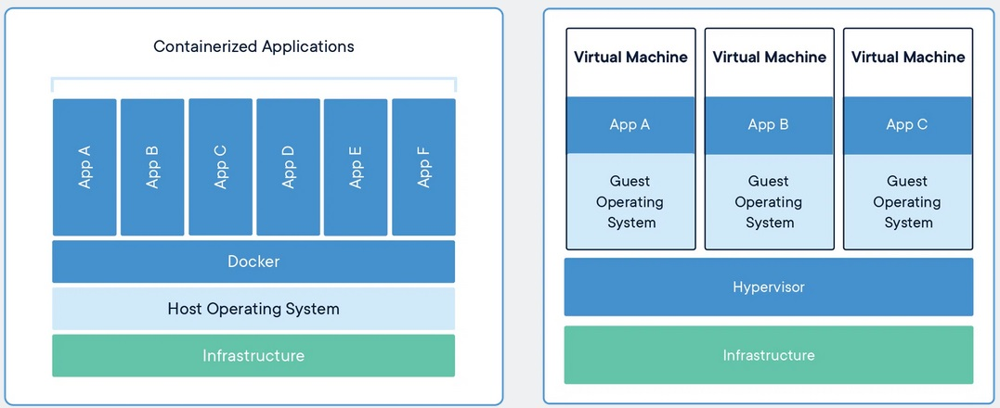
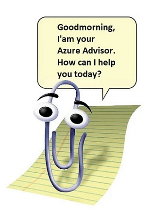
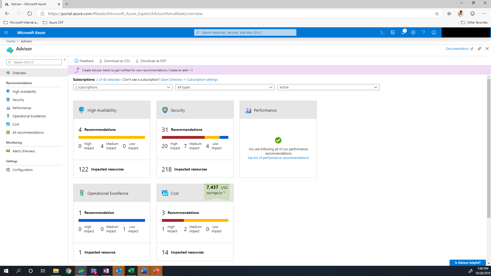
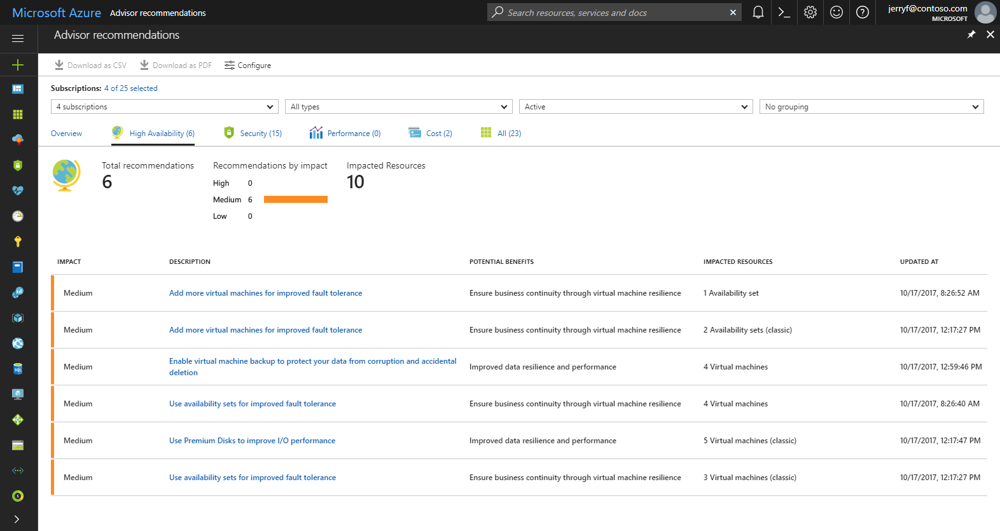

# [Subject]

Even more common services from Azure!

## Assignment

Study:  

- Containers
- Azure Support Plans
- Azure Advisor
- Azure App Configuration
- Azure Activity Log
- Azure Active Directory
- Azure Monitor
- Azure Functions
- CosmosDB
- Event Grid, Queue Storage, Service Bus

### Key-terms

[Schrijf hier een lijst met belangrijke termen met eventueel een korte uitleg.]

### Used Sources

[Plaats hier de bronnen die je hebt gebruikt.]

## Results

### Containers

[Docker, What is a container](https://www.docker.com/resources/what-container/)  
[MS Doc, Container options](https://learn.microsoft.com/en-us/azure/container-apps/compare-options)  

A container is a standard unit of software that packages up code and all its dependencies so the application runs quickly and reliably from one computing environment to another. Docker created the industry standard so they could be deployed anywhere. A container image is a lightweight, standalone, executable package of software that includes everything needed to run an application: code, runtime, system tools, system libraries and settings.  

The "oh but it worked on my computer" problem is solved with containers as they will always run the same regardless of the infrastructure, since containers isolated software from its environment it ensures that it works uniform in all environments. This enables you to run software X on version 1.1 and 1.2 at the same time using different container images in the same environment.

These Azure services use containers:

- Azure Container Apps
- Azure App Service
- Azure Container Instances
- Azure Kubernetes Service
- Azure Functions
- Azure Spring Apps
- Azure Red Hat OpenShift

Container vs Virtual Machine:

|Container|virtual machine|  
|Abstracts the app layer|Abstracts the physical hardware|  
|Virtualize OS only|Virtualize whole System|  
|Lightweight few Mb|Large many GB |  
|Starts in few seconds | Starts in few minutes |  
|Less secure|More secure|  

  

### Azure Support Plans

[MS Doc, support plans](https://azure.microsoft.com/en-us/support)  
[MS Doc, support plans overview](https://azure.microsoft.com/en-us/support/plans)  

It is the help desk service from Azure, it has four tiers based on your needs.  

- Basic, can be used by all customers and it's free, request support model.  
Simple ticketing system and self help pages.  

- Developer, for trail and non-production environments. €29 p/m  
Adds a new layer of support for configuration guidance and troubleshooting.  
Possible to mail about problems during business hours after a ticket is made.  
Can add severity response (C: minimal business impact, 8 business hours response) to tickets.  

- Standard, for production workload environments. €100 p/m  
24/7 phone and email support after ticket is made.  
Can add severity response, (C Minimal: within 8 business hours, B Moderate: within 4 business hours, A Critical: within 1 hour)  

- Professional Direct, Business-critical dependance. €1000 p/m  
Improved severity response times, (C Minimal: within 4 business hours, B Moderate: within 2 business hours, A Critical: within 1 hour)  
Support API accessible  
Operations support
Training, webinars led by Azure Experts
Proactive guidance  

### Azure Advisor

[MS Doc, Azure Advisor](https://learn.microsoft.com/en-us/azure/advisor/advisor-overview)  

Azure Advisor is a tool to help you work towards the guiding principles from the Well Architected Framework.  
It becomes a lot easier to proactively and actionable work towards personalizing the best practice recommendations. 
The importance of improving your cloud solution is stated as: High, medium, low impact.  

  

This is how it looks like (from MS learn page).  
They are categorized:  

- Reliability (High Availability is from an older version)  
- Security  
- Performance  
- Cost  
- Operational Excellence  

  
  

It is completely build for Azure, so it only involves Azure services. A list from the learn page.  

`Advisor provides recommendations for Application Gateway, App Services, availability sets, Azure Cache, Azure Data Factory, Azure Database for MySQL, Azure Database for PostgreSQL, Azure Database for MariaDB, Azure ExpressRoute, Azure Cosmos DB, Azure public IP addresses, Azure Synapse Analytics, SQL servers, storage accounts, Traffic Manager profiles, and virtual machines.`

## Encountered problems

We tried Feyman technique to explain subjects to each other and set a maximum time to learn/read about a subject.
