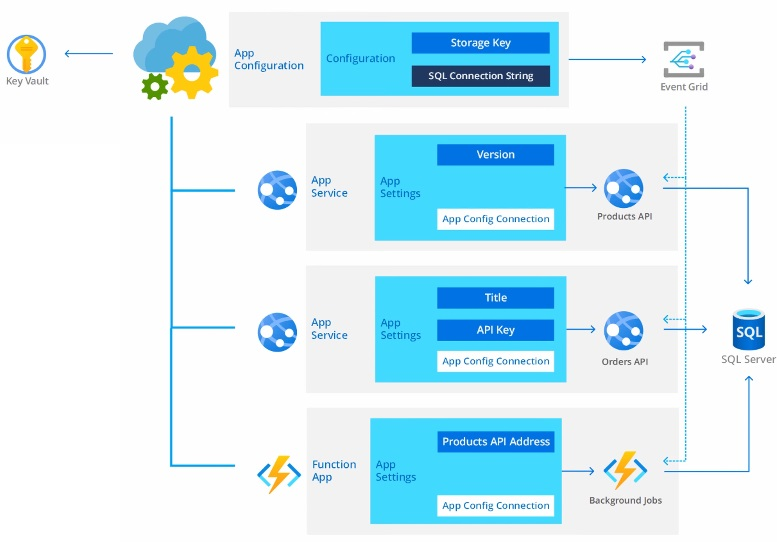
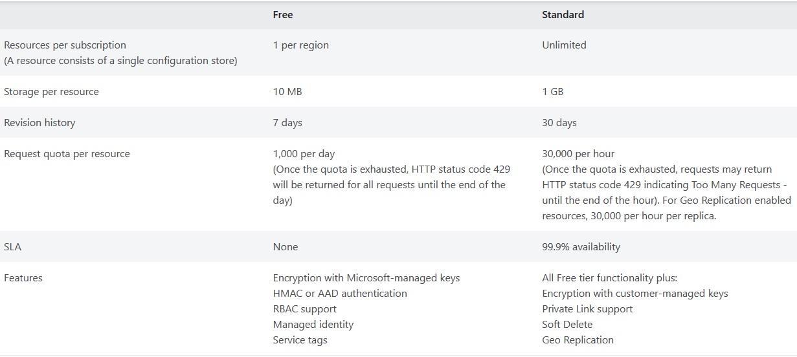
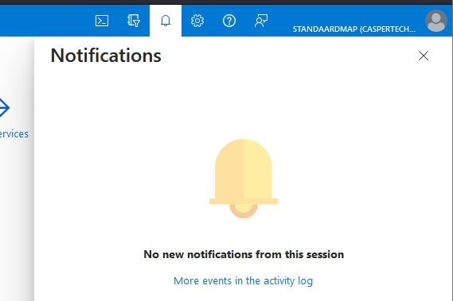
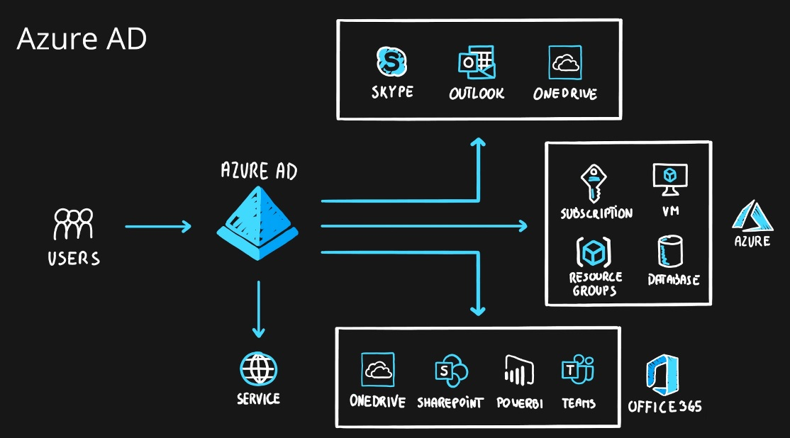

# [Subject]

Even more common services from Azure!

## Assignment

Study:  

- Containers
- Azure Support Plans
- Azure Advisor
- Azure App Configuration
- Azure Activity Log
- Azure Active Directory
- Azure Monitor
- Azure Functions
- CosmosDB
- Event Grid, Queue Storage, Service Bus

### Key-terms

[Schrijf hier een lijst met belangrijke termen met eventueel een korte uitleg.]

### Used Sources

[Plaats hier de bronnen die je hebt gebruikt.]

## Results

### Containers

[Docker, What is a container](https://www.docker.com/resources/what-container/)  
[MS Doc, Container options](https://learn.microsoft.com/en-us/azure/container-apps/compare-options)  

A container is a standard unit of software that packages up code and all its dependencies so the application runs quickly and reliably from one computing environment to another. Docker created the industry standard so they could be deployed anywhere. A container image is a lightweight, standalone, executable package of software that includes everything needed to run an application: code, runtime, system tools, system libraries and settings.  

The "oh but it worked on my computer" problem is solved with containers as they will always run the same regardless of the infrastructure, since containers isolated software from its environment it ensures that it works uniform in all environments. This enables you to run software X on version 1.1 and 1.2 at the same time using different container images in the same environment.

These Azure services use containers:

- Azure Container Apps
- Azure App Service
- Azure Container Instances
- Azure Kubernetes Service
- Azure Functions
- Azure Spring Apps
- Azure Red Hat OpenShift

Container vs Virtual Machine:

|Container|virtual machine|  
|Abstracts the app layer|Abstracts the physical hardware|  
|Virtualize OS only|Virtualize whole System|  
|Lightweight few Mb|Large many GB |  
|Starts in few seconds | Starts in few minutes |  
|Less secure|More secure|  

  

### Azure Support Plans

[MS Doc, support plans](https://azure.microsoft.com/en-us/support)  
[MS Doc, support plans overview](https://azure.microsoft.com/en-us/support/plans)  

It is the help desk service from Azure, it has four tiers based on your needs.  

- Basic, can be used by all customers and it's free, request support model.  
Simple ticketing system and self help pages.  

- Developer, for trail and non-production environments. €29 p/m  
Adds a new layer of support for configuration guidance and troubleshooting.  
Possible to mail about problems during business hours after a ticket is made.  
Can add severity response (C: minimal business impact, 8 business hours response) to tickets.  

- Standard, for production workload environments. €100 p/m  
24/7 phone and email support after ticket is made.  
Can add severity response, (C Minimal: within 8 business hours, B Moderate: within 4 business hours, A Critical: within 1 hour)  

- Professional Direct, Business-critical dependance. €1000 p/m  
Improved severity response times, (C Minimal: within 4 business hours, B Moderate: within 2 business hours, A Critical: within 1 hour)  
Support API accessible  
Operations support
Training, webinars led by Azure Experts
Proactive guidance  

### Azure Advisor

[MS Doc, Azure Advisor](https://learn.microsoft.com/en-us/azure/advisor/advisor-overview)  
[Youtube, Azure Advisor](https://www.youtube.com/watch?v=58_6MkB2znI)

Azure Advisor is you personalized consultant service to help you work towards the guiding principles from the Well Architected Framework.  
It becomes a lot easier to proactively and actionable work towards personalizing the best practice recommendations.  

  

This is how it looks like (from MS learn page).  
They are categorized:  

- Reliability (High Availability is from an older version)  
- Security  
- Performance  
- Cost  
- Operational Excellence  

The importance of improving your cloud solution is stated as: High, medium, low impact.  
You can also set alerts when ever there is a new recommendations.

  
  

It is completely build for Azure, so it only involves Azure services. A list from the learn page.  

`Advisor provides recommendations for Application Gateway, App Services, availability sets, Azure Cache, Azure Data Factory, Azure Database for MySQL, Azure Database for PostgreSQL, Azure Database for MariaDB, Azure ExpressRoute, Azure Cosmos DB, Azure public IP addresses, Azure Synapse Analytics, SQL servers, storage accounts, Traffic Manager profiles, and virtual machines.`

### Azure App Configuration

[MS Doc, App Configuration](https://learn.microsoft.com/en-us/azure/azure-app-configuration/overview)
[MS Doc, App Configuration Best Practices](https://learn.microsoft.com/en-us/azure/azure-app-configuration/howto-best-practices)
[Youtube, App Configuration](https://www.youtube.com/watch?v=t6m13DxUJMc)

Azure App Configuration provides a service to centrally manage applications settings and feature flags. Many modern programs especially in the cloud have many components with their own settings, it can become a hard to troubleshoot problem when you set settings one at a time. As with many things in the cloud it's best reduce the amount of input required, one place is better than ten places.

One place to add configuration helps to add to robustness for the apps with scalability, as the same setting are still applied when 1 settings needs to change, for example a new key to connect to a database.

Key recommendation according to the [Twelve-Factor App](https://12factor.net/), MS is referring to for well-tested architectural patterns. It's a best practice to separate configuration from code. An applications config should be kept external to its executable and read in from its runtime environment or external source.  

While any app can made use of the App Config, the following are the types benefit the most from it:  

- Microservices based on Kubernetes, Fabric, or other containerized apps deployed in one or more geographies
- Serverless apps, like Functions or other event-driven stateless compute apps
- Continues deployment pipeline

App Config complements the Key Vault, which is used to store app secrets. It makes it easier to implement the following scenarios:

- Centralized managed and distribution of hierarchical config data
- Dynamically change app settings without the need to redeploy or restart an app
- Control feature availability in real-time



As for pricing theres a free tier and standard tier.  



### Azure Activity Log

[MS Doc, activity log retrieval](https://learn.microsoft.com/en-us/azure/azure-monitor/essentials/activity-log?tabs=powershell)
[MS Doc, activity log schema](https://learn.microsoft.com/en-us/azure/azure-monitor/essentials/activity-log-schema)

This is a part of the Azure Monitor service and falls under the platform logs, these are the notifications you get when you make a new resource, start a VM, etc.. It gives insight over subscription-level events within Azure.  



Types of platform logs:

- Resource logs, about Azure Resources
- Activity logs, about Azure Subscriptions, Insights about operations
- Azure AD logs, about Azure Tenant, sign-in history/activity.

Each entry has a Severity level and category, the severity level is something you a developer can set up. As it depends on your own architecture what level of severity an event is.  

Severity levels:

- Critical, Events demanding immediate attention, failure of some sort or no responsiveness.  
- Error, Events that indicate a problem, however don't require immediate attention.  
- Warning, Events the provide a forewarning of potential problems, can indicate a resources is not in ideal state and may degrade later into showings errors or critical events.  
- Informational, Events that are noncritical, just for your information.  

Catagories:

- Administrative, records of create, update, delete, and action operations. "Delete this VM", "Updated Database", etc..
- Service Health, records of any service health incidents that have occurred in Azure
- Resource Health, records of any resource health incidents that have occurred in Azure
- Alert, records of activations for Azure Alerts, it's the alerts you set up
- Auto-scale, records of any autoscaling events related to the autoscaling engine
- Recommendation, recommendations from Azure Advisor
- Security, records of any alert generated by MS Defender Cloud
- Policy, records of all effect action operation performed by Azure Policy

You can retrieve detailed logs in a few ways:

- Via portal, download the CSV file
- via PowerShell, Get-AzLog command
- via Azure CLI, az monitor activity-log command
- via Azure Monitor REST API

Example from an event (from ms learn page):

```json
{
    "authorization": {
        "action": "Microsoft.Network/networkSecurityGroups/write",
        "scope": "/subscriptions/<subscription ID>/resourcegroups/myResourceGroup/providers/Microsoft.Network/networkSecurityGroups/myNSG"
    },
    "caller": "rob@contoso.com",
    "channels": "Operation",
    "claims": {
        "aud": "https://management.core.windows.net/",
        "iss": "https://sts.windows.net/1114444b-7467-4144-a616-e3a5d63e147b/",
        "iat": "1234567890",
        "nbf": "1234567890",
        "exp": "1234567890",
        "_claim_names": "{\"groups\":\"src1\"}",
        "_claim_sources": "{\"src1\":{\"endpoint\":\"https://graph.microsoft.com/1114444b-7467-4144-a616-e3a5d63e147b/users/f409edeb-4d29-44b5-9763-ee9348ad91bb/getMemberObjects\"}}",
        "http://schemas.microsoft.com/claims/authnclassreference": "1",
        "aio": "A3GgTJdwK4vy7Fa7l6DgJC2mI0GX44tML385OpU1Q+z+jaPnFMwB",
        "http://schemas.microsoft.com/claims/authnmethodsreferences": "rsa,mfa",
        "appid": "355249ed-15d9-460d-8481-84026b065942",
        "appidacr": "2",
        "http://schemas.microsoft.com/2012/01/devicecontext/claims/identifier": "10845a4d-ffa4-4b61-a3b4-e57b9b31cdb5",
        "e_exp": "262800",
        "http://schemas.xmlsoap.org/ws/2005/05/identity/claims/surname": "Robertson",
        "http://schemas.xmlsoap.org/ws/2005/05/identity/claims/givenname": "Rob",
        "ipaddr": "111.111.1.111",
        "name": "Rob Robertson",
        "http://schemas.microsoft.com/identity/claims/objectidentifier": "f409edeb-4d29-44b5-9763-ee9348ad91bb",
        "onprem_sid": "S-1-5-21-4837261184-168309720-1886587427-18514304",
        "puid": "18247BBD84827C6D",
        "http://schemas.microsoft.com/identity/claims/scope": "user_impersonation",
        "http://schemas.xmlsoap.org/ws/2005/05/identity/claims/nameidentifier": "b-24Jf94A3FH2sHWVIFqO3-RSJEiv24Jnif3gj7s",
        "http://schemas.microsoft.com/identity/claims/tenantid": "1114444b-7467-4144-a616-e3a5d63e147b",
        "http://schemas.xmlsoap.org/ws/2005/05/identity/claims/name": "rob@contoso.com",
        "http://schemas.xmlsoap.org/ws/2005/05/identity/claims/upn": "rob@contoso.com",
        "uti": "IdP3SUJGtkGlt7dDQVRPAA",
        "ver": "1.0"
    },
    "correlationId": "b5768deb-836b-41cc-803e-3f4de2f9e40b",
    "eventDataId": "d0d36f97-b29c-4cd9-9d3d-ea2b92af3e9d",
    "eventName": {
        "value": "EndRequest",
        "localizedValue": "End request"
    },
    "category": {
        "value": "Administrative",
        "localizedValue": "Administrative"
    },
    "eventTimestamp": "2018-01-29T20:42:31.3810679Z",
    "id": "/subscriptions/<subscription ID>/resourcegroups/myResourceGroup/providers/Microsoft.Network/networkSecurityGroups/myNSG/events/d0d36f97-b29c-4cd9-9d3d-ea2b92af3e9d/ticks/636528553513810679",
    "level": "Informational",
    "operationId": "04e575f8-48d0-4c43-a8b3-78c4eb01d287",
    "operationName": {
        "value": "Microsoft.Network/networkSecurityGroups/write",
        "localizedValue": "Microsoft.Network/networkSecurityGroups/write"
    },
    "resourceGroupName": "myResourceGroup",
    "resourceProviderName": {
        "value": "Microsoft.Network",
        "localizedValue": "Microsoft.Network"
    },
    "resourceType": {
        "value": "Microsoft.Network/networkSecurityGroups",
        "localizedValue": "Microsoft.Network/networkSecurityGroups"
    },
    "resourceId": "/subscriptions/<subscription ID>/resourcegroups/myResourceGroup/providers/Microsoft.Network/networkSecurityGroups/myNSG",
    "status": {
        "value": "Succeeded",
        "localizedValue": "Succeeded"
    },
    "subStatus": {
        "value": "",
        "localizedValue": ""
    },
    "submissionTimestamp": "2018-01-29T20:42:50.0724829Z",
    "subscriptionId": "<subscription ID>",
    "properties": {
        "statusCode": "Created",
        "serviceRequestId": "a4c11dbd-697e-47c5-9663-12362307157d",
        "responseBody": "",
        "requestbody": ""
    },
    "relatedEvents": []
}
```

### Azure Active Directory

[MS Doc, Azure AD](https://learn.microsoft.com/en-us/azure/active-directory/fundamentals/active-directory-whatis)
[Youtube, Azure AD](https://www.youtube.com/watch?v=b_WIjY-burU)



## Encountered problems

We tried Feynman technique to explain subjects to each other and set a maximum time to learn/read about a subject.
