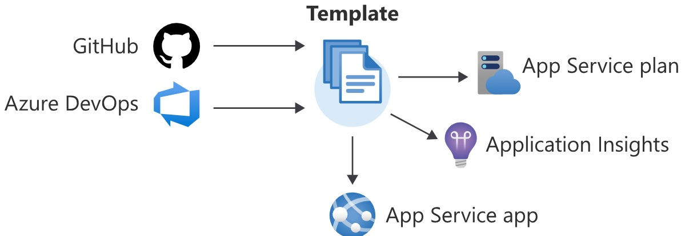
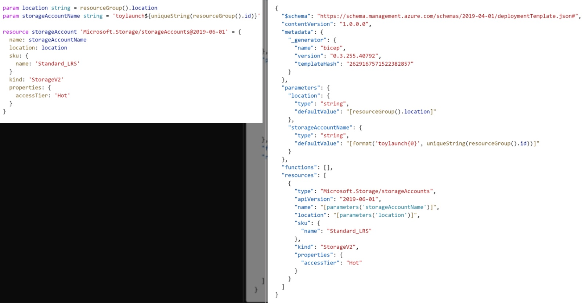

# [Bicep]

*Azure Bicep is a language and tool that aims to improve the experience of defining, deploying, and managing Azure resources. It offers a more human-friendly syntax, simplifies the creation of ARM templates, promotes code reusability, and aligns with the concept of Infrastructure as Code.*  

## Key-terms

- ***IoC:*** Infrastructure as Code
- ***Imperative Syntax:*** Step-by-step instructions that need to be followed in a specific order.  
- ***Declarative syntax:*** Instead of step-by-step, you describe the end goal without specifying the exact process to achieve it.  
- ***Transpilation*** is the process of converting source code written in one language into another language.

## Used Sources

[MS Doc, Bicep](https://learn.microsoft.com/en-us/azure/azure-resource-manager/bicep/overview?tabs=bicep)  
[Youtube, Getting Started with Azure Bicep](https://www.youtube.com/watch?v=77AfsFzTsI4)  

## Introduction to Bicep

### Infrastructure as code

#### **What is infrastructure as code?**

"IoC" is comparable to a setup guide for infrastructure, detailing the intended resource arrangement and the steps to attain it. This approach automates infrastructure setup with a coding language and versioning system akin to source code. Similar to how source code yields dependable results, this method guarantees automated, uniform, and repeatable deployment of elements like virtual networks, virtual machines, applications, and storage within the infrastructure.  



#### **Why use infrastructure as code?**  

- **Boosting Confidence:**  
    Infrastructure as Code (IoC) offers enhanced confidence in deployments through improved consistency and security.  

    **Seamless Process Integration:** IoC seamlessly integrates with existing processes, promoting consistency.  
    **Automated Security Scanning:** Automated scanning is facilitated by IoC, enhancing security measures.  
    **Efficient Secret Management:** IoC aids in efficient management of sensitive information.  
    **Enhanced Access Control:** IoC contributes to better access control mechanisms.  
    **Prevention of Configuration Drift:** Configuration drift is avoided through IoC implementation.  


- **Varied Application Environments in Organizations:**  
    Numerous organizations manage multiple application environments, with developers housing various versions of code in repositories for distinct environment releases. These encompass development, testing, and production stages. Some organizations even uphold multiple production environments for global distribution, while independent software vendors (ISVs) maintain multiple tenant environments for clients.  

    **Provisioning New Environments:** Addressing the creation of fresh environments.  
    **Non-Production Environments:** Encompassing stages such as development and testing.  
    **Disaster Recovery:** Highlighting strategies for recovery in adverse scenarios.  

- **Enhanced Cloud Resource Insight:**  
    Infrastructure as Code (IoC) contributes to improved comprehension of your cloud resources' status.  

    **Audit Trail:** IoC aids in maintaining an audit trail for better accountability.  
    **Thorough Documentation:** Ensuring comprehensive documentation for smoother management.  
    **Unified System:** Promoting a unified approach to system administration.  
    **Improved Cloud Infrastructure Understanding:** IoC fosters a deeper grasp of cloud infrastructures.  

#### **Imperative and declarative code**  

Crafting an assembly guide for a new application can vary in style. Similarly, automating service and infrastructure deployment offers two paths: imperative and declarative.

Using imperative code involves executing a series of commands in a specific order to achieve a final setup. It outlines both the objective and the procedure. This method resembles a stepwise instruction manual.

In contrast, declarative code only specifies the end setup, omitting the how-to details. This approach is like a simplified view manual.

When deciding between imperative and declarative strategies for resource provisioning, assess the existing tools in your organization and align with your personal skills.

- Example of imperative code:  

    ```bash
    #!/usr/bin/env bash
    az group create \
    --name storage-resource-group \
    --location eastus

    az storage account create \
    --name mystorageaccount \
    --resource-group storage-resource-group \
    --location eastus \
    --sku Standard_LRS \
    --kind StorageV2 \
    --access-tier Hot \
    --https-only true
    ```

- Example of declarative code:

    ```Bash
    resource storageAccount 'Microsoft.Storage/storageAccounts@2022-05-01' = {
    name: 'mystorageaccount'
    location: 'eastus'
    sku: {
        name: 'Standard_LRS'
    }
    kind: 'StorageV2'
    properties: {
        accessTier: 'Hot'
        supportsHttpsTrafficOnly: true
        }
    }
    ```

### Azure Resource Manager  

Azure Resource Manager serves as the platform for deploying and overseeing resources within Azure. It facilitates resource creation, modification, and removal within your Azure subscription. Numerous tools, including the Azure portal, enable interaction with Resource Manager. Moreover, Resource Manager offers additional functionalities such as access control, auditing, and tagging to effectively manage resources post-deployment.  

- **Terminology for Azure Resource Manager:**  
    **Resource:** A manageable entity available on Azure, such as virtual networks, virtual machines, storage accounts, web apps, and databases.  
    **Resource group:** A logical container holding interconnected resources for an Azure solution. Resources managed collectively are usually placed within a resource group, aligning with the solution's logic.  
    **Subscription:** A logical entity for resources and resource groups, serving as a billing boundary. Each resource and resource group connects to a single subscription.  
    **Management group:** A logical container used to oversee multiple subscriptions. Hierarchies of management groups, subscriptions, resource groups, and resources facilitate efficient access management, policy enforcement, and compliance.  
    **Azure Resource Manager template (ARM template):** A file outlining resources for deployment to a resource group, subscription, management group, or tenant. It enables consistent and repeatable resource deployment. There are two template types: JSON and Bicep, with this module emphasizing Bicep.  

#### **Advantages of Azure Resource Manager:**  

Azure Resource Manager offers various advantages and features regarding infrastructure-as-code resource provisioning:  

**Group Management:** Resources within your solution can be deployed, managed, and monitored collectively, streamlining the process.  
**Consistent Deployment:** During development stages, you can confidently redeploy your solution, knowing that resources maintain a consistent state.  
**Declarative Management:** Infrastructure management is achieved through declarative templates, replacing the need for scripts.  
**Dependency Management**: Resource dependencies can be specified, ensuring resources are deployed in the appropriate sequence.  

#### **Operations in Azure: Control Plane and Data Plane:**  

In Azure, two primary operation types exist: control plane operations and data plane operations. The control plane is utilized for resource management within your subscription, while the data plane provides access to resource-exposed functionalities.  
For instance, creating a virtual machine involves a control plane operation, while connecting to the virtual machine via Remote Desktop Protocol (RDP) constitutes a data plane operation.  

- **Control Plane:**  
    Control plane operations involve sending requests through Azure tools, APIs, or SDKs, which are then authenticated and authorized by Resource Manager. The request is subsequently directed to the relevant Azure resource provider for action. This uniform handling results in consistent outcomes across various Azure tools. Resource Manager ensures resource creation, distinguishes existing resources, and avoids redundant actions.  

- **Data Plane:**  
    Data plane operations are initiated with requests directed to specific endpoints within your Azure subscription. For instance, the Cognitive Services' "Detect Language" operation is a data plane operation, its request URL being an example. Unlike control plane operations, certain Resource Manager features, such as access control and locks, may not universally apply to data plane operations. For instance, users might lack control plane management permissions for a virtual machine yet can access its operating system.

#### **What are ARM Templates?**  

ARM templates serve as files defining deployment infrastructure and configuration. They embrace a declarative approach to resource provisioning, offering detailed descriptions of each resource in a deployment. However, they do not dictate the method of deployment. When submitted to Resource Manager, ARM templates enable the orderly and consistent deployment of specified resources.

#### **Why use ARM Templates?**  

- **Repeatable Outcomes:**  
    ARM templates are idempotent, ensuring consistent results upon repeated deployment without resource duplication.

- **Efficient Orchestration:**  
    Deployments initiated by template submissions to Resource Manager occur in parallel, leading to expedited completion. Resource Manager organizes deployments in a logical order based on dependencies.

- **Preview Capability:**  
    The "what-if" tool, accessible via Azure PowerShell and Azure CLI, facilitates environment previewing before template deployment, outlining changes like creations, modifications, and deletions.  
    Testing and Validation: Tools like the Bicep linter enable pre-deployment template quality checks. Resource Manager validates templates before deployment, identifying errors in advance.  

- **Modularity:**  
    Templates can be divided into smaller components and linked during deployment, enhancing organization and reusability.

- **CI/CD Integration:**  
    ARM templates integrate into various CI/CD tools like Azure DevOps and GitHub Actions. They can be versioned through source control and utilized in release pipelines.  

- **Extensibility:**  
    Deployment scripts permit Bash or PowerShell operations within ARM templates, enabling tasks like data plane operations. This extensibility allows comprehensive solution deployment via a single template.  

#### **JSON and Bicep Templates:**  

Two ARM template types are available: JSON templates and Bicep templates. JSON, an open-standard file format, is widely applicable. Bicep, a newer domain-specific language, offers a more user-friendly syntax for authoring ARM templates. Both template formats can be employed for resource deployments.

### **Bicep**  

#### **What is Bicep?**

After familiarizing your team with Azure Resource Manager's functioning and choosing ARM templates for resource provisioning, the next step is to delve into the specifics of Bicep templates. Bicep offers an alternative to JSON for template creation and deployment and promises a simplified experience.

#### **Bicep Language**

Bicep serves as a Resource Manager template language primarily designed for declarative Azure resource deployment. It's distinct as a domain-specific language tailored for creating Resource Manager templates. Bicep's clarity and ease of learning are emphasized, regardless of one's programming background. All resource types, API versions, and properties are valid within Bicep templates.

#### **Advantages of Bicep:**

Bicep introduces several improvements over JSON for template creation:

- **Simplified Syntax:**  
    Bicep's syntax is simpler, facilitating direct reference to parameters and variables without complex functions. It employs string interpolation instead of concatenation, making code more readable. Resource properties can be directly referenced using symbolic names.  

- **Modularity with Modules:**  
    Complex deployments are simplified by breaking them into smaller module files, promoting management and reusability. Sharing modules within teams is also supported.  

- **Automated Dependency Management:**  
    Bicep often detects dependencies between resources automatically, reducing manual effort in template creation.  

- **Type Validation and IntelliSense:**  
    Visual Studio Code's Bicep extension provides comprehensive validation and IntelliSense for Azure resource type APIs, enhancing the authoring experience.  

This Bicep example demonstrates the automatic generation of an Azure storage account's name and returning its resource ID upon deployment.  

```BICEP
param location string = resourceGroup().location
param namePrefix string = 'storage'

var storageAccountName = '${namePrefix}${uniqueString(resourceGroup().id)}'
var storageAccountSku = 'Standard_RAGRS'

resource storageAccount 'Microsoft.Storage/storageAccounts@2022-05-01' = {
  name: storageAccountName
  location: location
  kind: 'StorageV2'
  sku: {
    name: storageAccountSku
  }
  properties: {
    accessTier: 'Hot'
    supportsHttpsTrafficOnly: true
  }
}

output storageAccountId string = storageAccount.id
```

### How Bicep Works

#### Understanding Bicep Deployment

Having gained insight into the Bicep template language and its advantages for resource provisioning, the focus now shifts to comprehending how Bicep operates within Azure Resource Manager.

#### Bicep Deployment Process

Bicep, being a domain-specific language, is finely tailored for simplifying the deployment and configuration of Azure resources. Upon deploying resources to Azure, the Bicep template is submitted to Resource Manager, albeit in JSON format. The integrated tooling in Bicep facilitates an automatic conversion of the Bicep template into JSON—a process termed "transpilation." This conversion occurs either automatically during deployment submission or manually, if desired.


#### Azure CLI and Azure PowerShell Integration

The latest iterations of Azure CLI and Azure PowerShell inherently support Bicep. Deployment commands for Bicep and JSON templates are identical. For example, a Bicep template can be deployed using Azure CLI's command as illustrated.

```BASH
az deployment group create \
  --template-file main.bicep \
  --resource-group storage-resource-group
```

#### Resource Manager Process

Resource Manager examines the existing Azure deployment and the intended changes in your Bicep template, then orchestrates a series of steps to align Azure with your intended state. The entire process involves the invocation of the Resource Manager API.

#### Template Conversion and Comparison

To view the JSON template sent to Resource Manager, the "bicep build" command can be employed to convert a Bicep template into JSON. Notably, Bicep offers a simpler syntax compared to JSON. The succinctness and readability of Bicep code are evident in the provided comparison of Bicep and JSON templates.



Choosing Bicep for Your Deployments: Summary

### Is Bicep Suitable?

When evaluating infrastructure-as-code tools, it's crucial to determine if Bicep is the right fit for you and your organization, considering its strengths and limitations.

#### Advantages of Bicep

For Azure-focused deployments, Bicep offers several advantages:

- Azure-Native:  
    Bicep is tailored for Azure, ensuring swift support for new Azure features upon release or updates.  
- Azure Integration:  
    Both JSON and Bicep ARM templates are seamlessly integrated within Azure, enabling monitoring in the Azure portal during Resource Manager deployments.  
- Azure Support:  
    Bicep is fully backed by Microsoft Support.  
- State Management:  
    Bicep deployments synchronize Azure resource states with template-defined states, eliminating the need for separate state management.  
- Smooth Transition from JSON:  
    Transitioning from ARM JSON templates to Bicep is straightforward using the Bicep CLI's "bicep decompile" command.  

#### When Bicep Might Not Be Appropriate

Certain scenarios might warrant exploring other tools:

- Existing Tool Set:  
    If your organization already employs a different tool set for infrastructure-as-code, consider leveraging existing investments and knowledge before adopting a new approach.
- Multicloud Environments:  
    Bicep isn't suitable for multicloud deployments, as it's exclusive to Azure. For multiple cloud providers, tools like Terraform provide more versatile solutions, including Azure deployments.  
