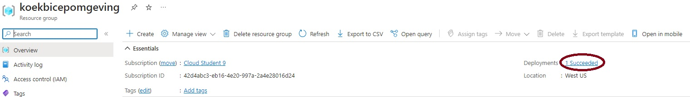
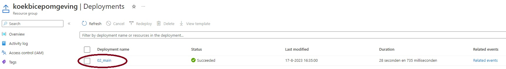
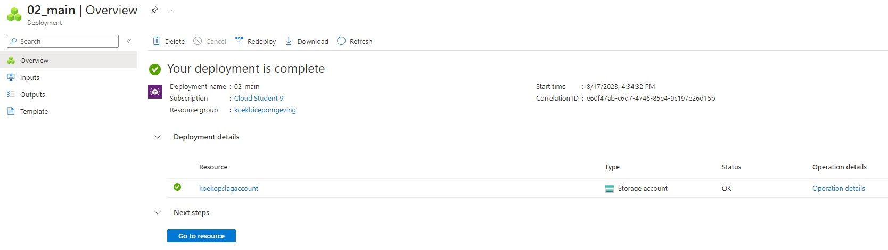
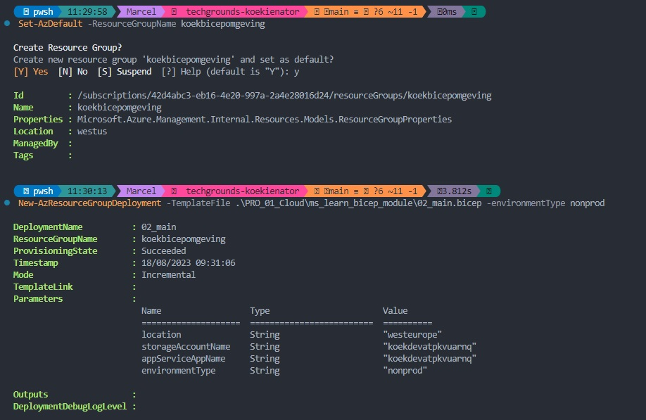
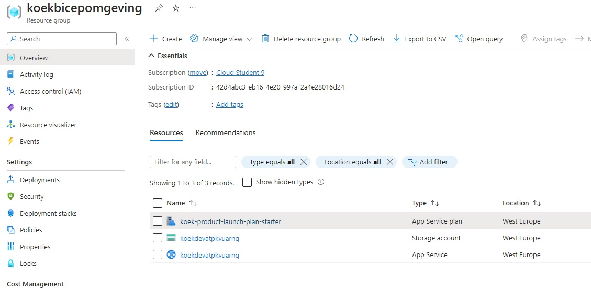
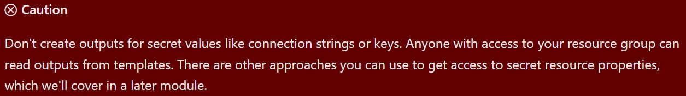
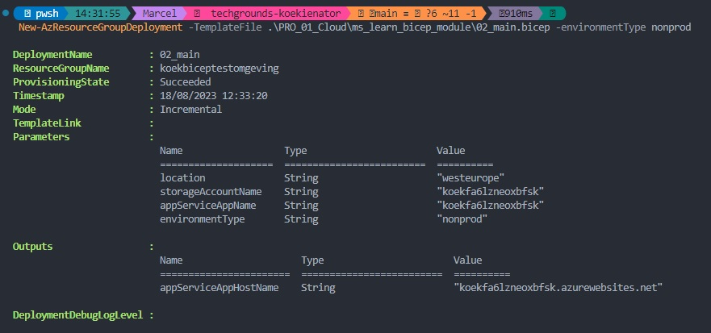
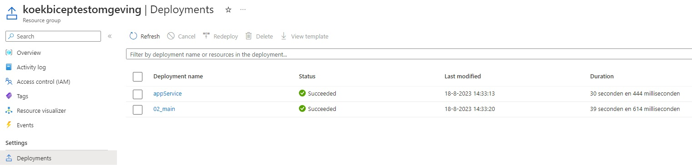
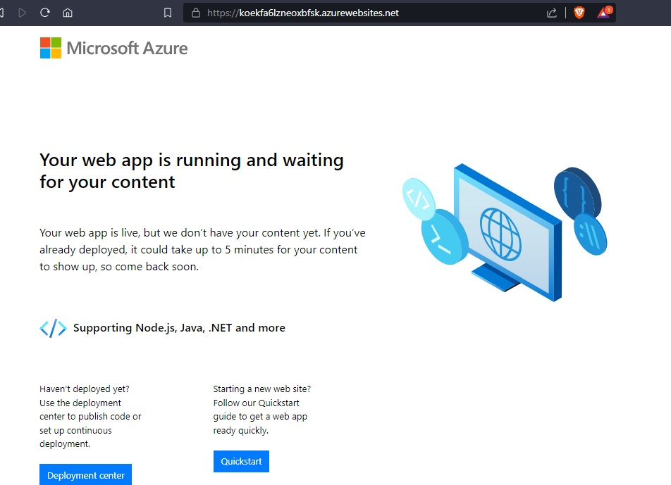

# [First Bicep Template]

Creating my first Bicep file via the ms learn module: build first bicep template

## Assignment

Creating my first Bicep file via the ms learn module: build first bicep template

### Key-terms

seed value
string interpolation
ternary operator

### Used Sources

[MS Doc, Set up Bicep](https://learn.microsoft.com/en-us/azure/azure-resource-manager/bicep/install)
[MS Learn, First Bicep Template](https://learn.microsoft.com/en-gb/training/modules/build-first-bicep-template/)

## Results

### Setting up Powershell to deploy to the cloud

[MS Learn, Install Bicep tools](https://learn.microsoft.com/en-us/azure/azure-resource-manager/bicep/install)  

```Powershell
winget install -e --id Microsoft.Bicep
```

You need to add Bicep to PATH, default location `C:\Users\<USERNAME>\AppData\Local\Programs\`.
Now you can use Powershell in VS Code and launch bicep templates!

### Sign in to Azure via Powershell

`Connect-AzAccount` gives a popup window (in VS Code at least), here you can log in to Azure.  

```Bash
$context = Get-AzSubscription -SubscriptionName 'Put your own subscription name here'
Set-AzContext $context
```

### Deploy your first bicep template

- Set the default resource group
    `Set-AzDefault -ResourceGroupName [Your resource group name here]`

- Deploy the template
    `New-AzResourceGroupDeployment -TemplateFile [path/to/template]`

- Verify your deployment via the portal (might take a few minutes before it shows).

    

    

    

- Verify your deployment via the CLI
    `Get-AzResourceGroupDeployment -ResourceGroupName [Your resource group name here] | Format-Table`

### Parameters and Variables

Parameters suit dynamic aspects that change in each deployment, such as unique resource names, deployment locations, pricing-related settings, and external credentials. Variables, however, are fitting when consistent values are used across deployments, offering reusability within the template. They're also handy for forming complex values through expressions and for resources that don't necessitate unique names.

- Parameters  
    Parameters in a template allow you to input external values when deploying. For manual deployments via Azure CLI or Azure PowerShell, users provide parameter values. These values can be organized in a parameter file. Automated processes, like deployment pipelines, can also supply parameter values.  

- Add a parameter
    `param appServiceAppName string`  
    **Param** tells Bicep that you define a parameter  
    **appServiceAppName** is the name of the parameter. (Clear and understandable names!)  
    **String** is the type of the parameter. (string, int, bool, array, object)  

- Provide default values  
    `param appServiceAppName string = 'koek-product-launch-1`  
    Optionally you can provide default value for a parameter. The person who's deploying the template can specify a value if they want, but if they don't, Bicep uses the default value.  

- Variables  
    Variables are defined within the template. They serve as containers for storing crucial data, accessible throughout the template without duplication.  
    `var appServicePlanName = 'toy-product-launch-plan'`  

### Expressions

While crafting templates, hard-coding values or requesting them as parameters might not always be ideal. Rather, the aim is to uncover values during template execution. For instance, it's likely that you'd want all template resources to be deployed within the same Azure region as the resource group's location. Alternatively, you might desire an automated approach to generate distinct resource names based on a specific corporate naming convention.  

In Bicep, expressions present a potent tool to manage a variety of intriguing scenarios. Let's explore some instances where expressions within a Bicep template come into play.  

- Resource Location  
    `param location string = resourceGroup().location`  
    We called a function here called `resourceGroup()` this gives access to information about the resource group the template is being deployed into. Here we used `.location` property. It's common to use this approach to deploy your resources into the same Azure region as the resource group.  

- Resource Name  
    `param storageAccountName string = uniqueString(resourceGroup().id)`  
    Many Azure resources need unique names, so far we got two resources in our template the requires unique names: Storage account and the App Service app. It can make it difficult making uniques every time you use a template. Bicep has a function for this `uniqueString()` this will generate a unique string. With in this function we put `resourceGroup().id` this will make every "seed value" unique but consistent across all deployments.  

    Every time you deploy the same resources, they'll go into the same resource group. The uniqueString() function will return the same value every time.  
    If you deploy into two different resource groups in the Azure subscription, the resourceGroup().id value will be different, because the resource group names will be different. The uniqueString() function will give different values for each set of resources.  
    If you deploy into two different Azure subscriptions, even if you use the same resource group name, the resourceGroup().id value will be different because the Azure subscription ID will be different. The uniqueString() function will again give different values for each set of resources.  

- Combined strings  
    `param storageAccountName string = 'koek${uniqueString(resourceGroup().id)}'`
    We got `koek` as the string name, then add `${uniqueString(resourceGroup().id)}` for the random string generation.

### Selecting SKU for resources  

When you got multiple working environments you might want to set different SKU for those environments.

- Production Environment:  
    Storage accounts use Standard_GRS for resilience.  
    App Service plans use P2v3 for high performance.  

- Non-production Environment:  
    Storage accounts use Standard_LRS for local redundancy.  
    App Service plans use free F1 tier.  

Implementing these rules involves choices about embedding business logic directly in the template. You can achieve this by leveraging parameters, variables and expressions. We first introduce parameters, then variable determining the SKU's.

```Bicep
@allowed([
  'nonprod'
  'prod'
])
param environmentType string
```

```Bicep
var storageAccountSkuName = (environmentType == 'prod') ? 'Standard_GRS' : 'Standard_LRS'
var appServicePlanSkuName = (environmentType == 'prod') ? 'P2V3' : 'F1'
```

The logic is as following:
`storageAccountSkuName` follows the logic: If the environment is production, use Standard_GRS; otherwise, use Standard_LRS.  
`appServicePlanSkuName` uses P2V3 for production or F1 for non-production  

- `(environmentType == 'prod')` is a boolean, true or false
- `? option1 | option2` is an IF statement

### Launching our new template

We added all the parameters to the Bicep file.

```Bicep
@description('Specifies the location for resources.')
param location string = 'westeurope'

@description('Specifies name for the following resources with unique IDs.')
param storageAccountName  string = 'koek${uniqueString(resourceGroup().id)}'
param appServiceAppName string = 'koek${uniqueString(resourceGroup().id)}'

@description('Automatically set the SKUs for each environment type.')
@allowed([
  'nonprod'
  'prod'
])
param environmentType string

@description('Specifies name for the following resources with non-unique IDs.')
var appServicePlanName = 'koek-product-launch-plan-starter'

@description('Define the environment and set the SLU per environment')
var storageAccountSkuName = (environmentType == 'prod') ? 'Standard_GRS' : 'Standard_LRS'
var appServicePlanSkuName = (environmentType == 'prod') ? 'P2v3' : 'F1'
```

This might take a few minutes to launch and update in the portal.

```Bicep
New-AzResourceGroupDeployment -TemplateFile .\PRO_01_Cloud\ms_learn_bicep_module\02_main.bicep -environmentType nonprod
```




### Modules

As Bicep code becomes more complex and has an increasing number of resources defined, you can create modules. Create individual bicep files (modules) for different parts of your deployment. The main bicep template can reference these modules. Behind the scenes modules rae transpiled into a single json template for deployment. With modules you make Bicep code even more reusable, as a single module can be used for many other Bicep templates.  

#### Outputs

Bicep templates can be deployed either manually by a user or through automated release processes. In both cases, it's often necessary to retrieve specific information from the template deployment. Here are instances where such information retrieval is required:

- **Accessing Virtual Machine IP:**  
    When deploying a Bicep template for a virtual machine, the public IP address might be needed for SSH access to the machine.

- **Dynamic App Service Naming:**  
    Bicep templates accepting parameters, like environment and application names, can generate Azure App Service app names using expressions. The deployed app's name should be accessible for publishing application binaries within a deployment pipeline.

To address these needs, Bicep provides the concept of outputs. Outputs are defined in the template using the output keyword, like this:

```bicep
output appServiceAppName string = appServiceAppName
```

- Key components of an output definition include:
    output keyword: Identifies an output declaration.
    appServiceAppName: Name of the output. After successful deployment, this output value can be accessed.
    string: Output type, aligning with parameter types.
    Value assignment: Every output must have a value, which can be an expression, parameter/variable reference, or resource property.

It's recommended to utilize resource properties as outputs, instead of making assumptions about resource behavior. For example, the FQDN of a public IP address can be an output:

```bicep
output ipFqdn string = publicIPAddress.properties.dnsSettings.fqdn
```

This practice ensures the accuracy of output information, avoiding issues stemming from environment differences or changing resource behaviors. Similarly, variables and parameters can also be exposed as outputs if necessary.



#### Define a module  

Bicep modules offer a way to structure and recycle your Bicep code by crafting smaller, reusable units that can be assembled into templates. Each Bicep template can serve as a module within another template. In the course of learning about Bicep, you've already created files that can function as these modules.

Consider a scenario where you have a Bicep template orchestrating resources for application, database, and networking needs in solution A. You could break down this template into three focused modules: application, database, and networking. The beauty is that these modules can be repurposed in other templates, even for different solutions. For instance, if solution B shares networking requirements with solution A, you can reuse the networking module.

Visualize this as a diagram where a template for solution A encompasses modules for application, database, and networking, while the networking module is also employed in another template for solution B.

When integrating a module file into a template, you employ the module keyword. The structure of a module definition resembles a resource declaration, except the resource type and API version are replaced by the module's file name:

```Bicep
module myModule 'modules/mymodule.bicep' = {
  name: 'MyModule'
  params: {
    location: location
  }
}
```

- module keyword: Signals that a Bicep file is to be used as a module.
myModule: A symbolic name, akin to resources, which will be used to reference the module's outputs elsewhere in the template.  

- 'modules/mymodule.bicep': Path to the module file, relative to the template file. Remember, this module file is essentially a regular Bicep file.  

- name property: Essential, as Azure employs the module's name to create separate deployments for each module within the template. These deployments can be identified by their names.  

- params keyword: Allows you to specify module parameters. Values for these parameters can include expressions, template parameters, variables, properties of resources in the template, and outputs from other modules. Bicep automatically handles the dependencies between resources.  

In essence, Bicep modules enable efficient code organization, reusability, and simplified inter-module communication within your Azure deployments.  

### Refactoring the template

- Created a new file 02_appService.bicep
    Best practice would be to make a new folder called modules, but I didn't do that for now.  
    Here we define both the resources related to the App Service we have in the current document.  
    We need to keep the params/variables related to these resources from the main template.  
    This must be done so the new template is self-contained.

    ```Bicep
    @description('Specifies the parameters used in the 02_main.bicep file')
    param location string
    param appServiceAppName string

    @description('Set the possible environments')
    @allowed([
        'nonprod'
        'prod'
    ])
    param environmentType string

    @description('Specifies name for the following resources with non-unique IDs.')
    var appServicePlanName = 'koek-product-launch-plan-starter'

    @description('Define the environment and set the SKU per environment')
    var appServicePlanSkuName = (environmentType == 'prod') ? 'P2v3' : 'F1'

    @description('Define the App Service plan')
    resource appServicePlan 'Microsoft.Web/serverFarms@2022-03-01' = {
        name: appServicePlanName
        location: location
        sku: {
            name: appServicePlanSkuName
        }
    }

    @description('Define the App Service app')
    resource appServiceApp 'Microsoft.Web/sites@2022-03-01' = {
        name: appServiceAppName
        location: location
        properties: {
            serverFarmId: appServicePlan.id
            httpsOnly: true
        }
    }
    ```

- Added a reference to the module to 02_main.bicep  
    First we remove the resources that defined that App Service but not the params/variables.
    Then we replace it with a module referring to the location where 02_appService.bicep is located.

    ```Bicep
    @description('Define the App Service via the 02_appService.bicep module')
    module appService '02_appService.bicep' = {
        name: 'appService'
        params: {
            location: location
            appServiceAppName: appServiceAppName
            environmentType: environmentType
        }
    }
    ```

- Added an output for the host name  
    In the 02_appService.bicep `output appServiceAppHostName string = appServiceApp.properties.defaultHostName`  
    In the 02_main.bicep `output appServiceAppHostName string = appService.outputs.appServiceAppHostName`  
    It must be declared in both files so the main template can deploy it.
    We bound the output from 02_appService.bicep to the output from the module.





## Encountered problems

At the start had a few PATH not found errors for Bicep, kept finding installing guides on google but not what the default install path is. Eventually found it `C:\Users\<USERNAME>\AppData\Local\Programs\` there was a Bicep folder.  
