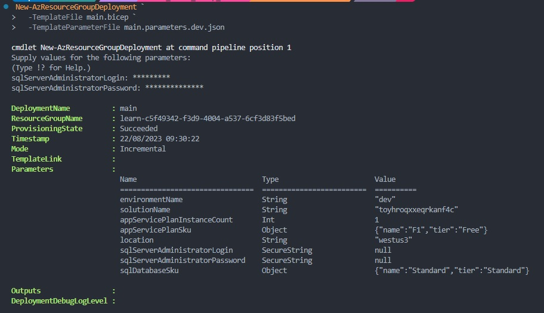
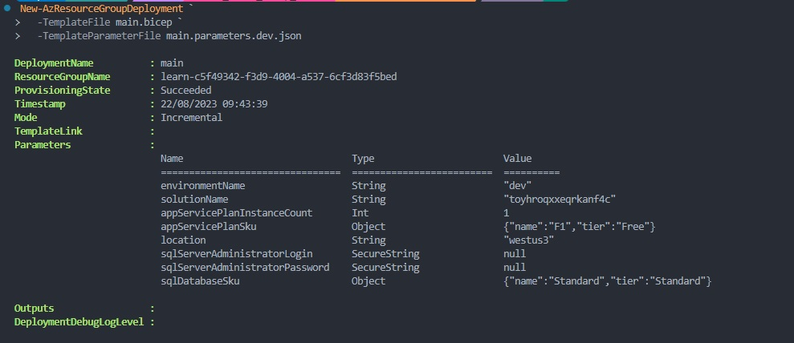
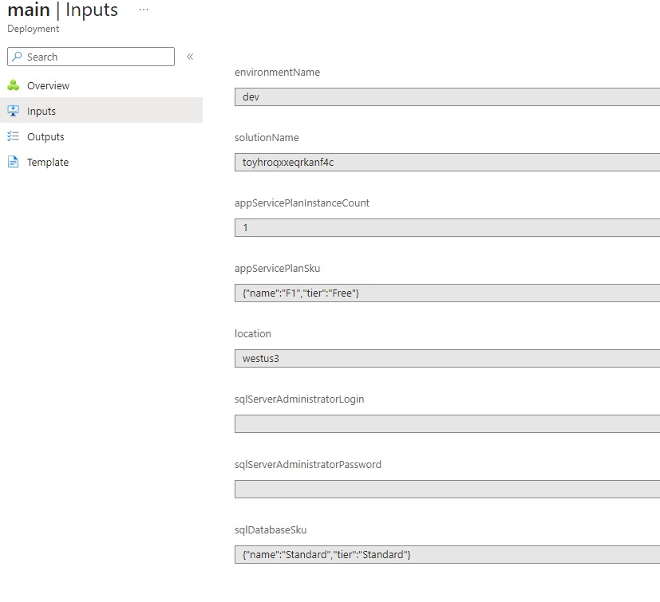

# [Making a reusable Bicep file]

Without defining parameters in the main/module file but in a parameter file, you can reuse the main template/modules.

## Key-terms

Parameters
Objects
Arrays
Specify allowed values

## Used Sources

[MS training, Build reusable Bicep templates by using parameters](https://learn.microsoft.com/en-us/training/modules/build-reusable-bicep-templates-parameters/)

## Results

### Simplifying Bicep Parameter Concepts

#### Parameters

In Bicep, use the "param" keyword to declare parameters. Place them at the top of the file for clarity. Parameters need a name and type. They're distinct from variables or resources and should have unique names. They can have default values, making them optional. Use expressions for default values. Parameter types are "string," "int," "bool," "object," and "array." Good naming and default values improve readability and cost management.

#### Objects

Bicep object parameters group structured data, like a parameter for App Service plan details. Object properties are accessed with dot notation. For instance:

```bicep
param appServicePlanSku object = {
  name: 'F1'
  tier: 'Free'
  capacity: 1
}
```

Tags are a great use case for object parameters, enhancing resource organization:

```bicep
param resourceTags object = {
  EnvironmentName: 'Test'
  CostCenter: '1000100'
  Team: 'Human Resources'
}
```

Object parameters make templates more efficient and reusable.

#### Arrays

Arrays hold lists of items. For instance, use an array for locations of an Azure Cosmos DB database account:

```bicep
param cosmosDBAccountLocations array = [
  {
    locationName: 'australiaeast'
  }
  {
    locationName: 'southcentralus'
  }
  {
    locationName: 'westeurope'
  }
]
```

Arrays are versatile. Visual Studio Code offers support for arrays in IntelliSense.

#### Specify Allowed Values

Use the @allowed decorator to limit values, like for App Service plans:

```bicep
@allowed([
  'P1v3'
  'P2v3'
  'P3v3'
])
param appServicePlanSkuName string
```

Use the @allowed decorator carefully to avoid over-restricting.

#### Restrict Parameters

Apply decorators to restrict characteristics. For example, set string length limits:

```bicep
@minLength(5)
@maxLength(24)
param storageAccountName string
```

Use decorators like @minValue and @maxValue for numeric ranges.

#### Add Descriptions

Use @description to explain parameters for better understanding:

```bicep
@description('The locations into which this Cosmos DB account should be configured. This parameter needs to be a list of objects, each of which has a locationName property.')
param cosmosDBAccountLocations array
```

Descriptions enhance reusability and are used in Azure portal deployments.

### Parameter files

When specifying parameter values in Bicep templates, it's important to consider various scenarios and approaches. Default values, command-line input, and parameter files all play a role in configuring your deployments.

1. **Create Parameter Files:**
   - Parameter files are convenient for grouping parameter values.
   - They're written in JSON and contain parameter-value pairs.
   - The `$schema` indicates the file type, while `contentVersion` tracks changes.
   - Parameters are defined within the `parameters` section, each with a `value` property.
   - Parameter files are tailored to different environments (e.g., dev, production).

2. **Using Parameter Files:**
   - To deploy with parameter files, specify the parameter file with `-TemplateParameterFile`.
   - For instance, using Azure PowerShell:  
  
     ```powershell
     New-AzResourceGroupDeployment `
       -TemplateFile main.bicep `
       -TemplateParameterFile main.parameters.json
     ```

3. **Parameter Value Precedence:**
   - Default values, command-line input, and parameter files interact.
   - Parameters are overridden following a specific hierarchy.
   - Parameter files override default values, while command-line values override parameter files.

For example, in a Bicep file:

```bicep
param location string = resourceGroup().location
param appServicePlanInstanceCount int = 1
param appServicePlanSku object = {
  name: 'F1'
  tier: 'Free'
}
```

And in a parameter file:

```json
{
  "$schema": "https://schema.management.azure.com/schemas/2019-04-01/deploymentParameters.json#",
  "contentVersion": "1.0.0.0",
  "parameters": {
    "appServicePlanInstanceCount": {
      "value": 3
    },
    "appServicePlanSku": {
      "value": {
        "name": "P1v3",
        "tier": "PremiumV3"
      }
    }
  }
}
```

When deploying, the value hierarchy is:  

- `location`: Default value (not overridden).  
- `appServicePlanSku`: Parameter file value overrides default value.  
- `appServicePlanInstanceCount`: Command-line value overrides both default and parameter file values.  

By strategically combining these approaches, you can efficiently manage parameter values without duplicating them across multiple places, maintaining flexibility to override as needed.

### Secure parameters

Sensitive values like passwords and API keys need protection. Use the @secure decorator on string and object parameters to shield these values. When @secure is applied, Azure avoids exposing the values in deployment logs or on the terminal during interactive deployment.  

For instance, to protect an Azure SQL logical server's administrator login and password, define them as secure parameters:

```bicep
@secure()
param sqlServerAdministratorLogin string

@secure()
param sqlServerAdministratorPassword string
```

Avoid specifying default values for secret parameters to ensure stronger security.

#### Avoid Using Parameter Files for Secrets

Avoid saving secret values in parameter files, especially in version control systems like Git, where others might have access.

#### Integrate with Azure Key Vault

Azure Key Vault stores and provides access to secrets securely. You can integrate Bicep templates with Key Vault by referencing secrets in a parameter file. The value isn't exposed; only its identifier is referenced, keeping it safe.


Here's an example of referencing secrets in a Key Vault for an SQL logical server administrator login and password:

```json
{
  "$schema": "https://schema.management.azure.com/schemas/2019-04-01/deploymentParameters.json#",
  "contentVersion": "1.0.0.0",
  "parameters": {
    "sqlServerAdministratorLogin": {
      "reference": {
        "keyVault": {
          "id": "/subscriptions/.../Microsoft.KeyVault/vaults/toysecrets"
        },
        "secretName": "sqlAdminLogin"
      }
    },
    "sqlServerAdministratorPassword": {
      "reference": {
        "keyVault": {
          "id": "/subscriptions/.../Microsoft.KeyVault/vaults/toysecrets"
        },
        "secretName": "sqlAdminLoginPassword"
      }
    }
  }
}
```

Make sure the Key Vault allows Resource Manager access, and the deploying user has permissions.

#### Use Key Vault with Modules

Modules facilitate reusable Bicep files for deploying parts of solutions. Securely provide module parameters like secrets from Key Vault. Here's how:

```bicep
resource keyVault 'Microsoft.KeyVault/vaults@2022-07-01' existing = {
  name: keyVaultName
}

module applicationModule 'application.bicep' = {
  name: 'application-module'
  params: {
    apiKey: keyVault.getSecret('ApiKey')
  }
}
```

Use the existing keyword to reference an existing Key Vault. Use the getSecret() function for secure module parameters to fetch secrets from Key Vault.

#### deployment with main & parameter file

- Deploy the file:

  ```powershell
  New-AzResourceGroupDeployment `
    -TemplateFile main.bicep `
    -TemplateParameterFile main.parameters.dev.json
  ```

  Write down the username and password you are prompted for.
  Will need them for the next step

- Create a key vault and secrets

  Prompt the next lines one by one.
  Give a name for the key-vault, I did demo-kv-2353515.
  Enter the username you just set.
  Enter the password you just set.
  The next 3 prompts create a key-vault and add the username and password we just set to a variable.
  Now we can deploy the main and param file again, this time we ain't prompted for user or password.
  
  ```powershell
  $keyVaultName = 'YOUR-KEY-VAULT-NAME'
  $login = Read-Host "Enter the login name" -AsSecureString
  $password = Read-Host "Enter the password" -AsSecureString

  New-AzKeyVault -VaultName $keyVaultName -Location westus3 -EnabledForTemplateDeployment
  Set-AzKeyVaultSecret -VaultName $keyVaultName -Name 'sqlServerAdministratorLogin' -SecretValue $login
  Set-AzKeyVaultSecret -VaultName $keyVaultName -Name 'sqlServerAdministratorPassword' -SecretValue $password
  ```

Without key vault you get prompted


With key vault you don't get a prompt for user/password


Secrets are blanc in the inputs menu of our deployment


## Encountered problems

Prompting for main + parameter file didn't work in one line, instead had to use the exact way it was in the training module
