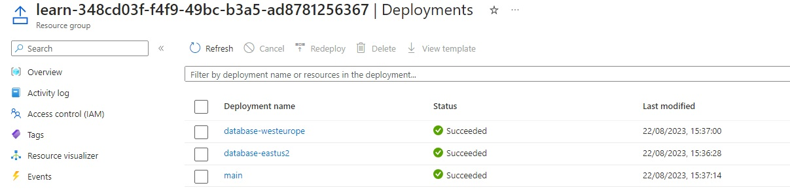
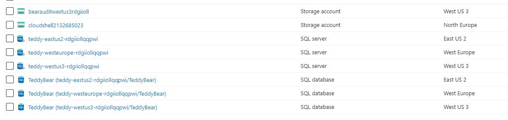
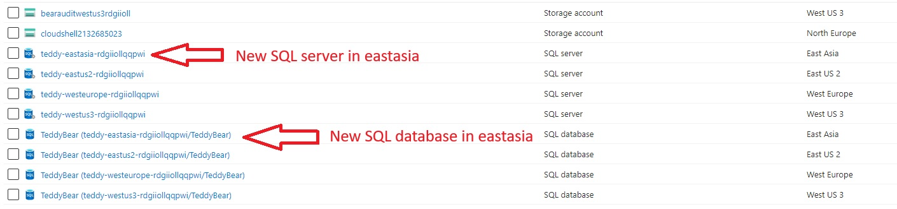
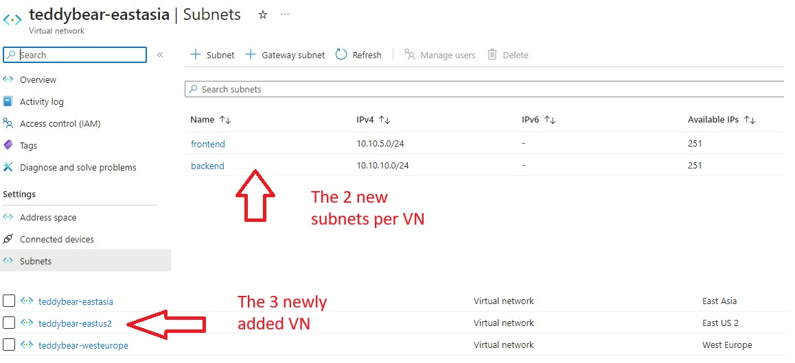
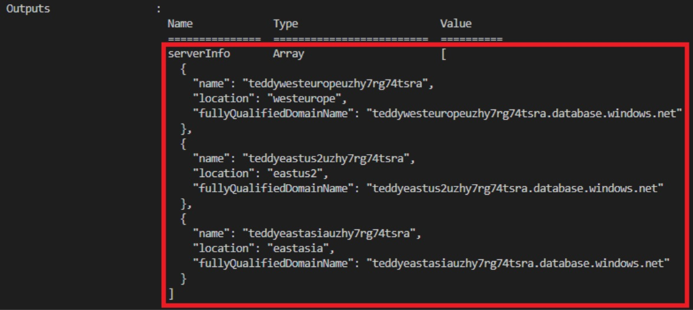

# [Flexible Templates]

When you work with Bicep templates, conditions and loops can help make your Azure deployments more flexible. With conditions, you can deploy resources only when specific constraints are in place. And with loops, you can deploy multiple resources that have similar properties.

## Assignment

- Use conditions to deploy Azure resources only when they're required.
- Use loops to deploy multiple instances of Azure resources.
- Learn how to control loop parallelism.
- Learn how to create nested loops.
- Combine loops with variables and outputs.

## Key-terms


## Used Sources

[MS Training, Flexible templates](https://learn.microsoft.com/en-us/training/modules/build-flexible-bicep-templates-conditions-loops/1-introduction)

## Results

### Deploy resources conditionally

Deploying resources conditionally in Bicep allows you to control when certain resources are deployed based on specific conditions. Here's a simplified summary:

**Basic Conditions:**
    - Use the "if" keyword in Bicep to deploy resources conditionally.
    - Provide a condition that evaluates to true or false.
    - Resources are deployed if the condition is true, and not deployed if false.
    - Conditions are often based on parameter values.

**Expressions as Conditions:**
    - Conditions can include expressions for more complex logic.
    - Create a variable to store the result of the expression for clarity.
    - Use the variable in the resource's condition for better readability.

**Dependency Consideration:**
    - Be mindful of dependencies between conditionally deployed resources.
    - Expressions within a resource's properties are evaluated before resource conditions.
    - Use the "?:" operator to conditionally set property values based on deployment environment.

**Using Modules for Consistency:**
    - If many resources share the same deployment condition, consider using modules.
    - Create a module that deploys related resources with the same condition.
    - Conditionally deploy the module in the main Bicep file.

Deploying resources conditionally in Bicep allows you to tailor deployments based on specific requirements, ensuring that resources are provisioned only when needed while maintaining logical organization.

Below in the if statement the condition auditEnables == TRUE, then the resource is deployed.
`New-AzResourceGroupDeployment -TemplateFile main.bicep -environmentName Production -location westus3`
We added `-environmentName Production` to the CLI prompt, therefore the statement is TRUE else it's FALSE.

```bicep
var auditingEnabled = environmentName == 'Production'

resource sqlServerAudit 'Microsoft.Sql/servers/auditingSettings@2021-11-01-preview' = if (auditingEnabled) {
  parent: sqlServer
  name: 'default'
  properties: {
    state: 'Enabled'
    storageEndpoint: environmentName == 'Production' ? auditStorageAccount.properties.primaryEndpoints.blob : ''
    storageAccountAccessKey: environmentName == 'Production' ? listKeys(auditStorageAccount.id, auditStorageAccount.apiVersion).keys[0].value : ''
  }
}
```

### Deploy multiple resources by using loops

Using the following array of locations and iterate through it with a for loop created 3 different servers and databases.
As you can see the module is in `[ ]` there for it becomes an array it self.

```bicep
@description('The Azure regions into witch the resouces should be deployed.')
param locations array = [
  'westeurope'
  'eastus2'
]

@secure()
@description('The administrator login username for the SQL server')
param sqlServerAdministratorLogin string

@secure()
@description('The administrator login password for the SQL server')
param sqlServerAdministratorLoginPassword string

module databases 'modules/database.bicep' = [for location in locations: {
  name:'database-${location}'
  params: {
    location: location
    sqlServerAdministratorLogin: sqlServerAdministratorLogin
    sqlServerAdministratorLoginPassword: sqlServerAdministratorLoginPassword
  }
}]
```





By adding a new location and then deploy the main.bicep again.
It added the new location to the resource group.



### Control loop execution and nest loops

In this unit, you'll learn how to use copy loops in Bicep to efficiently deploy multiple resources with similar configurations. This is particularly useful when deploying resources in bulk, such as deploying Azure SQL logical servers to various regions for your toy company's smart teddy bear launch.


- **Use Copy Loops:**  
    With the `for` keyword, you can create loops in your Bicep templates. It allows you to deploy multiple instances of resources using a single definition.

- **Loop Over an Array:**  
    You can loop over an array of objects to create multiple instances of a resource. Each iteration assigns values from the array to a specific variable.

- **Customize Properties:**  
    Within the loop, you can customize properties for each instance based on the loop variable's value.

- **Loop Based on Count:**  
    You can also use the `range()` function to loop a specific number of times. This is useful when you don't have an array but need to create a fixed number of resources.

- **Access Index:**  
    You can access the index of the current iteration, which is useful for creating unique names or managing properties based on the iteration.

- **Filter Items:**  
    Combining `for` loops with conditions (`if` statements) allows you to filter which instances of resources get deployed. This is helpful for deploying resources conditionally based on certain properties.

By utilizing copy loops, you can streamline your deployment process and ensure consistent resource configurations across different instances. This method is particularly beneficial when deploying resources across various regions or environments.

'@batchsize()' This allows to deploy resources in a for loop in batches.  
When its `@batchSize(1)` it deploys per resource, and with `@batchSize(2)` it deploys per 2 resources.  
This is useful avoid potential issues like rate limiting, throttling, or hitting Azure's API request limits.  

```bicep
@batchSize(1)
resource appServiceApp 'Microsoft.Web/sites@2021-03-01' = [for i in range(1,3): {
  name: 'app${i}'
  // ...
}]
```

Example of nesting for loops while creating multiple Virtual Networks with multiple Subnets.
While iterating over the for loop with `i` the nested loop iterates over `j`.  
So it creates x amount of subnets defined by `subnetCounter` per location where a Virtual Network is created.

```bicep
resource virtualNetworks 'Microsoft.Network/virtualNetworks@2021-08-01' = [for (location, i) in locations : {
  name: 'vnet-${location}'
  location: location
  properties: {
    addressSpace:{
      addressPrefixes:[
        '10.${i}.0.0/16'
      ]
    }
    subnets: [for j in range(1, subnetCount): {
      name: 'subnet-${j}'
      properties: {
        addressPrefix: '10.${i}.${j}.0/24'
      }
    }]
  }
}]
```

### Use variable and output loops

In Bicep deployments, loops can also be used with variables and outputs to enhance flexibility and efficiency in creating and managing resources.

**Variable Loops:**
Variable loops allow you to create arrays of values or complex objects that can be utilized throughout your Bicep file. You use the `for` keyword to define a variable loop. For instance, you can create an array of items like this:

```bicep
var items = [for i in range(1, 5): 'item${i}']
```

In more complex scenarios, you can use variable loops to create objects for resource properties. For example, if you have a parameter defining subnets, you can use a variable loop to structure the subnets for a virtual network resource:

```bicep
var subnetsProperty = [for subnet in subnets: {
  name: subnet.name
  properties: {
    addressPrefix: subnet.ipAddressRange
  }
}]
```

**Output Loops:**
Output loops in Bicep are used to provide information back to users or tools that initiated the deployment. Similar to other types of loops, you use the `for` keyword to create output loops. These loops are often employed alongside other loops within your template. For instance, if you're deploying storage accounts to multiple locations, you can use an output loop to retrieve important information about each storage account:

```bicep
output storageEndpoints array = [for i in range(0, length(locations)): {
  name: storageAccounts[i].name
  location: storageAccounts[i].location
  blobEndpoint: storageAccounts[i].properties.primaryEndpoints.blob
  fileEndpoint: storageAccounts[i].properties.primaryEndpoints.file
}]
```

However, keep in mind that outputs are not suitable for returning sensitive information like access keys or passwords, as outputs are logged and not designed for handling secure data.
By incorporating variable and output loops, you can efficiently manage resources, structure complex data, and communicate essential information back to your deployment process.

By adding the following code to our main.bicep we enable to create new VN and Subnets

```bicep
@description('The IP address range for all virtual networks to use.')
param virtualNetworkAddressPrefix string = '10.10.0.0/16'

@description('The name and IP address range for each subnet in the virtual networks.')
param subnets array = [
  {
    name: 'frontend'
    ipAddressRange: '10.10.5.0/24'
  }
  {
    name: 'backend'
    ipAddressRange: '10.10.10.0/24'
  }
]
```

```bicep
var subnetProperties = [for subnet in subnets: {
  name: subnet.name
  properties: {
    addressPrefix: subnet.ipAddressRange
  }
}]
```

```bicep
resource virtualNetworks 'Microsoft.Network/virtualNetworks@2021-08-01' = [for location in locations: {
  name: 'teddybear-${location}'
  location: location
  properties:{
    addressSpace:{
      addressPrefixes:[
        virtualNetworkAddressPrefix
      ]
    }
    subnets: subnetProperties
  }
}]
```

```bicep
output serverInfo array = [for i in range(0, length(locations)): {
  name: databases[i].outputs.serverName
  location: databases[i].outputs.location
  fullyQualifiedDomainName: databases[i].outputs.serverFullyQualifiedDomainName
}]
```

Then also add outputs to database.bicep

```bicep
output serverName string = sqlServer.name
output location string = location
output serverFullyQualifiedDomainName string = sqlServer.properties.fullyQualifiedDomainName
```

We now created 3 virtual networks with each 2 subnets.




## Encountered problems

Sandbox from MS training pages sometimes stopped working. Found a work around by starting a sandbox in an other module and then start the sandbox again from the training page I was working on.
