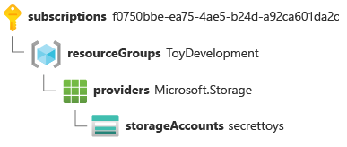

# [Child Extensions]

Child and extension resources allow your Azure deployments to access the advanced functionality and power of the Azure platform. You can create these resource types in Bicep by using a clear and understandable template syntax.

You can also use Bicep to refer to resources that were created outside the Bicep file itself. For example, you can refer to resources that your colleagues have created manually by using the Azure portal, or from within another Bicep template or module, even if they're in a different resource group or subscription. By using these features of Bicep, you can unlock the ability to create powerful templates that deploy all aspects of your Azure infrastructure.[Geef een korte beschrijving van het onderwerp]

## Assignment

- Learn: Child resource definitions, through nested resources, the parent property, and by constructing multipart resource names.
- Learn: Extension resource definitions, by using the scope property.
- Learn: Existing resource references, by using the existing keyword.

### Key-terms

[Schrijf hier een lijst met belangrijke termen met eventueel een korte uitleg.]

### Used Sources

[Plaats hier de bronnen die je hebt gebruikt.]

## Results

### Understanding Azure Resources

In Azure, resources are organized by types and identified by unique IDs. These concepts are crucial when working with Bicep templates for resource deployment.

#### Resource Types and Resource IDs

All Azure resources have a specific type that defines their kind.
A resource ID is a unique identifier for a particular instance of a resource.
Resource types and IDs are important when creating Bicep templates.

#### Resource Providers

Azure Resource Manager handles various resource providers through APIs and ARM templates.
A resource provider groups related resource types, often associated with specific Azure services.
Examples include Microsoft.Compute for virtual machines, Microsoft.Network for networking, and more.
Resource provider names may differ from Azure service names (e.g., Microsoft.OperationalInsights for Log Analytics).

- Microsoft.Compute, which is used for virtual machines.
- Microsoft.Network, which is used for networking resources like virtual networks, network security groups, and route tables.
- Microsoft.Cache, which is used for Azure Cache for Redis.
- Microsoft.Sql, which is used for Azure SQL.
- Microsoft.Web, which is used for Azure App Service and Azure Functions.
- Microsoft.DocumentDB, which is used for Azure Cosmos DB.

#### Resource Types

Resource providers expose multiple resource types, each with distinct properties and behaviors.
Example: In Microsoft.Web, there are types like "sites" (App Service applications) and "serverFarms" (App Service plans).
When defining resources in Bicep, specify type and API version for accurate resource definition.

- sites: Defines an App Service application or Azure Functions application. Properties include the environment variables that your application uses, and the supported protocols (HTTP and HTTPS) to access the application.
- serverFarms: Defines an App Service plan, the infrastructure that runs your applications. Properties include the size and SKU of the servers, and the number of instances of your plan that you want to deploy.

#### Resource IDs

Every Azure resource has a unique resource ID.
The ID includes information distinguishing resources of the same type or name.
Resource ID structure: Subscription ID, Resource Group, Resource Provider, Resource Type, and Resource Name.
Access resource ID in Bicep using the symbolic name and the id property.
Understanding these concepts helps you efficiently create Bicep templates for deploying Azure resources.



- subscriptions/f0750bbe-ea75-4ae5-b24d-a92ca601da2c indicates that this resource is within the Azure subscription with ID. f0750bbe-ea75-4ae5-b24d-a92ca601da2c.
- resourceGroups/ToyDevelopment indicates that the resource is within the resource group named ToyDevelopment.
- providers/Microsoft.Storage indicates that the resource is using a type from the Microsoft.Storage resource provider.
- storageAccounts is the resource type.
- secrettoys is the name of the storage account.

### Define Child Resources

Child resources are specific Azure resources that are deployed within the context of a parent resource. These child resources have longer, multipart names indicating their relationship with the parent. Some examples of child resource types in Azure include virtual network subnets, App Service configurations, SQL databases, virtual machine extensions, storage blob containers, and Azure Cosmos DB containers.

There are three main approaches to defining child resources in Bicep templates:

- **Nested Resources:**  
Child resources can be nested within their parent's definition using a simplified resource type. The parent's properties and the child's properties are both defined within the same block. However, nesting can become complex if there are many layers of nested resources.

```bicep
resource vm 'Microsoft.Compute/virtualMachines@2020-06-01' = {
  name: vmName
  location: location
  properties: {
    // ...
  }

  // this is nested within 'vm'
  resource installCustomScriptExtension 'extensions' = {
    name: 'InstallCustomScript'
    location: location
    properties: {
      // ...
    }
  }
}

// You refer to a nested resource by using '::' operator
output childResourceId string = vm::installCustomScriptExtension.id
```

- **Parent Property:**  
Child resources can be defined separately from the parent and linked using the `parent` property. This approach is less nested and clearly conveys the parent-child relationship. However, you need to specify the full resource type and API version for each child resource.

```bicep
resource vm 'Microsoft.Compute/virtualMachines@2020-06-01' = {
  name: vmName
  location: location
  properties: {
    // ...
  }
}

resource installCustomScriptExtension 'Microsoft.Compute/virtualMachines/extensions@2020-06-01' = {
  parent: vm
  name: 'InstallCustomScript'
  location: location
  properties: {
    // ...
  }
}

// You can refer to a child resource using a symbolic name
output childResourceId string = installCustomScriptExtension.id
```

- **Constructing Resource Name:**  
In certain situations, you might need to manually construct the child resource's name, especially within loops or when dynamically selecting a parent. This involves using string interpolation to form the child's name and can be complex. It's recommended to avoid this method when possible.

Child resource IDs are composed of their parent's resource ID along with the child's resource type and name. These IDs can become lengthy, but breaking them down into components helps in understanding their structure and behavior. For example, a child resource ID for a storage blob container includes the parent storage account's ID, the blobServices child type, the container's name, etc. Understanding these IDs helps you comprehend the resource's context within Azure.

Overall, selecting the appropriate approach for defining child resources depends on the complexity of the deployment scenario and the need for clarity and readability in the Bicep template.

## Encountered problems

[Geef een korte beschrijving van de problemen waar je tegenaan bent gelopen met je gevonden oplossing.]
