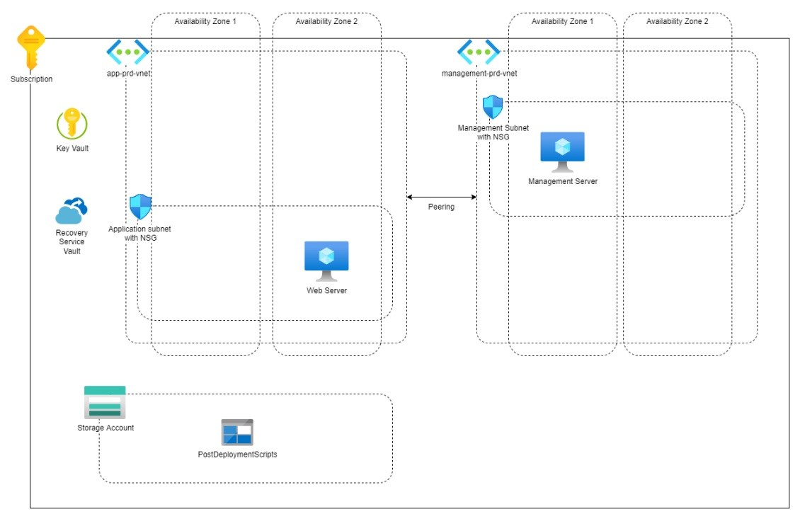

# [Documentatie V1.0]

Dit is het document waar ik mijn v1.0 project documenteer.

## Index

- 01: User stories  
- 02: Design & choices
- 03: User manual
- 04: Time logs

## 01: User stories v1.0

|Als team willen wij duidelijk hebben wat de eisen zijn van de applicatie.|
|---|
|Epic: Exploratie|
|Beschrijving: Je hebt al heel wat informatie gekregen.  Er staan al wat eisen in dit document genoemd, maar deze lijst is mogelijk incompleet of onduidelijk. Het is belangrijk om alle onduidelijkheden uitgezocht te hebben voordat je groot werk gaat verzetten. |
|Deliverable: Een puntsgewijze omschrijving van alle eisen|

|Als team willen wij een duidelijk overzicht van de aannames die wij gemaakt hebben.|
|---|
|Epic: Exploratie|
|Beschrijving: Je hebt al heel wat informatie gekregen. Mogelijk zijn er vragen die geen van de stakeholders heeft kunnen beantwoorden. Je team moet een overzicht kunnen produceren van de aannames die je daardoor maakt.|
|Deliverable: Een puntsgewijs overzicht van alle aannames|

|Als team willen wij een duidelijk overzicht hebben van de Cloud Infrastructuur die de applicatie nodig heeft|
|---|
|Epic: Exploratie|
|Beschrijving: Je hebt al heel wat informatie gekregen. En al een ontwerp. Alleen in het ontwerp ontbreken nog zaken als IAM/AD. Identificeer deze extra diensten die je nodig zal hebben en maak een overzicht van alle diensten.|
|Deliverable: Een overzicht van alle diensten die gebruikt gaan worden.|

|Als klant wil ik een werkende applicatie hebben waarmee ik een veilig netwerk kan deployen.|
|---|
|Epic: v1.0|
|Beschrijving: De applicatie moet een netwerk opbouwen dat aan alle eisen voldoet. Een voorbeeld van een genoemde eis is dat alleen verkeer van trusted sources de management server mag benaderen.|
|Deliverable: IaC-code voor het netwerk en alle onderdelen|

|Als klant wil ik een werkende applicatie hebben waarmee ik een werkende webserver kan deployen.|
|---|
|Epic: v1.0|
|Beschrijving: De applicatie moet een webserver starten en deze beschikbaar maken voor algemeen publiek. |
|Deliverable: IaC-code voor een webserver en alle benodigdheden|

|Als klant wil ik een werkende applicatie hebben waarmee ik een werkende management server kan deployen.|
|---|
|Epic: v1.0|
|Beschrijving: De applicatie moet een management server starten en deze beschikbaar maken voor een beperkt publiek.|
|Deliverable: IaC-code voor een management server met alle benodigdheden|

|Als klant wil ik een opslagoplossing hebben waarin bootstrap/post-deployment script opgeslagen kunnen worden.|
|---|
|Epic: v1.0|
|Beschrijving: Er moet een locatie beschikbaar zijn waar bootstrap scripts beschikbaar worden. Deze script moeten niet publiekelijk toegankelijk zijn.|
|Deliverable: IaC-code voor een opslagoplossing voor scripts|

|Als klant wil ik dat al mijn data in de infrastructuur is versleuteld.|
|---|
|Epic: v1.0|
|Beschrijving: Er wordt veel gehecht aan de veiligheid van de data at rest en in motion. Alle data moet versleuteld zijn.|
|Deliverable: IaC-code voor versleuteling voorzieningen|

|Als klant wil ik iedere dag een backup hebben dat 7 dagen behouden wordt|
|---|
|Epic: v1.0|
|Beschrijving: De klant wil graag dat er een backup beschikbaar is, mocht het nodig zijn om de servers terug te brengen naar een eerdere staat. (Zorg ervoor dat de Backup ook daadwerkelijk werkt)|
|Deliverable: IaC-code voor backup voorzieningen|

|Als klant wil ik weten hoe ik de applicatie kan gebruiken|
|---|
|Epic: v1.0|
|Beschrijving: Zorg dat de klant kan begrijpen hoe deze de applicatie kan gebruiken. Zorg dat het duidelijk is wat de klant moet configureren voor de deployment kan starten en welke argumenten het programma nodig heeft.|
|Deliverable: Documentatie voor het gebruik van de applicatie|

|Als klant wil ik een MVP kunnen deployen om te testen|
|---|
|Epic: v1.0|
|Beschrijving: De klant wil zelf intern je architectuur testen voordat ze de code gaan gebruiken in productie. Zorg ervoor dat er configuratie beschikbaar is waarmee de klant een MVP kan deployen.|
|Deliverable: Configuratie voor een MVP deployment|

## 02: Design & choices v1.0

### Diagram (Structure)



We got the following infrastructure:

- Subscription,
  - Key vault
  - Recovery Service
  - Storage account
    - blob storage
  - VN1
    - NSG
    - VM (Web server)
      - Two different availability zones
  - VN2
    - NSG
    - VM (Management server)
      - Two availability zones
  - Peering between VN1 & VN2

### Requirements v1.0

- KeyVault (WORKING)
  - KeyVault policies
    - system assigned applications

- Recovery Service (WORKING)
  - Daily back up from the web sever
  - Backups are stored for 7 days

- StorageAccount (WORKING)
  - Module blob storage (postDeploymentScripts)
    - managementserver script to install AzCli (Work in progress)
    - webserver script to set-up Apache (Working)

- Peering (WORKING)
  - vnet webserver to vnet managementserver

- Network (WORKING)
  - Vnet 'app-prd-vnet'
    - Public IP
    - Private IP (10.10.10.0/24)
  - Vnet 'management-prd-vnet'
    - Public IP
    - Private IP (10.20.20.0/24)

- Firewall (WORKING)
  - NSG that only allows certain IP addresses for SSH connections
  - NSG Rules module (Work in progress)

- Web Server (WORKING)
  - SSH connection only via management server
  - Public IP (or public IP via Management Server?)
  - Private IP (10.10.10.0/24), same for subnet
  - Ubuntu Server 22.04 LTS Gen 2
    - West europe only availability zone 1
    - Standard_B1ls
    - SSH login via management server (WORKS)
    - Standard SSD
    - Key management 'platform-managed key' (Work in progress, add in v1.1)
    - Enable system assigned managed identity for KeyVault
    - Enable backup (1 back up per day, keep back up for 7 days)
    - userData via scripts

- Management server (WORKING)
  - SSH via Public IP, only trusted locations
  - Public IP
  - Private IP (10.20.20.0/24), same for subnet
  - Ubuntu Server 22.04 LTS Gen 2
    - West europe only availability zone 2
    - Standard_B1ls
    - SSH login trusted location (Add admin's IP to trusted IP's)
    - Standard SSD
    - Key management 'platform-managed key' (Work in progress, add in v1.1)
    - Enable system assigned managed identity for KeyVault
    - userData via scripts

### Design choices

Resources:  

- Location 'UK South', this was the best option with low latency for multiple 'Availability zones'  
- Web server, 'Ubuntu 22.04 LTS' this requires very little compute power and is supported till 2032.  
- Management server, same as above.  
- Firewall, NSG with security rules, as a stateful firewall this is sufficient to control the SSH connections from trusted sources.
- KeyVault, use system assigned identities for applications, easy to manage what rights the servers got within the vault.  
- Recovery Service, it's managed by Azure, requires little set up and is secure, encrypted back up data with user manged keys.

Deployment:

- Powershell script using Azure Powershell, this will automate some tasks instead of manually inputs to the terminal  
- Pre-deployment bicep to create resources for the environment with a resource group and key vault  
- Setting up secrets for the servers via the powershell script  
- Setting up the environment via the powershell script  
- Main-deployment bicep to set up the rest of the resources  

Pricing Estimates:

|Resource|Price(Estimation)|
|---|---|
|Webserver (Ubunut 22.04 LTS, b1ls)|$4.99/month|
|Managementserver (Ubunut 22.04 LTS, b1ls)|$4.99/month|
|StorageAccount (Hot, 1gb storage)|$1.71/month|
|VnetPeering (Uk South <-> Uk South)|free|
|Recovery Service (Webserver)|$5.82/month|
|Key Vault| $0.03/month/10k operations|
|---|---|
|Total|$17.54/month|

## 03: User manual v1.0

Before you deploy, please go through the following steps!

### Install Azure Powershell

[Link to installation guide](https://learn.microsoft.com/en-us/powershell/azure/install-azps-windows?view=azps-10.3.0&tabs=powershell&pivots=windows-psgallery)

01: Check if powershell 7.x.x or higher is installed
`$PSVersionTable.PSVersion`

02: Check if you have Az Powershell installed (if installed skip to step 6)
`Get-Module -Name AzureRM -ListAvailable`

03: Check execution policies
`Get-ExecutionPolicy -List`

04: Set execution policies (Requires Admin rights)
`Set-ExecutionPolicy -ExecutionPolicy RemoteSigned -Scope CurrentUser`

05: Installaltion
`Install-Module -Name Az -Repository PSGallery -Force`

06: Check for updates
`Update-Module -Name Az -Force`

### Login to Azure and go to the folder where the project is based

We need to login to Azure

```powershell
Connect-AzAccount
```

Then set the file path to where the project is

```powershell
cd '<path/to/folder>'
```

### Change predeployment.bicep

- We need to set a prefix for the RG name
 `param rgNamePrefix string = 'Your Resource Group prefix'`

### Change main.bicepparam

- We need to set the two secrets in the param file:  
    param webServerAdminLoginPassword = getSecret('subscriptionId', 'resourceGroup Name', 'keyvaultName', 'secretname')
    param webServerAdminLoginPassword = getSecret('subscriptionId', 'resourceGroup Name', 'keyvaultName', 'secretname')

- We can get the resource group name and KeyVault name with:  
 `New-AzSubscriptionDeployment -whatif -templatefile .\predeployment.json -Location`

- We can get the subscription id with:
 `Get-AzSubscription -TenantId (Get-AzContext).Tenant`

- Set a secret name
 `You will get prompted to enter them when running the deployment script, this must be the same as you wrote in the param file`

### Change kv.bicep

- We need to set an Admin with all KeyVault rights
 `param objectId string = 'Your object ID'`

### Run the deployment file

```powershell
.\deployment_app.ps1
```


## 04: Time logs v1.0

### Log [21/08/23]

#### Daily report

Read the product owners requirements, think of questions to ask product owner.

#### Obstacles

New way of thinking about the cloud I didn't learn yet with AZ900.
A lot of googling and checking in the portal what requirements there are to launch a resource.

#### Solutions

Drawing word webs with potential requirements for resources.
Put the user stories in chronological order in Jira.

#### Learnings

Basics of Jira.
Went over some requirements again to stat up a service/resource.

---

### Log [22/08/23]

#### Daily report

Started on the bicep modules from microsoft training.  

#### Obstacles

Bicep it self seems relatively easy.  
Was struggling with the sandbox environments sometimes.  

#### Solutions

Found a work around for the not working sandboxes.  
Start one in an other module and then you can start it again in the module you're on.  
Better option than waiting X hours for reset.  

#### Learnings

Basics of Bicep

---

### Log [23/08/23]

#### Daily report

Meeting with product owner

#### Obstacles

n/a

#### Solutions

n/a

#### Learnings

Virtual Machines got an option to select an availability zone.

---

### Log [24/08/23]

#### Daily report

Created network.bicep and searched online for all requirements

#### Obstacles

A fair amount of errors not to be found online (within 30mins)

#### Solutions

Experiment, worked out ok-ish.
Deploying a second time sometimes changes the errors.

#### Learnings

Error messages aren't always clear at first.
Deploying a second time sometimes changes the errors.

---

### Log [25/08/23]

#### Daily report

Modulated network.bicep and added modules for the network elements in main.bicep

#### Obstacles

Kept getting errors I couldn't find on the MS pages or StackOverflow

#### Solutions

Auto fill requirements for a module in main.bicep.
This put all params in the correct order, therefore solving all errors I had.

#### Learnings

Need to pay more attention to logic behind deploying aspects

---

### Log [28/08/23]

#### Daily report

working on the VM implementation

#### Obstacles

Keep getting errors about "Code:CanceledAndSupersededDueToAnotherOperation".
Can't say these error codes are very easy to read and understand, no easy to find online.

```json
{
    "status": "Failed",
    "error": {
        "code": "DeploymentFailed",
        "target": "/subscriptions/subid/resourceGroups/somerandombiceptesting/providers/Microsoft.Resources/deployments/webserver-fa6lzneoxbfsk",
        "message": "At least one resource deployment operation failed. Please list deployment operations for details. Please see https://aka.ms/arm-deployment-operations for usage details.",
        "details": [
            {
                "code": "ResourceDeploymentFailure",
                "target": "/subscriptions/subid/resourceGroups/somerandombiceptesting/providers/Microsoft.Network/networkSecurityGroups/webServerSubnet-NSG",
                "message": "The resource write operation failed to complete successfully, because it reached terminal provisioning state 'Canceled'.",
                "details": [
                    {
                        "code": "Canceled",
                        "message": "Operation was canceled.",
                        "details": [
                            {
                                "code": "CanceledAndSupersededDueToAnotherOperation",
                                "message": "Operation PutNetworkSecurityGroupOperation (98533895-7ac8-4058-a28c-31e907eb4199) was canceled and superseded by operation PutNetworkSecurityGroupOperation (13d11a84-0058-46d1-89c4-a79500dcbcc1)."
                            }
                        ]
                    }
                ]
            }
        ]
    }
}
```

#### Solutions

This post on github, https://github.com/Azure/bicep/discussions/9791 helped me a fair bit.
Narrowed it down to just a NSG error instead 4 different network errors.
Did not have to define the NSG as it was already connected to the subnet.

#### Learnings

Need to pay more attention to logic behind deploying aspects

---

### Log [04/09/23] Lost previous logs

Got an error while pushing update from timelogs to Git.  
Reverted to an old file from 28-08 instead of the last that was 01-09.  
Can't find the 01-09 in the log files from git anymore...

### Log [04/09/23]

#### Daily report

Explored key-vaults and managed identities.

#### Obstacles

Can't receive secrets from key-vaults within a bicep file.
Keep getting errors with managed identities when redeploying.

#### Solutions

Need to work in smaller steps and figure out how it works.  

#### Learnings

Took to big leaps with to little testing.  
Should be able to get it working doing small steps at at time.  

### Log [05/09/23] Git Testing branch was empty after fixing something

Not sure what happened but the testing branch only had time logs.md and the rest was gone.
Pushed all from local repository and it seems fine now?  

---

### Log [07/09/23]

#### Daily report

Fixed VM identities for KeyVault via access policies

#### Obstacles

Wasn't able to assign a managed identity or access policy to a Key Vault.
Kept getting that I couldn't do certain things as "contributor".
Struggled with this for nearly two weeks.
Just couldn't find the right keyword to search for to get a solution.

#### Solutions

Was able to attach principal id from the vm's to applicationId and objectId.

```bicep
accessPolicies: [
      {
        applicationId: vm.identity.principalId
        objectId: vm.identity.principalId
      }
]
```

#### Learnings

Look more often in the portal and how things work in the portal.
Cloud have saved me a lot of time and frustration.

---

### Log [08/09/23]

#### Daily report

Fixed security issues given by advisor, looking more on KV options

#### Obstacles

In the Azure portal security issues regarding the KV kept popping up in the advisor.  
KV needed to be restored manually.  

#### Solutions

KV security issues were a trail of errors, easy to fix.  
Stumbled on the solution for the deployment state of the KV from a Youtube snippet.
The code below fixed it. Do want to see it's possible to determine the stat with an ? if statement.

```bicep
properties {
    createMode: 'recover'
}
```

#### Learnings

Pause Youtube video's to look at the code when the Youtuber goes by everything fast.
You might find the thing you've been looking for.  

---

### Log [11/09/23]

#### Daily report

Added the creation of a new resource group for the deployment

#### Obstacles

Had to change all the naming since `resourceGroup().id` didn't work anymore.
Fair amount of errors, tried many ways of defining the names.

#### Solutions

The code below works like a charm instead of the `resourceGroup().id`

```bicep
var resourceName = '${namePrefix}${uniqueString(newRG.name)}'
```

#### Learnings

Most errors came from the storage account name not being viable.
Don't generate names over multiple files, keep it to your main file.

---

### Log [13/09/23]

#### Daily report

made a powershell script to deploy two bicep files

#### Obstacles

didn't know powershell that well
didn't know most azure cli commands

#### Solutions

Read about powershell and got little help from chatGPT to speed it up a bit.
Removed some variables from files to make deployments smoother

#### Learnings

`-mode incremental` helps a lot with deployments with multiple modules

---

### Log [14/09/23]

#### Daily report

added userData to Vm's

#### Obstacles

n/a

#### Solutions

n/a

#### Learnings

n/a

---

### Log [15/09/23]

#### Daily report

presented v1.0

#### Obstacles

n/a

#### Solutions

n/a

#### Learnings

Need a Windows server for the management server

---

